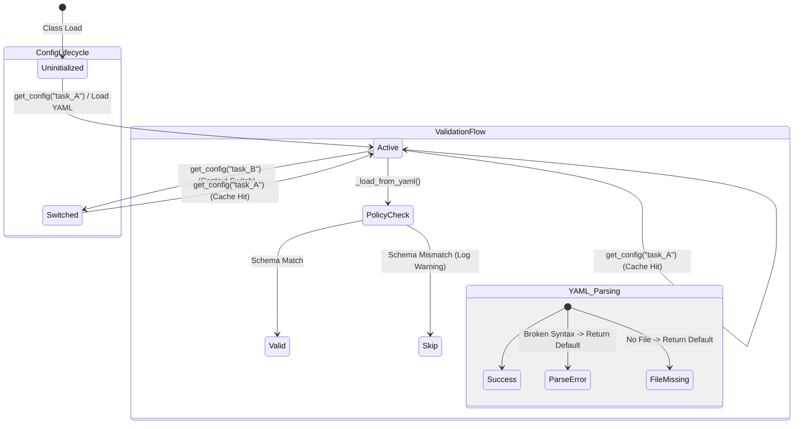

# Config 테스트 명세서

## 1. 문서 정보 및 전략

- **대상 모듈:** `src.common.config.ConfigManager`
- **복잡도 수준:** **중간 (Medium)** (싱글톤 상태 관리, 파일 I/O, Pydantic 검증 혼합)
- **커버리지 목표:** 분기 커버리지 100%, 구문 커버리지 100%
- **적용 전략:**
  - [x] **상태 전이 (State Transition):** `Uninitialized` → `Loaded(Task A)` → `Cached` → `Switched(Task B)` 흐름 검증.
  - [x] **부분 실패 (Partial Failure):** YAML 내 여러 정책 중 일부만 잘못되었을 때, 전체가 실패하지 않고 유효한 정책만 로드되는지 검증.
  - [x] **견고성 (Robustness):** 파일 시스템 에러나 YAML 문법 오류 시 프로그램이 죽지 않고 기본값으로 복구되는지(Graceful Degradation) 검증.
  - [x] **보안 (Security):** `SecretStr` 타입의 환경변수 처리 검증.

## 2. 로직 흐름도

## 3. BDD 테스트 시나리오

**시나리오 요약 (총 18건)**

- **초기화 및 보안 (Init & Security):** 3건 (필수 환경변수, 검증 실패, SecretStr 마스킹)
- **파일 로드 및 캐싱 (Load & Cache):** 4건 (정상 로드 및 로그 오버라이드, 캐시 적중, 파일 없음, 문법 오류)
- **유틸리티 (Utility):** 1건 (Get 메서드 기본값 처리)
- **수집 정책 (Extractor):** 3건 (격리 검증, 누락 방어, 정상 파싱)
- **적재 정책 (Loader):** 5건 (격리 검증, 누락 방어, AWS 분기, Postgres 분기, 미지원 타겟 에러)
- **파이프라인 정책 (Pipeline):** 2건 (격리 검증, 누락 방어, 정상 파싱)

|  테스트 ID  | 분류 | 기법 | 전제 조건 (Given)                        | 수행 (When)                              | 검증 (Then)                                              | 입력 데이터 / 상황              |
| :---------: | :--: | :--: | :--------------------------------------- | :--------------------------------------- | :------------------------------------------------------- | :------------------------------ |
| **INIT-01** | 단위 | 표준 | `.env`에 필수 API 키가 모두 존재함       | `ConfigManager()` 인스턴스 생성          | 인스턴스 생성 성공 및 Provider URL 정상 매핑             | `KIS_BASE_URL` 등 유효 값       |
| **INIT-02** | 단위 | BVA  | `.env`에 `KIS_APP_KEY` 등 필수값 누락    | `ConfigManager()` 인스턴스 생성          | `ValidationError` 발생 (Fail-Fast)                       | 필수 환경변수 제거              |
| **INIT-03** | 단위 | 보안 | `UPBIT_SECRET_KEY`가 메모리에 로드됨     | 설정 객체 출력 및 속성 접근              | `SecretStr`로 래핑되어 평문 노출이 방지됨                | `secret_key` 접근               |
| **LOAD-01** | 통합 | 상태 | `extractor.yml` 정상 파일 존재           | `ConfigManager.load("extractor")`        | 1. 파싱 성공 2. 글로벌 로그 설정 오버라이드 3. 캐시 저장 | 파일 내 `log_level: DEBUG` 포함 |
| **LOAD-02** | 통합 | 상태 | `extractor` 설정이 이미 캐시에 존재함    | `ConfigManager.load("extractor")` 재호출 | 파일 I/O 없이 메모리의 동일한 객체 반환                  | Cache Hit 검증                  |
| **LOAD-03** | 통합 | 예외 | 문법이 깨진(Broken) YAML 파일 존재       | `ConfigManager.load("broken")`           | `ConfigurationError` 예외 발생 및 Fail-Fast              | 내용: `key: value: :`           |
| **LOAD-04** | 통합 | BVA  | 요청한 이름의 YAML 파일이 존재하지 않음  | `ConfigManager.load("no_file")`          | 에러 없이 빈 `yaml_data`({})를 가진 객체 반환            | 파일 없음                       |
| **UTIL-01** | 단위 | BVA  | YAML 데이터에 존재하지 않는 키 조회      | `config.get("invalid_key", "default")`   | 지정한 `default` 값이 반환됨                             | `key="none", default="def"`     |
| **EXT-01**  | 단위 | 상태 | `file_name`이 'pipeline'인 설정 객체     | `get_extractor("job_1")` 호출            | `ConfigurationError` 발생 (도메인 격리 위반)             | `file_name="pipeline"`          |
| **EXT-02**  | 단위 | BVA  | `extractor` 설정 내 존재하지 않는 Job ID | `get_extractor("unknown_job")` 호출      | `ConfigurationError` 발생                                | `job_id="unknown"`              |
| **EXT-03**  | 단위 | 표준 | 정상적인 Job 정책이 정의된 `extractor`   | `get_extractor("job_1")` 호출            | `JobPolicy` Pydantic 모델로 변환 및 반환                 | 정상 `JobPolicy` 스키마         |
| **LDR-01**  | 단위 | 상태 | `file_name`이 'extractor'인 설정 객체    | `get_loader("aws")` 호출                 | `ConfigurationError` 발생 (도메인 격리 위반)             | `file_name="extractor"`         |
| **LDR-02**  | 단위 | BVA  | `loader` 설정 내 존재하지 않는 타겟      | `get_loader("unknown_db")` 호출          | `ConfigurationError` 발생                                | `loader_name="unknown"`         |
| **LDR-03**  | 단위 | 표준 | AWS 타겟 정보가 정의된 `loader` 설정     | `get_loader("aws")` 호출                 | `AWSLoaderPolicy` 타입으로 객체 반환                     | 타겟: `aws`                     |
| **LDR-04**  | 단위 | 표준 | Postgres 타겟 정보가 정의된 `loader`     | `get_loader("postgres")` 호출            | `PostgresLoaderPolicy` 타입으로 객체 반환                | 타겟: `postgres`                |
| **LDR-05**  | 단위 | BVA  | 지원하지 않는 로더 타겟(예: 'gcp') 요청  | `get_loader("gcp")` 호출                 | `ConfigurationError` 발생                                | 타겟: `gcp`                     |
| **PIPE-01** | 단위 | 상태 | `file_name`이 'loader'인 설정 객체       | `get_pipeline("task_1")` 호출            | `ConfigurationError` 발생 (도메인 격리 위반)             | `file_name="loader"`            |
| **PIPE-02** | 단위 | BVA  | `pipeline` 설정 내 존재하지 않는 Task ID | `get_pipeline("unknown_task")` 호출      | `ConfigurationError` 발생                                | `task_id="unknown"`             |
| **PIPE-03** | 단위 | 표준 | 정상적인 Task 정책이 정의된 `pipeline`   | `get_pipeline("task_1")` 호출            | `PipelineTask` Pydantic 모델로 변환 및 반환              | 정상 `PipelineTask` 스키마      |
