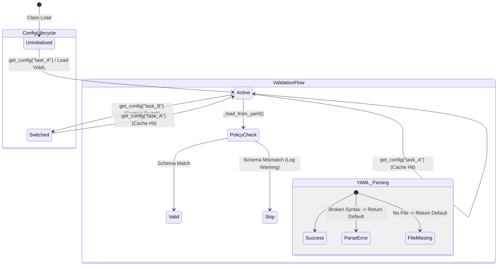

# Config 테스트 명세서

## 1. 문서 정보 및 전략

- **대상 모듈:** `src.common.config.ConfigManager`
- **복잡도 수준:** **중간 (Medium)** (싱글톤 상태 관리, 파일 I/O, Pydantic 검증 혼합)
- **커버리지 목표:** 분기 커버리지 100%, 구문 커버리지 100%
- **적용 전략:**
  - [x] **상태 전이 (State Transition):** `Uninitialized` → `Loaded(Task A)` → `Cached` → `Switched(Task B)` 흐름 검증.
  - [x] **부분 실패 (Partial Failure):** YAML 내 여러 정책 중 일부만 잘못되었을 때, 전체가 실패하지 않고 유효한 정책만 로드되는지 검증.
  - [x] **견고성 (Robustness):** 파일 시스템 에러나 YAML 문법 오류 시 프로그램이 죽지 않고 기본값으로 복구되는지(Graceful Degradation) 검증.
  - [x] **보안 (Security):** `SecretStr` 타입의 환경변수 처리 검증.

## 2. 로직 흐름도

## 3. BDD 테스트 시나리오

**시나리오 요약 (총 15건)**

- **초기화 (Initialization):** 3건 (환경변수 필수값, SecretStr 처리, 기본값)
- **팩토리/캐싱 (Factory & Caching):** 4건 (최초 로딩, 캐시 적중, 컨텍스트 전환, 활성 설정 조회)
- **파일 로딩 (File Loading):** 3건 (파일 부재, 빈 파일, 깨진 YAML)
- **정책 검증 (Policy Validation):** 3건 (정상 파싱, 스키마 불일치 건너뛰기, Provider 타입 오류)
- **예외/상태 (Exception & State):** 2건 (초기화 전 접근, 상태 격리)

|  테스트 ID   | 분류 |  기법  | 전제 조건 (Given)                 | 수행 (When)                          | 검증 (Then)                                                        | 입력 데이터 / 상황     |
| :----------: | :--: | :----: | :-------------------------------- | :----------------------------------- | :----------------------------------------------------------------- | :--------------------- |
| **INIT-01**  | 단위 |  표준  | `.env`에 필수 키(KIS 등) 존재     | `ConfigManager()` 직접 초기화        | 인스턴스 생성 성공 및 환경변수 매핑 확인                           | Env: Valid Keys        |
| **INIT-02**  | 단위 |  BVA   | `.env`에 `KIS_APP_KEY` 누락       | `ConfigManager()` 직접 초기화        | `ValidationError` 발생 (Fail-Fast)                                 | Env: Key Missing       |
| **INIT-03**  | 단위 |  보안  | `KIS_APP_KEY` 값 설정             | 인스턴스 생성 후 `app_key` 조회      | `SecretStr`로 래핑되어 평문 노출 방지 확인                         | Env: Key="Secret"      |
| **FACT-01**  | 통합 |  상태  | 캐시 비어있음, YAML 파일 존재     | `get_config("task_A")` 최초 호출     | 1. 파일 로딩 발생 2. 캐시에 저장 3. `active_task` 설정       | Task: "task_A"         |
| **FACT-02**  | 통합 |  상태  | `task_A` 이미 로드됨              | `get_config("task_A")` 재호출        | **동일한 객체 ID** 반환 (File I/O 없음)                            | Task: "task_A"         |
| **FACT-03**  | 통합 |  상태  | `task_A` 활성 상태                | `get_config("task_B")` 호출          | 1. 새로운 객체 로드 2. `active_task`가 B로 변경됨               | Task: "task_B"         |
| **FACT-04**  | 통합 |  상태  | `task_A` 활성 상태                | `get_config()` (인자 없음) 호출      | `task_A`의 설정 객체 반환                                          | Args: None             |
| **FILE-01**  | 통합 | 견고성 | YAML 파일이 없는 경로             | `get_config("no_file")` 호출         | 에러 없이 기본 설정(Env only) 반환 (로그 출력)                     | File: Missing          |
| **FILE-02**  | 통합 |  BVA   | 내용은 없으나 존재하는 YAML       | `get_config("empty")` 호출           | 에러 없이 기본 설정 반환                                           | File: Empty            |
| **FILE-03**  | 통합 | 견고성 | 문법이 깨진(Broken) YAML          | `get_config("broken")` 호출          | 1. `yaml.YAMLError` 내부 처리 2. 기본 설정 반환 3. 경고 로그 | Content: `key: value:` |
|  **POL-01**  | 단위 |  표준  | 올바른 `JobPolicy` 정의           | `get_config("valid")` 호출           | `extraction_policy` 딕셔너리에 Job ID 매핑됨                       | Policy: Valid          |
|  **POL-02**  | 단위 |  부분  | Job A(정상), Job B(필수값 누락)   | `get_config("partial")` 호출         | 1. Job A는 로드 성공 2. Job B는 스킵 (Warning Log)              | Policy: 1 Valid, 1 Bad |
|  **POL-03**  | 단위 |  BVA   | 지원하지 않는 `Provider` ("TEST") | `get_config("invalid_type")` 호출    | 해당 Job 스킵 (Pydantic Enum 검증)                                 | Provider: "UNKNOWN"    |
|  **ERR-01**  | 예외 |  로직  | 캐시 비어있음 (초기화 전)         | `get_config()` (인자 없음) 호출      | `RuntimeError` 발생 ("Not initialized" 메시지)                     | State: None            |
| **STATE-01** | 단위 |  상태  | 캐시에 데이터 존재                | 테스트 종료 후 `fixture`에 의한 정리 | `ConfigManager._cache`가 비어있는 상태로 복구됨                    | Teardown Logic         |
