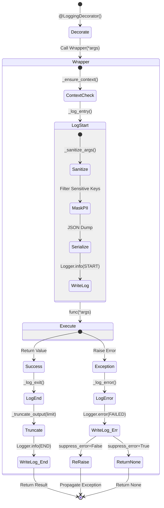

# Logging Decorator 테스트 문서

## 1. 문서 정보 및 전략

- **대상 모듈:** `src.common.decorators.log_decorator.LoggingDecorator`
- **복잡도 수준:** **중 (Medium)** (메타프로그래밍, 비동기 지원, 컨텍스트 관리, 보안 마스킹 포함)
- **커버리지 목표:** 분기 커버리지 100%, 구문 커버리지 100%
- **적용 전략:**
  - [x] **인터페이스 호환성 (Hybrid Support):** 동기(Sync) 및 비동기(Async) 함수 모두에서 데코레이터가 투명하게 동작하는지 검증.
  - [x] **보안 및 규정 준수 (Security & Compliance):** PII(개인식별정보) 마스킹 로직의 정확성과 대소문자 무관 탐지 능력 검증.
  - [x] **경계값 분석 (BVA):** 로그 길이 제한(Truncation) 및 빈 인자 처리 등 데이터 경계 조건 검증.
  - [x] **결함 격리 (Fault Tolerance):** 로깅 과정(직렬화 실패 등)의 오류가 비즈니스 로직을 중단시키지 않음(Fail-Safe)을 검증.
  - [x] **환경 견고성 (Env Robustness):** 필수 의존성(`src.common.log`) 누락 시 Fallback 로직의 동작 검증.

## 2. 로직 흐름도

## 3. BDD 테스트 시나리오

**시나리오 요약 (총 18건):**

1.  **기능 성공 (Happy Path):** 3건 (동기/비동기 정상 동작, None 반환 처리)
2.  **데이터 경계 (Boundary & Type):** 4건 (길이 제한, 빈 인자, 객체 직렬화)
3.  **보안 (Security):** 2건 (PII 마스킹 정확성)
4.  **예외 제어 (Exception Logic):** 4건 (동기/비동기 예외 전파 및 억제)
5.  **상태 및 설정 (State & Config):** 3건 (컨텍스트 유지, 로거 이름 결정)
6.  **환경 (Environment):** 2건 (직렬화 실패 방어, 임포트 복구)

| 테스트 ID  | 분류 |   기법    | 전제 조건 (Given)                   | 수행 (When)                              | 검증 (Then)                                                                   | 입력 데이터 / 상황           |
| :--------: | :--: | :-------: | :---------------------------------- | :--------------------------------------- | :---------------------------------------------------------------------------- | :--------------------------- |
| **TC-001** | 단위 |   표준    | `request_id="system"` (초기)        | **[Sync]** 데코레이터 적용 함수 호출     | 1. Context ID 자동 생성(Injection) 2. Start/End 로그 기록                  | `add(10, 20)`                |
| **TC-002** | 단위 |  비동기   | `request_id="system"` (초기)        | **[Async]** 데코레이터 적용 함수 `await` | 1. 비동기 실행 완료 2. Start/End 로그 기록                                 | `await echo("test")`         |
| **TC-003** | 단위 |   표준    | -                                   | 반환값이 `None`인 함수 호출              | End 로그에 결과값이 문자열 `"None"`으로 기록됨                                | `return None`                |
| **TC-004** | 단위 |    BVA    | `truncate_limit=2000` (기본)        | 짧은 문자열 반환 함수 호출               | 로그에 전체 문자열이 기록됨 (잘림 없음)                                       | `ret="Short"`                |
| **TC-005** | 단위 |    BVA    | `truncate_limit=10`                 | 10자 초과 문자열 반환 함수 호출          | 로그에 `... (truncated)` 문구 포함 및 길이 제한됨                             | `ret="LongString..."`        |
| **TC-006** | 단위 |    BVA    | -                                   | 인자 없이 함수 호출                      | Start 로그의 Params가 빈 JSON `{}`으로 기록됨                                 | `args=()`                    |
| **TC-007** | 보안 |   보안    | `SENSITIVE_KEYS` 설정됨             | `password` 키워드 인자 전달              | 로그에 실제 값 대신 `***** (MASKED)` 기록                                     | `kwargs={"password": "x"}`   |
| **TC-008** | 보안 |   보안    | -                                   | 대소문자 혼합(`PaSsWoRd`) 인자 전달      | 대소문자 무시하고 마스킹 처리됨                                               | `kwargs={"PaSsWoRd": "x"}`   |
| **TC-009** | 단위 |   타입    | `__str__` 정의된 복합 객체          | 객체를 인자로 전달하여 호출              | `str()` 변환을 통해 객체 정보가 로그에 남음                                   | `args=(ComplexObj)`          |
| **TC-010** | 예외 |  견고성   | `json.dumps`가 에러 발생하도록 설정 | 함수 호출 (Start 로그 시점)              | 1. 함수 실행 중단 없음 (Fail-Safe) 2. 로그에 `(Serialization Failed)` 기록 | Mock `json.dumps` Fail       |
| **TC-011** | 예외 | **MC/DC** | **[Sync]** `suppress_error=False`   | 예외 발생 함수 호출                      | 1. Error 로그(Stack Trace 포함) 기록 2. 예외가 상위로 전파(Re-raise)됨     | `raise ValueError`           |
| **TC-012** | 예외 | **MC/DC** | **[Sync]** `suppress_error=True`    | 예외 발생 함수 호출                      | 1. Error 로그 기록 2. 예외 억제되고 `None` 반환                            | `raise ValueError`           |
| **TC-013** | 예외 | **MC/DC** | **[Async]** `suppress_error=False`  | 예외 발생 비동기 함수 `await`            | 1. Error 로그 기록 2. 예외가 상위로 전파됨                                 | `raise RuntimeError`         |
| **TC-014** | 예외 | **MC/DC** | **[Async]** `suppress_error=True`   | 예외 발생 비동기 함수 `await`            | 1. Error 로그 기록 2. 예외 억제되고 `None` 반환                            | `raise RuntimeError`         |
| **TC-015** | 상태 |  멱등성   | Context ID가 이미 존재함            | 데코레이터 적용 함수 호출                | 기존 Context ID 유지 (새로 생성하지 않음)                                     | `ctx="existing-id"`          |
| **TC-016** | 설정 |   설정    | `logger_name="custom"` 지정         | 함수 호출                                | 지정된 이름("custom")으로 로거 인스턴스 생성                                  | `LoggingDecorator("custom")` |
| **TC-017** | 설정 |   설정    | `logger_name` 미지정                | 함수 호출                                | 함수의 모듈 경로(`func.__module__`)를 로거 이름으로 사용                      | `LoggingDecorator()`         |
| **TC-018** | 환경 |  견고성   | `src.common.log` 임포트 실패 상황   | 모듈 임포트 시도                         | 1. `ImportError` Catch 2. `sys.path` 수정 후 재시도하여 로드 성공          | Mock `builtins.__import__`   |
