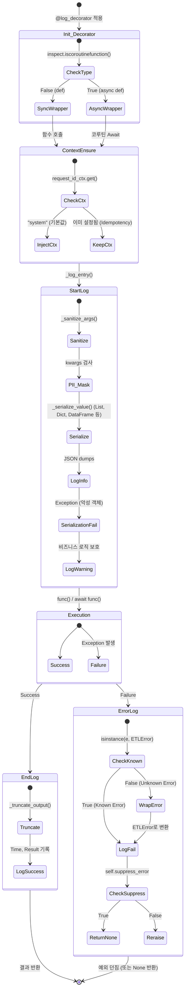

# Logging Decorator 테스트 문서

## 1. 문서 정보 및 전략

- **대상 모듈:** `src.common.log_decorator.LoggingDecorator`
- **복잡도 수준:** **높음 (High)** (동기/비동기 혼합 지원, 재귀적 객체 검사, 컨텍스트 스레드 안전성)
- **커버리지 목표:** **분기 커버리지(Branch Coverage) 100%**, 구문 커버리지 100%
- **적용 전략:**
  - **다형성 검증 (Polymorphism):** `inspect.iscoroutinefunction` 분기를 통한 Sync/Async 래퍼의 동작 일관성 보장.
  - **보안/PII (Security):** `SENSITIVE_KEYS` 기반의 인자 마스킹(Masking) 로직 누락 방지.
  - **결함 격리 (Fault Tolerance):** 직렬화 실패(`Serialization Failed`) 시 로깅 로직이 비즈니스 로직을 중단시키지 않도록 격리.
  - **예외 매핑 및 정책 (Exception Policy):** `ETLError` 래핑과 `suppress_error` 플래그에 따른 에러 전파 제어 분기 검증 (MC/DC).
  - **멱등성 (Idempotency):** `request_id_ctx`의 상태를 기반으로 한 컨텍스트 주입의 멱등성 보장.

## 2. 로직 흐름도

## 3. BDD 테스트 시나리오

**시나리오 요약 (총 16건):**

1. **정상 흐름 (Success):** 2건 (동기, 비동기)
2. **보안 및 견고성 (Security & Robustness):** 2건 (PII 마스킹, 직렬화 실패)
3. **경계값 및 데이터 검증 (Boundary/Data):** 6건 (반환값 길이, 컨테이너/문자열 파라미터 한계 초과/이하, DataFrame 구조)
4. **예외 및 정책 제어 (Exception Control):** 4건 (동기/비동기별 Unknown 래핑, Known 유지)
5. **에러 억제 (Suppress Error):** 2건 (동기/비동기 에러 억제)
6. **상태 제어 (Context State):** 2건 (컨텍스트 주입 및 유지)

|   테스트 ID   |  분류  | 기법  | 전제 조건 (Given)                                         | 수행 (When)  | 검증 (Then)                                                           |
| :-----------: | :----: | :---: | :-------------------------------------------------------- | :----------- | :-------------------------------------------------------------------- |
|  **SYNC-01**  |  기능  | 표준  | 데코레이터가 적용된 일반 동기 함수가 주어짐               | 함수 호출    | START/END 로그 출력 및 원본 반환값 유지                               |
| **ASYNC-01**  |  기능  | 표준  | 데코레이터가 적용된 비동기(async) 함수가 주어짐           | `await` 호출 | START/END 로그 출력 및 원본 반환값 유지                               |
|  **SEC-01**   |  보안  |  BVA  | `access_key`, `token` 등의 키를 포함한 `kwargs` 인자 전달 | 함수 호출    | 해당 키의 값이 `***** (MASKED)`로 대체됨                              |
| **ROBUST-01** | 견고성 | 예외  | `__str__` 호출 시 에러가 발생하는 손상된 객체 전달        | 함수 호출    | 앱 크래시 없이 `(Serialization Failed)` Warning 로깅                  |
|  **BVA-01**   | 데이터 |  BVA  | 반환값이 `truncate_limit`를 초과하는 함수                 | 함수 호출    | END 로그의 Result가 지정된 길이까지만 기록되고 `(truncated)` 표시됨   |
|  **BVA-02**   | 데이터 |  BVA  | 문자열 변환 시 50자를 초과하는 컨테이너(List) 인자 전달   | 함수 호출    | START 로그에 `[list len=...]`과 함께 일부만 잘려서(`...`) 기록됨      |
|  **BVA-03**   | 데이터 |  BVA  | 문자열 변환 시 50자 이하인 컨테이너(List) 인자 전달       | 함수 호출    | START 로그에 `...` 생략 기호 없이 전체 요소가 온전히 기록됨           |
|  **BVA-04**   | 데이터 |  BVA  | 100자를 초과하는 스칼라 String 인자 전달                  | 함수 호출    | START 로그에 지정된 길이까지만 잘리고 `(truncated, total=...)` 표시됨 |
|  **BVA-05**   | 데이터 | 구조  | `Pandas DataFrame` (또는 Duck Typing 매칭 객체) 인자/반환 | 함수 호출    | 직렬화 대신 `[DataFrame shape=(...)]` 형태로 요약 기록됨              |
|  **ERR-01**   |  예외  | MC/DC | [동기] 실행 중 일반 `ValueError` (Unknown) 발생           | 함수 호출    | `ETLError`로 래핑되어 FAILED 로깅 후 Re-raise                         |
|  **ERR-02**   |  예외  | MC/DC | [동기] 실행 중 도메인 정의 `ETLError` (Known) 발생        | 함수 호출    | 중복 래핑 없이 FAILED 로깅 후 원본 그대로 Re-raise                    |
|  **ERR-03**   |  억제  | MC/DC | [동기] `suppress_error=True` 인 상태에서 예외 발생        | 함수 호출    | 예외가 외부로 던져지지 않고 로깅 후 `None` 반환                       |
|  **ERR-04**   |  예외  | MC/DC | [비동기] 코루틴 실행 중 `ValueError` (Unknown) 발생       | `await` 호출 | `ETLError`로 래핑되어 FAILED 로깅 후 Re-raise                         |
|  **ERR-05**   |  예외  | MC/DC | [비동기] 코루틴 실행 중 `ETLError` (Known) 발생           | `await` 호출 | 중복 래핑 없이 FAILED 로깅 후 원본 그대로 Re-raise                    |
|  **ERR-06**   |  억제  | MC/DC | [비동기] `suppress_error=True` 인 상태에서 예외 발생      | `await` 호출 | 예외가 외부로 던져지지 않고 로깅 후 `None` 반환                       |
|  **CTX-01**   |  상태  | 전이  | 현재 Context(Request ID)가 초기값(`"system"`)인 상태      | 함수 호출    | `LogManager.set_context()` 호출을 통해 신규 UUID 생성                 |
|  **CTX-02**   |  상태  | 전이  | 현재 Context가 상위 호출자에 의해 이미 설정된 상태        | 함수 호출    | 멱등성 보장 (기존 UUID 유지, 생성 함수 호출 안 됨)                    |
