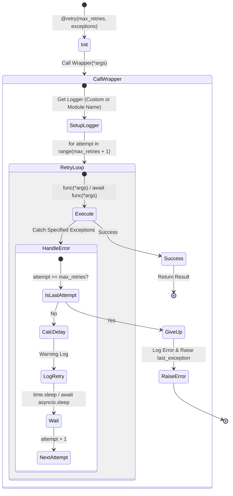

# Rate Limit Decorator 테스트 문서

## 1. 문서 정보 및 전략

- **대상 모듈:** `src.common.decorators.RetryDecorator`
- **복잡도 수준:** **상 (High)** (지수 백오프 계산, 비동기 루프 제어, 예외 선택적 처리, 모듈 리로드 대응)
- **커버리지 목표:** **분기 커버리지 100%**, 구문 커버리지 100%
- **적용 전략:**
  - [x] **탄력성 검증 (Resilience):** 일시적 오류 발생 시 정의된 지수 백오프(Exponential Backoff) 전략에 따라 정상 복구되는지 검증.
  - [x] **지터 적용 (Jittering):** Thundering Herd 현상 방지를 위해 대기 시간에 무작위성(Jitter)이 올바르게 가산되는지 검증.
  - [x] **예외 필터링 (Selective Retry):** 특정 예외 타입에 대해서만 재시도가 트리거되고, 그 외의 예외는 즉시 전파되는지 검증.
  - [x] **루프 건너뛰기 (Loop Skipping):** `max_retries` 설정이 음수일 때 루프를 타지 않고 비정상 종료되는 경계 조건 검증.
  - [x] **참조 무결성 (Import Fallback):** `src.common.log` 누락 시의 복구 로직 및 모듈 재로딩 후의 클래스 참조 일관성 검증.

# 2. 로직 흐름도

## 3. BDD 테스트 시나리오

**시나리오 요약 (총 22건):**

1.  **기능 성공 (Happy Path):** 4건 (동기/비동기 즉시 성공 및 재시도 후 복구)
2.  **경계값 분석 (Boundary):** 3건 (재시도 0회, 최대 지연 제한, 백오프 공식 검증)
3.  **데이터 및 타입 (Type Safety):** 3건 (인자 전달, 반환값 보존, 기본 설정값)
4.  **예외 제어 (Logical Exceptions):** 4건 (재시도 소진, 특정 예외 선택/불일치, 다중 예외 처리)
5.  **상태 및 로깅 (State & Log):** 3건 (지터 무작위성, 재시도/포기 로그 출력)
6.  **커버리지 특화 (Branch Coverage):** 5건 (비동기 소진 분기, 기본 로거 이름, 임포트 폴백, 커스텀 로거 이름, 루프 스킵)

| 테스트 ID  | 분류 |  기법  | 전제 조건 (Given)       | 수행 (When)                    | 검증 (Then)                                                | 입력 데이터 / 상황           |
| :--------: | :--: | :----: | :---------------------- | :----------------------------- | :--------------------------------------------------------- | :--------------------------- |
| **TC-001** | 단위 |  표준  | `max_retries=3`         | **[Sync]** 첫 시도 성공        | 재시도 없이 결과 즉시 반환                                 | `return "Success"`           |
| **TC-002** | 단위 | 비동기 | `max_retries=3`         | **[Async]** 첫 시도 성공       | `await` 정상 처리 및 결과 반환                             | `await async_echo()`         |
| **TC-003** | 단위 |  복구  | 2회 실패 시뮬레이션     | **[Sync]** 함수 호출           | 1. 2회 실패 후 3회차 성공 2. `time.sleep` 2회 호출 확인 | `side_effect=[Err, Err, OK]` |
| **TC-004** | 단위 |  복구  | 1회 실패 시뮬레이션     | **[Async]** 함수 `await`       | 1. `asyncio.sleep` 1회 호출 2. 비동기 복구 성공 확인    | `side_effect=[Err, OK]`      |
| **TC-005** | 단위 |  BVA   | `max_retries=0`         | 실패 함수 호출                 | 재시도 없이 즉시 예외 발생 확인                            | `max_retries=0`              |
| **TC-006** | 단위 |  BVA   | `max_delay=0.5`         | 지수 백오프 계산 유도          | 계산된 대기 시간이 상한선(0.5s)을 넘지 않음                | `attempt=10`                 |
| **TC-007** | 단위 |  BVA   | `jitter=False`          | 백오프 계산 (1, 2, 3회차)      | 공식(`base * factor^(att-1)`)에 따른 정확한 값 확인        | `1.0, 2.0, 4.0`              |
| **TC-008** | 단위 |  표준  | -                       | 인자(`*args`, `**kwargs`) 전달 | 원본 함수로 인자가 손실 없이 전달됨 확인                   | `(1, "B", key="v")`          |
| **TC-009** | 단위 |  표준  | 복잡한 객체 반환        | 함수 호출                      | 반환값(None 또는 객체)이 그대로 보존됨                     | `complex_obj`                |
| **TC-010** | 단위 |  표준  | 인자 미지정 초기화      | 데코레이터 생성                | 기본값(`max_retries=3` 등) 적용 확인                       | `Default Config`             |
| **TC-011** | 예외 | MC/DC  | `max_retries=2`         | **[Sync]** 모든 시도 실패      | 1. 총 3회 실행 2. 마지막 예외가 호출자에게 전파         | `raise RuntimeError`         |
| **TC-012** | 예외 |  필터  | `exceptions=ValueError` | `ValueError` 발생              | 지정된 예외이므로 재시도 수행 확인                         | `raise ValueError`           |
| **TC-013** | 예외 |  필터  | `exceptions=ValueError` | `KeyError` 발생                | 재시도 없이 **즉시 예외 전파**                             | `raise KeyError`             |
| **TC-014** | 예외 |  필터  | 다중 예외 지정          | 지정된 예외 중 하나 발생       | Tuple로 지정된 여러 예외에 대해 재시도 작동                | `(ValueError, KeyError)`     |
| **TC-015** | 상태 | 무작위 | `jitter=True`           | 대기 시간 2회 계산             | 동일 시도 차수에서도 두 대기 시간이 서로 다름              | `attempt=1`                  |
| **TC-016** | 상태 |  로깅  | 재시도 상황 발생        | 함수 호출                      | `RETRY` 문구가 포함된 Warning 로그 기록                    | `Warning Log`                |
| **TC-017** | 상태 |  로깅  | 모든 재시도 실패        | 함수 호출                      | `GAVE UP` 문구가 포함된 Error 로그 기록                    | `Error Log`                  |
| **TC-018** | 예외 | MC/DC  | `max_retries=2`         | **[Async]** 모든 시도 실패     | 1. `GAVE UP` 로그 기록 2. 마지막 예외 비동기 전파       | `raise RuntimeError`         |
| **TC-019** | 설정 |  분기  | `logger_name` 미지정    | 함수 호출                      | 함수의 모듈명(`__module__`)을 로거 이름으로 사용           | `Default Logger`             |
| **TC-020** | 환경 |  폴백  | 모듈 임포트 실패 유도   | 모듈 최초 로드 시도            | 1. `ImportError` 처리 2. `sys.path` 수정 후 재로드 성공 | Mock `__import__`            |
| **TC-021** | 설정 |  분기  | `logger_name="Custom"`  | 데코레이터 초기화 및 실행      | 함수 모듈명이 아닌 지정된 이름으로 로거 생성               | `logger_name="Custom"`       |
| **TC-022** | 경계 |  분기  | `max_retries=-1`        | 함수 호출 (Sync/Async)         | 루프 미진입으로 인한 `TypeError` 발생 확인                 | `max_retries=-1`             |
