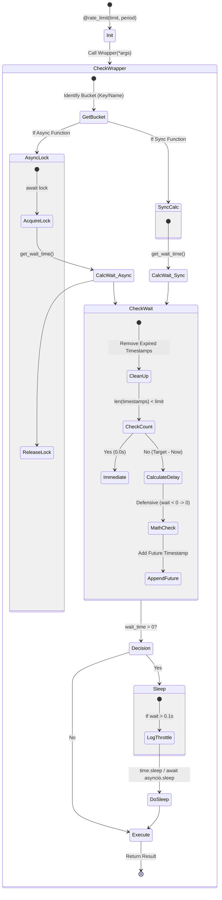

# Retry Decorator 테스트 문서

## 1. 문서 정보 및 전략

- **대상 모듈:** `src.common.decorators.RateLimitDecorator`
- **복잡도 수준:** **상 (High)** (전역 상태 관리, 시간 제어, 비동기 락/동시성 제어, 토큰 버킷 알고리즘)
- **커버리지 목표:** 분기 커버리지 100%, 구문 커버리지 100%
- **적용 전략:**
  - [x] **트래픽 제어 검증 (Traffic Shaping):** 제한된 횟수(Limit)와 기간(Period) 내에서 정확히 스로틀링(Throttling)이 발생하는지 검증.
  - [x] **상태 격리 및 공유 (State Isolation & Sharing):** 함수별 독립 버킷 생성과 `bucket_key`를 통한 제한 공유 기능을 검증.
  - [x] **동시성 제어 (Concurrency Safety):** 비동기(`asyncio`) 환경에서의 경쟁 조건(Race Condition) 방지와 동기 멀티스레드 안전성 검증.
  - [x] **방어적 코딩 (Defensive Programming):** 시간 역행, 부동소수점 오차로 인한 음수 대기 시간, 외부 의존성(`LogManager`) 누락에 대한 방어 로직 검증.
  - [x] **자원 관리 (Resource Management):** 오래된 타임스탬프의 자동 정리(Cleanup) 및 메모리 누수 방지 로직 검증.

## 2. 로직 흐름도

## 3. BDD 테스트 시나리오

**시나리오 요약 (총 15건):**

1.  **기능 성공 (Happy Path):** 2건 (동기/비동기 제한 내 호출 성공)
2.  **스로틀링 로직 (Throttling Logic):** 2건 (제한 초과 시 대기 시간 계산 및 지연 수행)
3.  **경계값 분석 (Boundary Analysis):** 2건 (정확한 Limit 경계, Period 만료 시점)
4.  **버킷 상태 관리 (Bucket Logic):** 3건 (독립 버킷, 공유 버킷, 계산 방어 로직)
5.  **자원 및 예외 (Resource & Exception):** 2건 (타임스탬프 정리, 의존성 누락 방어)
6.  **로깅 및 통합 (Logging & Integration):** 2건 (로그 출력 조건, 임계값)
7.  **동시성 (Concurrency):** 2건 (비동기 Race Condition, 스레드 안전성)

| 테스트 ID  | 분류 |    기법    | 전제 조건 (Given)                     | 수행 (When)                              | 검증 (Then)                                                                       | 입력 데이터 / 상황     |
| :--------: | :--: | :--------: | :------------------------------------ | :--------------------------------------- | :-------------------------------------------------------------------------------- | :--------------------- |
| **TC-001** | 단위 |    표준    | `limit=5`, `period=1.0`               | **[Sync]** 5회 연속 호출                 | 1. 모든 호출 즉시 성공 2. 총 소요시간 < 0.1s (대기 없음)                       | Loop 5 times           |
| **TC-002** | 단위 |   비동기   | `limit=5`, `period=1.0`               | **[Async]** 5회 연속 `await` 호출        | 모든 호출 즉시 성공 및 결과 반환                                                  | Loop 5 times           |
| **TC-003** | 단위 |   MC/DC    | `limit=1`, 1회 호출 완료              | **[Sync]** `period` 내에 재호출          | 1. `time.sleep` 호출됨 2. 대기 시간 = `잔여 period` (정확도 검증)              | Mock `time.time`       |
| **TC-004** | 단위 |   MC/DC    | `limit=1`, 1회 호출 완료              | **[Async]** `period` 내에 재호출         | 1. `asyncio.sleep` 호출됨 2. 대기 시간 = `잔여 period`                         | Mock `time.time`       |
| **TC-005** | 단위 |    BVA     | `limit=5`                             | 6회 연속 호출 (경계값 초과)              | 1~5회는 대기 없음, **6회째** 호출에서만 스로틀링(Sleep) 발생                      | Loop 6 times           |
| **TC-006** | 단위 |    BVA     | `limit=1`, 호출 후 `period` 경과      | 함수 재호출                              | 기간이 만료되었으므로 버킷이 초기화되어 **대기 없이** 즉시 실행됨                 | Time += 2.0s           |
| **TC-007** | 상태 |    격리    | `limit=1`, 서로 다른 함수 A, B        | A 호출 후 즉시 B 호출                    | `bucket_key`가 다르므로 B는 A의 호출에 영향받지 않고 즉시 실행됨                  | `func_a()`, `func_b()` |
| **TC-008** | 상태 |    공유    | `limit=1`, `bucket_key="SHARED"` 설정 | A 호출 후 즉시 B 호출                    | 같은 키를 공유하므로 B 호출 시 스로틀링 발생                                      | `key="API_KEY_1"`      |
| **TC-009** | 단위 |    방어    | 시스템 시간 오류 등 가정              | 계산된 대기 시간이 음수가 되는 상황 유도 | 대기 시간이 0.0s로 보정되어 `sleep`이 호출되지 않음 (Crash 방지)                  | Mock Time Skew         |
| **TC-010** | 자원 |    자원    | 5회 호출 기록 존재                    | 시간 경과 후 함수 호출                   | 오래된 타임스탬프가 `deque`에서 제거(Cleanup)되어 메모리 누수 방지 확인           | Time += Period         |
| **TC-011** | 예외 |   견고성   | `LogManager` 모듈 임포트 실패 상황    | 스로틀링이 발생하는 상황 연출            | 로깅 시도 시 `ImportError`나 `AttributeError` 없이 함수가 정상 실행됨 (Fail-Safe) | Mock `LogManager=None` |
| **TC-012** | 통합 |    통합    | `LogManager` 정상 동작                | 스로틀링 발생 시점                       | "Throttling active" 및 대기 시간이 포함된 Debug 로그 기록                         | Wait > 0.1s            |
| **TC-013** | 통합 |    BVA     | `limit=1`                             | 대기 시간이 매우 짧은(0.05s) 상황 연출   | Sleep은 수행하되, 로그 부하 방지를 위해 **로그는 기록되지 않음**                  | Wait = 0.05s           |
| **TC-014** | 통합 | **동시성** | `limit=5`, **[Async]** 10개 동시 요청 | `asyncio.gather`로 동시 실행             | `asyncio.Lock`에 의해 Race Condition 없이 타임스탬프가 정확히 10개 기록됨         | 10 Tasks Concurrently  |
| **TC-015** | 통합 |   동시성   | `limit=50`, **[Sync]** 100개 스레드   | `ThreadPoolExecutor`로 동시 호출         | 스레드 환경에서도 데코레이터 내부 상태가 깨지지 않고 버킷 기록이 수행됨           | 100 Threads            |
