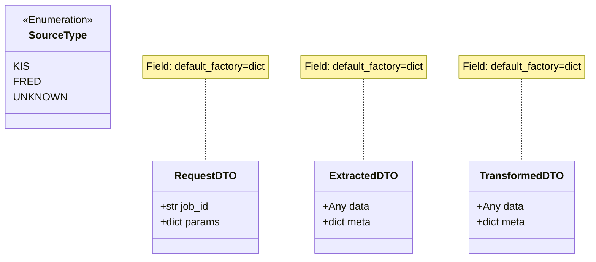

# DTO 테스트 문서

## 1. 문서 정보 및 전략

- **대상 모듈:** `src.common.dtos` (SourceType, RequestDTO, ExtractedDTO, TransformedDTO)
- **복잡도 수준:** **하 (Low)** (데이터 정의 및 컨테이너 역할, 복잡한 비즈니스 로직 없음)
- **커버리지 목표:** 분기 커버리지 100%, 구문 커버리지 100%
- **적용 전략:**
  - [x] **상태 검증 (State Verification):** 객체 생성 후 필드 값이 예상대로 매핑되는지 확인.
  - [x] **불변성/독립성 검증 (Immutability/Independence):** Python의 `mutable default argument` 함정을 피하기 위해 `default_factory`가 올바르게 적용되었는지 검증 (TC-009).
  - [x] **직렬화 가능성 (Serialization):** `asdict`를 통한 딕셔너리 변환 호환성 검증.
  - [x] **타입 정합성 (Type Integrity):** `dataclass` 데코레이터 적용 여부 및 Enum 값 일치 확인.

## 2. 로직 흐름도

## 3. BDD 테스트 시나리오

**시나리오 요약 (9건):**

- **구조 검증 (Structure):** 2건 (Dataclass 속성 및 Enum 값 확인)
- **초기화 로직 (Initialization):** 2건 (RequestDTO 필수값 및 기본값 처리)
- **데이터 핸들링 (Data Handling):** 3건 (Extracted/Transformed DTO의 데이터 저장 및 Null 처리)
- **견고성 및 유틸리티 (Robustness):** 2건 (직렬화 및 인스턴스 간 메모리 독립성 보장)

| 테스트 ID  | 분류 |  기법  | 전제 조건 (Given)              | 수행 (When)                       | 검증 (Then)                                                    | 입력 데이터                             |
| :--------: | :--: | :----: | :----------------------------- | :-------------------------------- | :------------------------------------------------------------- | :-------------------------------------- |
| **TC-001** | 단위 |  구조  | `src.common.dtos` 모듈 로드    | `is_dataclass()` 함수로 DTO 검사  | 모든 DTO 객체가 `@dataclass` 속성을 보유함                     | `RequestDTO`, `ExtractedDTO` 등         |
| **TC-002** | 단위 |  구조  | `SourceType` Enum 정의         | Enum 멤버 값 접근                 | 정의된 상수값(`KIS`, `FRED` 등)과 실제 문자열 값이 일치함      | `SourceType.KIS`                        |
| **TC-003** | 단위 | 초기화 | 유효한 작업 ID와 파라미터      | `RequestDTO(job_id, params)` 생성 | 인스턴스 필드에 입력값이 정확히 매핑됨                         | `job_id="TASK_1"`, `params={...}`       |
| **TC-004** | 단위 | 기본값 | `params` 없이 초기화           | `RequestDTO(job_id)` 생성         | `params` 필드가 빈 딕셔너리(`{}`)로 자동 초기화됨              | `job_id="MINIMAL"`                      |
| **TC-005** | 단위 |  상태  | 원본 데이터와 메타데이터       | `ExtractedDTO(data, meta)` 생성   | `data`와 `meta` 필드에 원본 객체가 그대로 저장됨               | `raw={"p": 100}`, `meta={"src": "KIS"}` |
| **TC-006** | 단위 | 경계값 | 인자 없이 초기화               | `ExtractedDTO()` 생성             | `data`는 `None`, `meta`는 빈 딕셔너리로 안전하게 생성됨        | `None`                                  |
| **TC-007** | 단위 |  상태  | 정제된 리스트 데이터           | `TransformedDTO(data, meta)` 생성 | 정제된 데이터 리스트가 손상 없이 저장됨                        | `clean=[10.5, 11.0]`                    |
| **TC-008** | 단위 | 호환성 | 데이터가 채워진 DTO 인스턴스   | `dataclasses.asdict(dto)` 호출    | 표준 Python Dictionary 형태로 완벽하게 변환됨                  | `ExtractedDTO(...)`                     |
| **TC-009** | 단위 | 견고성 | 두 개의 서로 다른 DTO 인스턴스 | 한 인스턴스의 `dict` 필드 수정    | **다른 인스턴스에는 영향을 주지 않음** (메모리 주소 분리 확인) | `inst_a.params["k"] = "v"`              |
