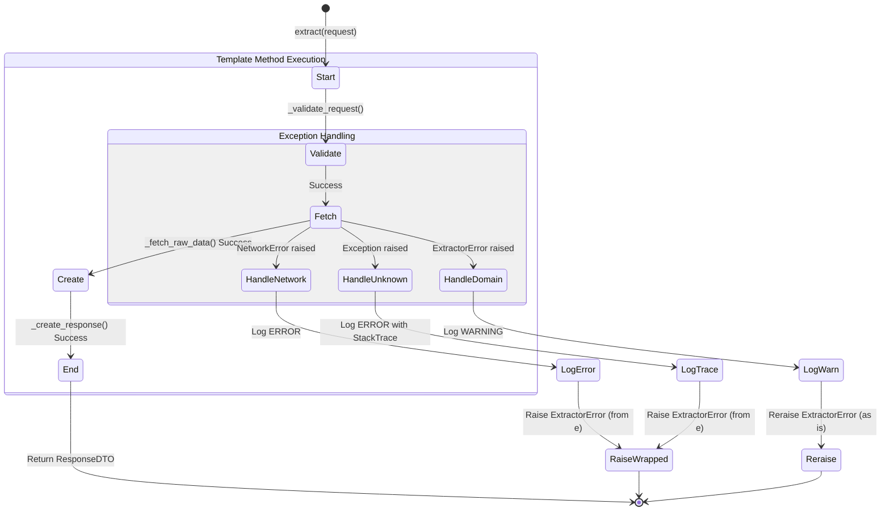

# AbstractExtractor 테스트 명세서

## 1. 문서 정보 및 전략

- **대상 모듈:** `extractor.providers.AbstractExtractor`
- **복잡도 수준:** **높음 (High)** (모든 수집기의 기반이 되는 템플릿 메서드 및 에러 처리 표준 정의)
- **커버리지 목표:** 분기 커버리지 100%, 구문 커버리지 100%
- **적용 전략:**
  - [x] **상태 전이 (State Transition):** 템플릿 메서드의 실행 순서(Validate -> Fetch -> Create) 검증.
  - [x] **결함 주입 (Fault Injection):** NetworkError, ExtractorError, Unhandled Exception 등 다양한 에러 상황 시뮬레이션.
  - [x] **Stubbing & Mocking:** 추상 클래스 테스트를 위한 구현체(Stub) 정의 및 로거/Config 모의 객체 사용.
  - [x] **Null Safety:** 요청 객체 누락 등 방어 코드 검증.

## 2. 로직 흐름도

## 3. BDD 테스트 시나리오 (전체 목록)

**시나리오 요약:**

- **초기화 (Initialization):** 2건 (설정 주입 방어, 요청 객체 방어)
- **정상 흐름 (Happy Path):** 1건 (템플릿 메서드 순서)
- **흐름 제어 (Flow Control):** 2건 (검증 실패 시 중단, 상태 비저장성)
- **에러 핸들링 (Error Handling):** 3건 (네트워크, 도메인, 미확인 에러)
- **데이터 검증 (Data Verification):** 1건 (DTO 포장)
- **로깅 (Logging):** 1건 (정상 로그 기록)

|  테스트 ID  | 분류 |   기법   | 전제 조건 (Given)                      | 수행 (When)                                | 검증 (Then)                                                                          | 입력 데이터 / 상황          |
| :---------: | :--: | :------: | :------------------------------------- | :----------------------------------------- | :----------------------------------------------------------------------------------- | :-------------------------- |
| **INIT-01** | 단위 |   BVA    | `config` 객체가 `None`인 상태          | `StubExtractor(client, None)` 초기화       | `ExtractorError` 발생 (메시지: "ConfigManager cannot be None")                       | `config=None`               |
| **INIT-02** | 단위 |   보안   | `extract(None)` 호출 (요청 객체 누락)  | `extract(None)` 실행                       | 1. 로깅 시 job_id="Unknown" 처리 (Crash 없음) 2. `_validate`에서 에러 발생        | `request=None`              |
| **FLOW-01** | 단위 |   상태   | 모든 단계가 성공하는 `StubExtractor`   | `extract(request)` 호출                    | 1. `_validate` -> `_fetch` -> `_create` 순서 호출 확인 2. 최종 `ResponseDTO` 반환 | `request=RequestDTO(...)`   |
| **FLOW-02** | 단위 |   상태   | `_validate`에서 에러 발생하도록 설정   | `extract(request)` 호출                    | 1. `_validate` 호출됨 2. **`_fetch`는 호출되지 않음** (흐름 중단 확인)            | Stub: `validate` raises Err |
| **FLOW-03** | 단위 |   상태   | 하나의 인스턴스 재사용                 | `extract(req1)`, `extract(req2)` 연속 호출 | 두 호출이 독립적으로 성공하며, 내부 상태(맴버 변수)가 공유/오염되지 않음             | `req1`, `req2`              |
| **ERR-01**  | 예외 | 결함주입 | `_fetch` 중 `NetworkError` 발생        | `extract(request)` 호출                    | 1. `ExtractorError`로 래핑되어 발생 2. 로그 레벨 **ERROR** 기록                   | Raise `NetworkError`        |
| **ERR-02**  | 예외 | 결함주입 | `_fetch` 중 `ExtractorError` 발생      | `extract(request)` 호출                    | 1. 원본 `ExtractorError` 그대로 발생 (래핑 X) 2. 로그 레벨 **WARNING** 기록       | Raise `ExtractorError`      |
| **ERR-03**  | 예외 |  견고성  | `_fetch` 중 알 수 없는 `KeyError` 발생 | `extract(request)` 호출                    | 1. `ExtractorError`로 래핑되어 발생 2. 로그에 **Stack Trace** 포함 확인           | Raise `KeyError`            |
| **DATA-01** | 단위 |   표준   | `_create` 단계 정상 수행               | `extract(request)` 결과 확인               | 반환된 객체가 `ResponseDTO` 타입이며, Stub 데이터가 올바르게 매핑됨                  | Stub Return Data            |
| **LOG-01**  | 단위 |   표준   | 정상 흐름 실행                         | `extract(request)` 완료 후 로그 검사       | "Starting..." 및 "Completed..." 로그가 **INFO** 레벨로 기록됨                        | `job_id="test_job"`         |
