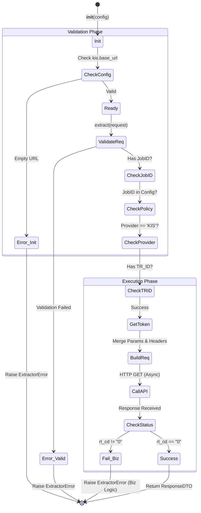

# KIS Extractor 테스트 명세서

## 1. 문서 정보 및 전략

- **대상 모듈:** `extractor.kis_extractor.KISExtractor`
- **복잡도 수준:** **최상 (Critical)** (외부 금융 API 연동 및 민감 정보 처리)
- **커버리지 목표:** 분기 커버리지 100%, 구문 커버리지 100%
- **적용 전략:**
  - [x] **MC/DC (수정 조건/결정 커버리지):** `_validate_request` 내 다중 검증 조건(Job ID, Policy, Provider, TR_ID)의 독립적 결함 유발 검증.
  - [x] **Fail-Fast (조기 실패):** 설정 오류나 필수 파라미터 누락 시 즉각적인 예외 발생 여부 검증.
  - [x] **Mocking & Stubbing:** `IHttpClient`, `IAuthStrategy`, `AppConfig`의 완벽한 제어를 통한 외부 의존성 격리.
  - [x] **Data Integrity:** 파라미터 병합 우선순위 및 응답 코드(`rt_cd`) 기반의 무결성 검증.

## 2. 로직 흐름도



## 3. BDD 테스트 시나리오 (전체 목록)

**시나리오 요약:**

- **초기화 (Initialization):** 1건 (설정 검증)
- **요청 검증 (Validation):** 4건 (MC/DC 적용 - JobID, Policy, Provider, TR_ID)
- **정상 흐름 (Functional):** 3건 (E2E, 파라미터 병합, URL 구성)
- **보안 (Security):** 2건 (헤더 내 평문 키/토큰 주입 확인)
- **데이터 안정성 (Robustness):** 2건 (비즈니스 응답 코드 검증)
- **예외 및 데코레이터 (Exception):** 2건 (래핑 로직, 재시도/제한 적용)

|  테스트 ID  | 분류 |  기법  | 전제 조건 (Given)                       | 수행 (When)                          | 검증 (Then)                                                        | 입력 데이터 / 상황                |
| :---------: | :--: | :----: | :-------------------------------------- | :----------------------------------- | :----------------------------------------------------------------- | :-------------------------------- |
| **INIT-01** | 단위 |  BVA   | `kis.base_url`이 비어있는 설정 객체     | `KISExtractor(config)` 초기화        | `ExtractorError` 발생 (Critical Config Error)                      | `base_url=""`                     |
| **REQ-01**  | 단위 | MC/DC  | `job_id`가 없는 요청 객체               | `extract(request)` 호출              | `ExtractorError` 발생 (Invalid Request)                            | `job_id=None`                     |
| **REQ-02**  | 단위 | MC/DC  | 설정 파일에 정의되지 않은 `job_id` 요청 | `extract(request)` 호출              | `ExtractorError` 발생 (Policy not found)                           | `job_id="UNKNOWN"`                |
| **REQ-03**  | 단위 | MC/DC  | Provider가 'FRED'로 설정된 정책 요청    | `extract(request)` 호출              | `ExtractorError` 발생 (Provider Mismatch)                          | `provider="FRED"`                 |
| **REQ-04**  | 단위 | MC/DC  | 정책에 필수 필드 `tr_id`가 누락됨       | `extract(request)` 호출              | `ExtractorError` 발생 (Missing tr_id)                              | `tr_id=None`                      |
| **FLOW-01** | 단위 |  표준  | 유효한 설정, 정책, 토큰, 정상 응답      | `extract(request)` 호출              | 1. API 호출 성공<br>2. `ResponseDTO` 반환<br>3. `job_id` 일치 확인 | `params={"a": 1}`                 |
| **FLOW-02** | 단위 |  BVA   | 정책 파라미터와 요청 파라미터 중복      | `extract(request)` 호출              | **요청 파라미터가 우선순위**를 가져 정책값을 덮어씀                | Policy:`{p:1}`, Req:`{p:2}`       |
| **FLOW-03** | 단위 |  표준  | `base_url`과 `path`가 설정됨            | `_fetch_raw_data` 내부 호출 URL 확인 | 두 문자열이 결합된 **완전한 URL**로 호출됨                         | `url="host/path"`                 |
| **SEC-01**  | 단위 |  보안  | `SecretStr` 타입의 앱 키/시크릿         | `_fetch_raw_data` 헤더 검사          | 헤더에는 `get_secret_value()`로 복호화된 **평문**이 주입됨         | `headers["appkey"]`               |
| **SEC-02**  | 단위 |  보안  | `AuthStrategy`가 유효 토큰 반환         | `_fetch_raw_data` 헤더 검사          | `authorization` 헤더에 토큰 값이 포함됨                            | `headers["authorization"]`        |
| **DATA-01** | 단위 |  BVA   | API 응답 `rt_cd`가 "1" (실패)           | `extract(request)` 호출              | `ExtractorError` 발생 (메시지: msg1 내용 포함)                     | `{"rt_cd": "1", "msg1": "Error"}` |
| **DATA-02** | 단위 | 견고성 | API 응답에 `rt_cd` 필드 없음            | `extract(request)` 호출              | `ExtractorError` 발생 (Unknown Error)                              | `{"data": []}`                    |
| **ERR-01**  | 예외 |  래핑  | 수집 중 예상치 못한 `ValueError` 발생   | `extract(request)` 호출              | `ExtractorError`로 래핑되어 던져짐 (System Error)                  | Raise `ValueError`                |
| **DEC-01**  | 단위 |  메타  | `@retry`, `@rate_limit` 데코레이터 적용 | `_fetch_raw_data` 속성 검사          | 데코레이터 래퍼가 적용되어 있음 (실제 동작은 Stub으로 검증)        | `__wrapped__` 속성 확인           |

```

```
