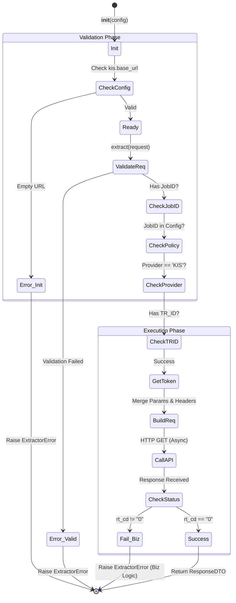

# KIS Extractor 테스트 명세서

## 1. 문서 정보 및 전략

- **대상 모듈:** `extractor.providers.kis_extractor.KISExtractor`
- **복잡도 수준:** **최상 (Critical)** (외부 금융 API 연동 및 민감 정보 처리)
- **커버리지 목표:** 분기 커버리지 100%, 구문 커버리지 100%
- **적용 전략:**
  - [x] **MC/DC (수정 조건/결정 커버리지):** `_validate_request` 내 다중 검증 조건(Job ID, Policy, Provider, TR_ID)의 독립적 결함 유발 검증.
  - [x] **Fail-Fast (조기 실패):** 설정 오류나 필수 파라미터 누락 시 즉각적인 예외 발생 여부 검증.
  - [x] **Mocking & Stubbing:** `IHttpClient`, `IAuthStrategy`, `ConfigManager`의 완벽한 제어를 통한 외부 의존성 격리.
  - [x] **Data Integrity:** 파라미터 병합 우선순위 및 응답 코드(`rt_cd`) 기반의 무결성 검증.

## 2. 로직 흐름도

## 3. BDD 테스트 시나리오 (전체 목록)

**시나리오 요약 (총 10건)**

- **초기화 (Initialization):** 2건 (정상, 설정 누락 조기 실패)
- **요청 검증 (Validation):** 5건 (MC/DC 적용 - JobID, 설정 부재, Provider, TR_ID, 정상)
- **실행 (Execution):** 1건 (토큰 확보, 파라미터 병합, 헤더 주입 및 API 호출)
- **응답 검증 (Response):** 2건 (정상, 비즈니스 에러 래핑)

|  테스트 ID   | 분류 | 기법  | 전제 조건 (Given)                      | 수행 (When)                   | 검증 (Then)                                                   | 입력 데이터 / 상황               |
| :----------: | :--: | :---: | :------------------------------------- | :---------------------------- | :------------------------------------------------------------ | :------------------------------- |
| **INIT-01**  | 단위 |  BVA  | `kis.base_url`이 비어있는 설정 객체    | `KISExtractor` 초기화         | `ExtractorError` 발생 (Critical Config Error)                 | `base_url=""`                    |
| **INIT-02**  | 단위 | 표준  | 유효한 API 설정 정보 및 시크릿 키      | `KISExtractor` 초기화         | 인스턴스 정상 생성, 시크릿 평문 복호화 완료                   | 유효 `ConfigManager`             |
|  **REQ-01**  | 단위 | MC/DC | `job_id`가 없는 요청 객체              | `_validate_request` 호출      | `ExtractorError` 발생 ('job_id' 필수)                         | `job_id=None`                    |
|  **REQ-02**  | 단위 | MC/DC | 설정에 정의되지 않은 `job_id` 요청     | `_validate_request` 호출      | `ExtractorError` 발생 (설정 오류)                             | `job_id="UNKNOWN"`               |
|  **REQ-03**  | 단위 | MC/DC | Provider가 'KIS'가 아닌 정책           | `_validate_request` 호출      | `ExtractorError` 발생 (API 제공자 불일치)                     | `provider="FRED"`                |
|  **REQ-04**  | 단위 | MC/DC | 정책에 필수 필드 `tr_id`가 누락됨      | `_validate_request` 호출      | `ExtractorError` 발생 ('tr_id' 누락)                          | `tr_id=None`                     |
|  **REQ-05**  | 단위 | 표준  | 유효한 KIS 정책이 설정된 요청          | `_validate_request` 호출      | 예외 발생 없이 유효성 검증 통과                               | 유효 `RequestDTO`                |
| **FETCH-01** | 단위 | 통합  | 유효한 요청과 발급된 인증 토큰         | `_fetch_raw_data` 비동기 호출 | 1. 토큰 발급 호출 2. 병합된 URL, Header, Params로 API 호출 | `RequestDTO`, Mock Token         |
|  **RES-01**  | 단위 |  BVA  | API 응답 `rt_cd`가 "1" (비즈니스 실패) | `_create_response` 호출       | `ExtractorError` 발생 (KIS API 실패 래핑)                     | `{"rt_cd": "1", "msg": "Error"}` |
|  **RES-02**  | 단위 | 표준  | API 응답 `rt_cd`가 "0" (성공)          | `_create_response` 호출       | 원본 데이터 및 메타데이터가 포함된 `ExtractedDTO` 반환        | `{"rt_cd": "0", "data": "A"}`    |
