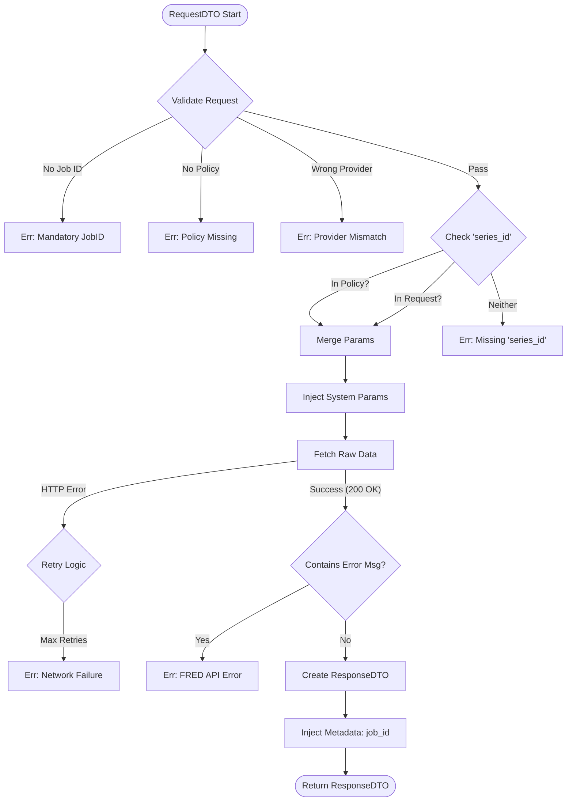

# FRED Extractor 테스트 명세서

## 1. 문서 정보 및 전략

- **대상 모듈:** `extractor.providers.fred_extractor.FREDExtractor`
- **복잡도 수준:** **높음 (High)** (파라미터 병합 로직 및 부모 클래스 오버라이딩 포함)
- **커버리지 목표:** 분기 커버리지 100%, 구문 커버리지 100%
- **적용 전략:**
  - [x] **MC/DC (수정 조건/결정 커버리지):** 필수 파라미터(`series_id`)의 소스(Policy vs Request)에 따른 분기 검증.
  - [x] **Data Integrity (데이터 무결성):** 시스템 강제 파라미터(`file_type=json`, `api_key`)의 우선순위 검증.
  - [x] **Fail-Fast (조기 실패):** 설정 누락 및 정책 위반 시 즉각적인 에러 발생 검증.
  - [x] **Decorator Verification:** 재시도(`@retry`) 및 로깅(`@log`) 동작 확인.

## 2. 로직 흐름도

## 3. BDD 테스트 시나리오

**시나리오 요약:**

- **초기화 (Initialization):** 3건 (필수 설정값 방어 로직)
- **유효성 검증 (Validation - MC/DC):** 5건 (정책, 제공자, 파라미터 조합)
- **실행 및 병합 (Execution & Merging):** 2건 (파라미터 우선순위, 메타데이터 주입)
- **에러 처리 (Error Handling):** 3건 (논리적 에러, 예상치 못한 예외 래핑)

|  테스트 ID  | 분류 |    기법    | 전제 조건 (Given)                        | 수행 (When)                          | 검증 (Then)                                                                      | 입력 데이터 / 상황            |
| :---------: | :--: | :--------: | :--------------------------------------- | :----------------------------------- | :------------------------------------------------------------------------------- | :---------------------------- |
| **INIT-01** | 단위 | fail-fast  | `base_url`이 설정되지 않음               | `FREDExtractor(http, config)` 초기화 | `ExtractorError` 발생 ("base_url is empty")                                      | `base_url=""`                 |
| **INIT-02** | 단위 | fail-fast  | `api_key`가 설정되지 않음                | `FREDExtractor(http, config)` 초기화 | `ExtractorError` 발생 ("api_key is missing")                                     | `api_key=None`                |
| **INIT-03** | 단위 |    표준    | 유효한 설정(`SecretStr` 키 포함)         | `FREDExtractor(http, config)` 초기화 | 인스턴스 정상 생성됨                                                             | `base_url="http://..."`       |
| **VAL-01**  | 단위 |    표준    | Config에 해당 `job_id` 정책 없음         | `extract(request)` 호출              | `ExtractorError` 발생 ("Policy not found")                                       | `job_id="UNKNOWN_JOB"`        |
| **VAL-02**  | 단위 |    표준    | Policy의 Provider가 "KIS"임              | `extract(request)` 호출              | `ExtractorError` 발생 ("Provider Mismatch")                                      | `provider="KIS"`              |
| **VAL-03**  | 단위 | **MC/DC**  | `series_id`가 **Policy에만** 존재        | `extract(request)` 호출              | 정상 수행 (API 호출 발생)                                                        | Policy:`{series_id: A}`       |
| **VAL-04**  | 단위 | **MC/DC**  | `series_id`가 **Request에만** 존재       | `extract(request)` 호출              | 정상 수행 (API 호출 발생)                                                        | Request:`{series_id: B}`      |
| **VAL-05**  | 단위 | **MC/DC**  | `series_id`가 **어디에도 없음**          | `extract(request)` 호출              | `ExtractorError` 발생 ("series_id is required")                                  | Policy:`{}`, Request:`{}`     |
| **EXEC-01** | 단위 |   데이터   | Request 파라미터가 Policy와 중복됨       | `extract(request)` 호출              | 1. Request 값이 Policy 덮어씀 2. `file_type=json` 및 `api_key` 강제 주입 확인 | Request:`{period: "M"}`       |
| **EXEC-02** | 단위 |    구조    | 부모 `extract` 호출 흐름                 | `extract(request)` 호출              | 반환된 `ResponseDTO`의 `meta` 필드에 `job_id`가 올바르게 주입됨                  | `meta['job_id'] == "JOB_01"`  |
| **ERR-01**  | 단위 |    논리    | HTTP 200이나 Body에 `error_message` 있음 | `extract(request)` 호출              | `ExtractorError` 발생 (메시지 및 코드 포함)                                      | Body:`{"error_message": "X"}` |
| **ERR-02**  | 단위 |    래핑    | 내부 로직 중 `KeyError` 등 예상 외 에러  | `extract(request)` 호출              | `ExtractorError`로 래핑되어 전파됨 ("System Error")                              | Mock: `raise KeyError`        |
| **ERR-03**  | 통합 | 데코레이터 | 네트워크 에러 발생 (Mocking)             | `_fetch_raw_data(request)` 호출      | `retry` 데코레이터 작동 확인 (call_count > 1)                                    | Mock: `raise NetworkError`    |
