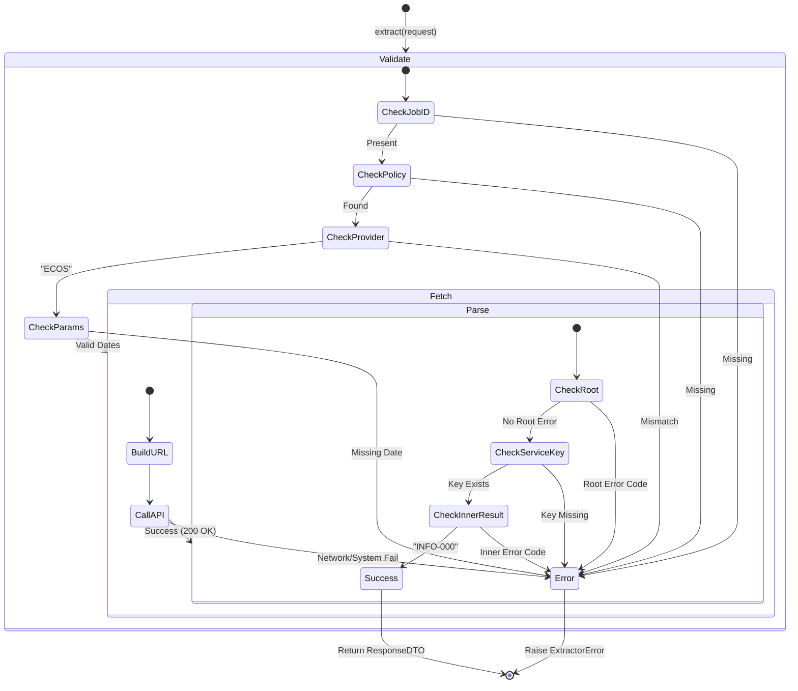

# ECOS Extractor 테스트 명세서

## 1. 문서 정보 및 전략

- **대상 모듈:** `extractor.providers.ecos_extractor.ECOSExtractor`
- **복잡도 수준:** **중 (Medium)** (엄격한 URL 경로 조립 및 이중 응답 구조 파싱)
- **커버리지 목표:** 분기 커버리지 100%, 구문 커버리지 100%
- **적용 전략:**
  - [x] **MC/DC (수정 조건/결정 커버리지):** `_validate_request` 내 Job ID, Policy, Provider, 필수 날짜 파라미터의 독립적 결함 유발 검증.
  - [x] **Path-Based Testing (경로 기반 테스트):** ECOS 고유의 이중 JSON 구조(Root/Service Level)에 따른 파싱 로직 검증.
  - [x] **Defensive Logic Verification (방어 로직 검증):** 성공 응답임에도 메타데이터 구조가 다르거나(Root Result 존재), 내부 키가 누락된 경우(Implicit Success)에 대한 방어 코드 검증.
  - [x] **Fail-Fast (조기 실패):** `base_url` 및 `api_key` 설정 누락 시 인스턴스 생성 즉시 차단.
  - [x] **Fault Injection (결함 주입):** 네트워크 및 시스템 에러 상황 시뮬레이션을 통한 예외 래핑 로직 검증.

## 2. 로직 흐름도

## 3. BDD 테스트 시나리오

**시나리오 요약:**

- **초기화 (Initialization):** 3건 (필수 설정값 및 객체 생성 검증)
- **요청 검증 (Validation):** 4건 (MC/DC 적용 - JobID, Policy, Provider, Date Params)
- **정상 흐름 (Functional):** 1건 (전체 파이프라인 성공 및 URL 검증)
- **데이터 안정성 (Data/Parsing):** 5건 (응답 구조 변형, 에러 코드, 암시적 성공 처리)
- **예외 처리 (Exception):** 2건 (시스템 에러 래핑 및 비즈니스 에러 전파)

|  테스트 ID  | 분류 | 기법  | 전제 조건 (Given)                        | 수행 (When)                    | 검증 (Then)                                                          | 입력 데이터 / 상황              |
| :---------: | :--: | :---: | :--------------------------------------- | :----------------------------- | :------------------------------------------------------------------- | :------------------------------ |
| **INIT-01** | 단위 |  BVA  | `ecos.base_url`이 비어있는 설정 객체     | `ECOSExtractor(config)` 초기화 | `ExtractorError` 발생 (Critical Config Error)                        | `base_url=""`                   |
| **INIT-02** | 단위 |  BVA  | `ecos.api_key`가 없는 설정 객체          | `ECOSExtractor(config)` 초기화 | `ExtractorError` 발생 (Critical Config Error)                        | `api_key=None`                  |
| **INIT-03** | 단위 | 표준  | 유효한 설정(URL, Key 포함) 객체          | `ECOSExtractor(config)` 초기화 | 인스턴스 정상 생성 (가드 절 통과)                                    | `base_url="http://..."`         |
| **REQ-01**  | 단위 | MC/DC | `job_id`가 없는 요청 객체                | `extract(request)` 호출        | `ExtractorError` 발생 (Invalid Request)                              | `job_id=None`                   |
| **REQ-02**  | 단위 | MC/DC | 설정 파일에 정의되지 않은 `job_id` 요청  | `extract(request)` 호출        | `ExtractorError` 발생 (Policy not found)                             | `job_id="UNKNOWN"`              |
| **REQ-03**  | 단위 | MC/DC | Provider가 'KIS'로 설정된 정책 요청      | `extract(request)` 호출        | `ExtractorError` 발생 (Provider Mismatch)                            | `provider="KIS"`                |
| **REQ-04**  | 단위 | MC/DC | `start_date` 파라미터가 누락됨           | `extract(request)` 호출        | `ExtractorError` 발생 (Mandatory for ECOS)                           | `params={"end_date": "..."}`    |
| **FLOW-01** | 단위 | 표준  | 정상 정책, 서비스 내 `INFO-000` 응답     | `extract(request)` 호출        | 1. `ResponseDTO` 반환 2. URL 조립 포맷 일치 3. 메타데이터 검증 | `CODE="INFO-000"`               |
| **DATA-01** | 단위 | 구조  | Root 레벨에 `RESULT.CODE="INFO-200"`     | `extract(request)` 호출        | `ExtractorError` 발생 (Root Level Failure)                           | `{"RESULT": {"CODE": "200"}}`   |
| **DATA-02** | 단위 | 구조  | Root에 정책 경로(`StatisticSearch`) 없음 | `extract(request)` 호출        | `ExtractorError` 발생 (Invalid Response)                             | `{"WrongKey": {...}}`           |
| **DATA-03** | 단위 | 구조  | 서비스 내 `RESULT.CODE="INFO-200"`       | `extract(request)` 호출        | `ExtractorError` 발생 (Business Failure)                             | `{"Stat..": {"RESULT": "200"}}` |
| **DATA-04** | 단위 | 방어  | Root `RESULT` 존재하나 성공(`INFO-000`)  | `extract(request)` 호출        | 에러 없이 정상 데이터 반환 (Root 결과 무시 분기 검증)                | Root `CODE="INFO-000"`          |
| **DATA-05** | 단위 | 방어  | 서비스 내 `RESULT` 키 자체가 누락됨      | `extract(request)` 호출        | 에러 없이 정상 데이터 반환 (암시적 성공 처리 분기 검증)              | `{"row": [...]} ` (No RESULT)   |
| **ERR-01**  | 예외 | 래핑  | HTTP 클라이언트가 `ValueError` 발생      | `extract(request)` 호출        | `ExtractorError`로 래핑되어 던져짐 (System Error)                    | Raise `ValueError`              |
| **ERR-02**  | 예외 | 전파  | 내부 로직에서 `ExtractorError` 발생      | `extract(request)` 호출        | 에러가 래핑되지 않고 그대로 전파됨 (중복 래핑 방지)                  | Raise `ExtractorError`          |
