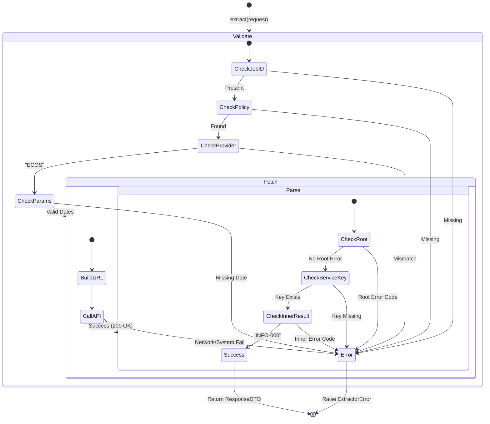

# ECOS Extractor 테스트 명세서

## 1. 문서 정보 및 전략

- **대상 모듈:** `extractor.providers.ecos_extractor.ECOSExtractor`
- **복잡도 수준:** **중 (Medium)** (엄격한 URL 경로 조립 및 이중 응답 구조 파싱)
- **커버리지 목표:** 분기 커버리지 100%, 구문 커버리지 100%
- **적용 전략:**
  - [x] **MC/DC (수정 조건/결정 커버리지):** `_validate_request` 내 Job ID, Policy, Provider, 필수 날짜 파라미터의 독립적 결함 유발 검증.
  - [x] **Path-Based Testing (경로 기반 테스트):** ECOS 고유의 이중 JSON 구조(Root/Service Level)에 따른 파싱 로직 검증.
  - [x] **Defensive Logic Verification (방어 로직 검증):** 성공 응답임에도 메타데이터 구조가 다르거나(Root Result 존재), 내부 키가 누락된 경우(Implicit Success)에 대한 방어 코드 검증.
  - [x] **Fail-Fast (조기 실패):** `base_url` 및 `api_key` 설정 누락 시 인스턴스 생성 즉시 차단.
  - [x] **Fault Injection (결함 주입):** 네트워크 및 시스템 에러 상황 시뮬레이션을 통한 예외 래핑 로직 검증.

## 2. 로직 흐름도

## 3. BDD 테스트 시나리오

**시나리오 요약 (총 15건):**

- **초기화 (Initialization):** 3건 (필수 설정값 및 평문 키 추출 검증)
- **요청 검증 (Validation):** 5건 (MC/DC 적용 - JobID, Policy Exception, Provider 불일치, 기본 날짜 주입, **날짜 존재 시 주입 스킵**)
- **데이터 패치 (Fetch):** 1건 (URL 조립 알고리즘 및 호출 검증)
- **응답 생성 (Response):** 6건 (이중 응답 구조 파싱, 에러 코드 식별, 암시적 성공 처리, **Root 성공 코드 무시 분기**)

|  테스트 ID   | 분류 | 기법  | 전제 조건 (Given)                              | 수행 (When)                | 검증 (Then)                                     | 입력 데이터 / 상황        |
| :----------: | :--: | :---: | :--------------------------------------------- | :------------------------- | :---------------------------------------------- | :------------------------ |
| **INIT-01**  | 단위 |  BVA  | `ecos.base_url`이 비어있는 설정 객체           | `ECOSExtractor()` 초기화   | `ExtractorError` 발생 (Critical Config Error)   | `base_url=""`             |
| **INIT-02**  | 단위 |  BVA  | `ecos.api_key`가 없는 설정 객체                | `ECOSExtractor()` 초기화   | `ExtractorError` 발생 (Critical Config Error)   | `api_key=None`            |
| **INIT-03**  | 단위 | 표준  | 유효한 설정(URL, Key 포함) 객체                | `ECOSExtractor()` 초기화   | 인스턴스 생성 및 `get_secret_value()` 추출 확인 | 정상 `config` 주입        |
|  **REQ-01**  | 단위 | MC/DC | `job_id`가 없는 요청 객체                      | `_validate_request()` 호출 | `ExtractorError` 발생 (Invalid Request)         | `job_id=None`             |
|  **REQ-02**  | 단위 | 예외  | 설정 객체에서 정책 조회 중 예외 발생           | `_validate_request()` 호출 | `ExtractorError` 발생 (Policy Error 래핑)       | `get_extractor` Exception |
|  **REQ-03**  | 단위 | MC/DC | Provider가 'ECOS'가 아닌 정책 반환             | `_validate_request()` 호출 | `ExtractorError` 발생 (Provider Mismatch)       | `provider="KIS"`          |
|  **REQ-04**  | 단위 | 방어  | Request 및 Policy 모두 날짜 파라미터 누락      | `_validate_request()` 호출 | 기본값(`start_date`, `end_date`) 자동 주입됨    | 빈 `params` 객체          |
|  **REQ-05**  | 단위 | 분기  | Request에 `start_date`, `end_date` 명시됨      | `_validate_request()` 호출 | 기본값 주입 분기를 건너뜀 (Branch 97, 101)      | `params`에 날짜 포함      |
| **FETCH-01** | 단위 | 조합  | 정상 파라미터가 포함된 요청 객체               | `_fetch_raw_data()` 호출   | ECOS 규격에 맞는 Path 방식 URL 조립 및 통신     | `stat_code`, `cycle` 등   |
| **RESP-01**  | 단위 | 구조  | Root 레벨에 `RESULT.CODE != INFO-000`          | `_create_response()` 호출  | `ExtractorError` 발생 (Root Error)              | Root `CODE="ERR-100"`     |
| **RESP-02**  | 단위 | 구조  | Root 레벨에 정책 경로 키(Service Key) 누락     | `_create_response()` 호출  | `ExtractorError` 발생 (Key Missing)             | `{"WrongKey": {}}`        |
| **RESP-03**  | 단위 | 구조  | 서비스 내 `RESULT.CODE != INFO-000`            | `_create_response()` 호출  | `ExtractorError` 발생 (Inner Error)             | Inner `CODE="ERR-200"`    |
| **RESP-04**  | 단위 | 표준  | 서비스 내 정상 `RESULT` 객체 포함 (`INFO-000`) | `_create_response()` 호출  | 파싱 성공 및 표준 `ExtractedDTO` 래핑 반환      | Inner `CODE="INFO-000"`   |
| **RESP-05**  | 단위 | 방어  | 서비스 내 `RESULT` 객체 아예 없음              | `_create_response()` 호출  | 에러 통과 및 암시적 성공(Implicit Success) 처리 | `{"row": [...]}`          |
| **RESP-06**  | 단위 | 방어  | Root에 `RESULT` 존재하나 성공(`INFO-000`)      | `_create_response()` 호출  | 에러 처리 스킵 후 데이터 정상 파싱 (Branch 171) | Root `CODE="INFO-000"`    |
