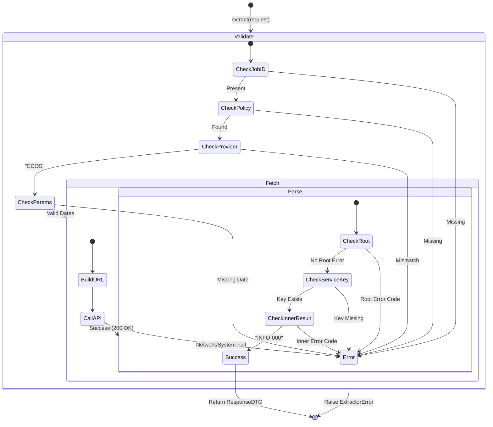

# UPBIT Extractor 테스트 명세서

## 1. 문서 정보 및 전략

- **대상 모듈:** `extractor.providers.upbit_extractor.UPBITExtractor`
- **복잡도 수준:** **최상 (Critical)** (외부 가상화폐 거래소 API 연동 및 시세 데이터 수집)
- **커버리지 목표:** 분기 커버리지(Branch Coverage) 100%, 구문 커버리지(Statement Coverage) 100%
- **적용 전략:**
  - [x] **MC/DC (수정 조건/결정 커버리지):** `_validate_request` 내 필수 파라미터(`market`, `markets`) 조합에 따른 경고 로직의 독립적 검증.
  - [x] **Fail-Fast (조기 실패):** `base_url` 설정 누락 및 잘못된 정책 요청 시 즉각적인 예외 발생 여부 검증.
  - [x] **Mocking & Stubbing:** `IHttpClient`, `IAuthStrategy`의 응답 제어를 통한 네트워크/인증 격리 테스트.
  - [x] **Data Integrity:** Request 파라미터의 Policy 덮어쓰기(Override) 및 에러 객체(`error`) 감지 로직 검증.

## 2. 로직 흐름도

# 3. BDD 테스트 시나리오 (UPBIT Extractor)

**시나리오 요약 (총 9건):**

- **초기화 (Initialization):** 1건 (필수 설정값 방어)
- **요청 검증 (Validation):** 4건 (식별자 누락, 정책 누락, Provider 불일치, 정상 통과 - 분기 100% 커버리지 확보)
- **통신 및 인가 (Fetch & Auth):** 2건 (토큰 유무에 따른 헤더 분기, 파라미터 병합)
- **응답 조립 (Response):** 2건 (업비트 비즈니스 에러 래핑, 정상 DTO 반환)

|  테스트 ID   | 분류 |  기법  | 전제 조건 (Given)                                     | 수행 (When)                  | 검증 (Then)                                           | 입력 데이터 / 상황                    |
| :----------: | :--: | :----: | :---------------------------------------------------- | :--------------------------- | :---------------------------------------------------- | :------------------------------------ |
| **INIT-01**  | 단위 |  BVA   | `config` 내 `upbit.base_url`이 빈 문자열인 상태       | `UPBITExtractor` 초기화      | `ExtractorError` 발생 (Critical Config Error)         | `base_url=""`                         |
|  **REQ-01**  | 단위 |  BVA   | 요청 객체(RequestDTO)에 `job_id`가 없음               | `_validate_request(request)` | `ExtractorError` 발생 (유효하지 않은 요청)            | `job_id=None`                         |
|  **REQ-02**  | 단위 |  예외  | `get_extractor` 조회 시 해당 정책이 없어 예외 발생    | `_validate_request(request)` | `ExtractorError` 발생 (설정 오류 래핑)                | `Exception("Not found")`              |
|  **REQ-03**  | 단위 | MC/DC  | 조회된 정책의 `provider`가 'UPBIT'이 아님 (예: 'KIS') | `_validate_request(request)` | `ExtractorError` 발생 (API 제공자 불일치)             | `provider="KIS"`                      |
|  **REQ-04**  | 단위 |  상태  | 정상적인 `job_id`와 `UPBIT` 정책이 준비된 상태        | `_validate_request(request)` | 예외 없이 **정상적으로 로직 통과 및 종료**            | `provider="UPBIT"`                    |
| **FETCH-01** | 단위 |  상태  | 유효한 토큰 발급 및 정적/동적 파라미터가 혼합됨       | `_fetch_raw_data(request)`   | 1. `authorization` 헤더 포함 2. 파라미터 병합 호출 | `token="Bearer"`, `params={"cnt":10}` |
| **FETCH-02** | 단위 |  분기  | 토큰이 필요 없는 Public API (토큰 `None` 반환)        | `_fetch_raw_data(request)`   | `authorization` 헤더 **포함되지 않음**                | `token=None`                          |
| **RESP-01**  | 단위 | Robust | 수신된 JSON 데이터에 `error` 객체가 포함됨            | `_create_response(data)`     | `ExtractorError` 발생 (업비트 API 실패)               | `{"error": {"message": "Fail"}}`      |
| **RESP-02**  | 단위 |  표준  | 정상적인 시세/캔들 JSON 배열 데이터 수신              | `_create_response(data)`     | `ExtractedDTO` 객체로 포장 및 `status_code` OK        | `[{"market": "KRW-BTC"}]`             |
