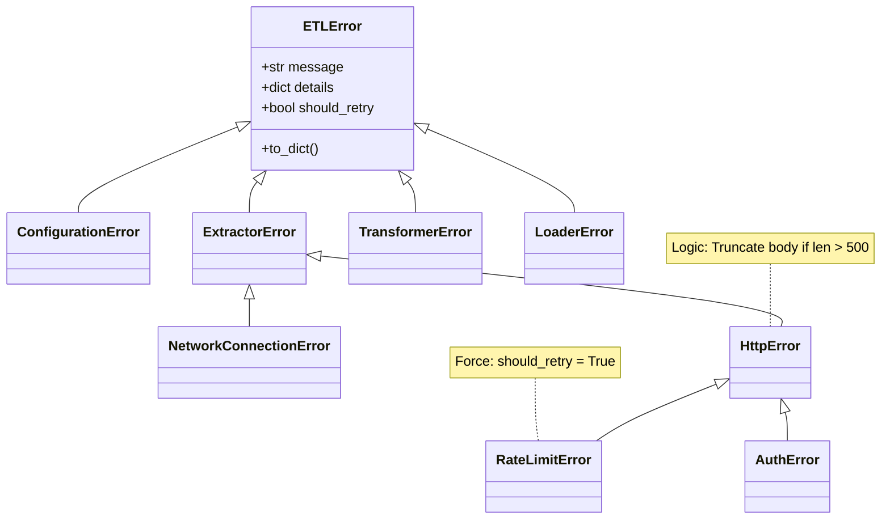

# Exception 테스트 문서

## 1. 문서 정보 및 전략

- **대상 모듈:** `src.common.exceptions` (Custom Exception Definitions)
- **복잡도 수준:** **중 (Medium)** (상속 구조, 데이터 직렬화, 문자열 조작 로직 포함)
- **커버리지 목표:** 분기 커버리지 100%, 구문 커버리지 100%
- **적용 전략:**
  - [x] **경계값 분석 (BVA):** 로그 축약(Truncation) 임계값인 500자를 기준으로 `Under`, `Exact`, `Over` 케이스 검증.
  - [x] **데이터 직렬화 (Serialization):** `to_dict()` 메서드가 LogManager가 요구하는 JSON 스키마를 정확히 준수하는지 검증.
  - [x] **상속 계층 (Inheritance Hierarchy):** `try-except` 블록에서 상위 클래스(예: `ExtractorError`)로 하위 에러가 정상적으로 잡히는지 검증.
  - [x] **재시도 정책 (Retry Policy):** 각 예외 클래스의 `should_retry` 속성이 설계 의도(네트워크=True, 설정=False 등)대로 설정되었는지 확인.

## 2. 로직 흐름도

## 3. BDD 테스트 시나리오

**시나리오 요약 (총 12건):**

1.  **기반 로직 (Base Logic):** 3건 (JSON 직렬화, 원인 예외 체이닝, 콘솔 출력 포맷)
2.  **데이터 축약 (Truncation):** 5건 (HTTP Body 경계값 [Under, Exact, Over], Null 처리, 스키마 데이터)
3.  **계층 및 속성 (Hierarchy & Props):** 4건 (설정 키, 네트워크 URL, RateLimit 헤더, Auth 상속/재시도 정책)

|  테스트 ID   | 분류 |   기법    | 전제 조건 (Given)                     | 수행 (When)                       | 검증 (Then)                                                                    | 입력 데이터 / 상황          |
| :----------: | :--: | :-------: | :------------------------------------ | :-------------------------------- | :----------------------------------------------------------------------------- | :-------------------------- |
| **BASE-01**  | 단위 |  직렬화   | `ETLError` 인스턴스 생성              | `to_dict()` 호출                  | 반환된 딕셔너리에 `error_type`, `message`, `should_retry` 키가 필수적으로 존재 | `msg="Base Error"`          |
| **BASE-02**  | 단위 |  체이닝   | 하위 예외(`ValueError`)가 원인인 에러 | `to_dict()` 호출                  | `cause` 필드에 원본 예외의 문자열 표현(`str(e)`)이 포함됨                      | `original=ValueError("..")` |
| **BASE-03**  | 단위 |  포맷팅   | `ETLError` 인스턴스 생성              | `str(error)` (콘솔 출력) 확인     | `[ETLError] 메시지 (Caused by: ..)` 형식의 디버깅용 문자열 반환                | `msg="Debug Check"`         |
| **TRUNC-01** | 단위 |  **BVA**  | HTTP Body 길이가 **499자** (Under)    | `HttpError` 초기화 후 `to_dict()` | `details['response_body_preview']`에 원본 문자열이 **그대로** 저장됨           | `body="A" * 499`            |
| **TRUNC-02** | 단위 |  **BVA**  | HTTP Body 길이가 **500자** (Exact)    | `HttpError` 초기화 후 `to_dict()` | 1. 문자열이 잘리지 않음 2. `...(truncated)` 접미사가 붙지 않음              | `body="A" * 500`            |
| **TRUNC-03** | 단위 |  **BVA**  | HTTP Body 길이가 **501자** (Over)     | `HttpError` 초기화 후 `to_dict()` | 1. 문자열이 500자에서 잘림 2. 끝에 `...(truncated)` 접미사가 붙음           | `body="A" * 501`            |
| **TRUNC-04** | 단위 |   방어    | HTTP Body가 `None` 또는 빈 값         | `HttpError` 초기화 후 `to_dict()` | 에러 없이 `preview` 값이 "Empty"로 안전하게 처리됨                             | `body=None`                 |
| **TRUNC-05** | 단위 |    BVA    | 검증 실패 데이터가 매우 큰 딕셔너리   | `SchemaValidationError` 초기화    | `invalid_data_preview`가 문자열 변환 후 500자로 축약됨                         | `data={"k": "v"*100}`       |
| **PROP-01**  | 단위 | 속성/분기 | `ConfigurationError` 생성             | `details` 속성 검사               | `key_name` 키가 `details` 딕셔너리에 올바르게 주입됨                           | `key_name="DB_HOST"`        |
| **PROP-02**  | 단위 | 속성/분기 | `NetworkConnectionError` 생성         | `details` 속성 검사               | `url` 키가 `details` 딕셔너리에 올바르게 주입됨                                | `url="http://test.com"`     |
| **PROP-03**  | 단위 | 속성/분기 | `RateLimitError` 생성                 | 인스턴스 속성 검사                | 1. `should_retry`가 **True**여야 함 2. `retry_after`가 `details`에 포함됨   | `retry_after=60`            |
| **HIER-01**  | 단위 |   상속    | `AuthError` 인스턴스 생성             | `isinstance` 및 속성 체크         | 1. `HttpError`의 인스턴스임(True) 2. `should_retry`는 **False**여야 함      | `AuthError(...)`            |
