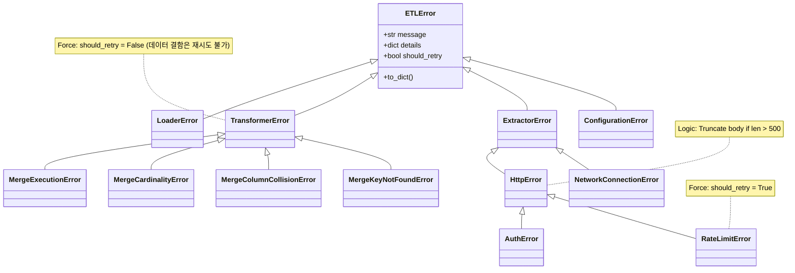

# Exception 테스트 문서

## 1. 문서 정보 및 전략

- **대상 모듈:** `src.common.exceptions` (Custom Exception Definitions)
- **복잡도 수준:** **중 (Medium)** (상속 구조, 데이터 직렬화, 문자열 조작 로직 포함)
- **커버리지 목표:** 분기 커버리지 100%, 구문 커버리지 100%
- **적용 전략:**
  - [x] **경계값 분석 (BVA):** 로그 축약(Truncation) 임계값인 500자를 기준으로 `Under`, `Exact`, `Over` 케이스 검증.
  - [x] **데이터 직렬화 (Serialization):** `to_dict()` 메서드가 LogManager가 요구하는 JSON 스키마를 정확히 준수하는지 검증.
  - [x] **상속 계층 (Inheritance Hierarchy):** `try-except` 블록에서 상위 클래스(예: `ExtractorError`, `TransformerError`)로 하위 에러가 정상적으로 잡히는지 검증.
  - [x] **재시도 정책 (Retry Policy):** 각 예외 클래스의 `should_retry` 속성이 설계 의도대로 올바르게 고정되었는지 확인.

## 2. 로직 흐름도

## 3. BDD 테스트 시나리오

### 3.1. 전역 기반 예외 (Global Base Exceptions)

**시나리오 요약 (총 4건):**

1. **기반 로직 검증:** 3건 (JSON 직렬화 필수 키, 예외 체이닝 원인 보존, 콘솔 출력 포맷)
2. **설정 예외 검증:** 1건 (`ConfigurationError` 속성 주입)

|   Test ID   | Category |   Technique   | Given                                 | When                | Then                                                                   | Input Data                  |
| :---------: | :------: | :-----------: | :------------------------------------ | :------------------ | :--------------------------------------------------------------------- | :-------------------------- |
| **BASE-01** |   Unit   | Serialization | `ETLError` 인스턴스 생성              | `to_dict()` 호출    | 반환된 딕셔너리에 `error_type`, `message`, `should_retry` 키 필수 존재 | `msg="Base Error"`          |
| **BASE-02** |   Unit   |   Chaining    | 하위 예외(`ValueError`)가 원인인 에러 | `to_dict()` 호출    | `cause` 필드에 원본 예외의 문자열 표현(`str(e)`)이 포함됨              | `original=ValueError("..")` |
| **BASE-03** |   Unit   |  Formatting   | `ETLError` 인스턴스 생성              | `str(error)` 확인   | `[ETLError] 메시지 (Caused by: ..)` 형식의 텍스트 반환                 | `msg="Debug Check"`         |
| **BASE-04** |   Unit   |   Property    | `ConfigurationError` 생성             | `details` 속성 검사 | `key_name` 키가 `details` 딕셔너리에 올바르게 주입됨                   | `key_name="DB_HOST"`        |

### 3.2. 데이터 축약 로직 (Log Noise Reduction)

**시나리오 요약 (총 5건):**

1. **HTTP Body 경계값 (BVA):** 3건 (500자 기준 Under, Exact, Over 검증)
2. **데이터 방어 (Robustness):** 2건 (Null 입력 시 안전 처리, 스키마 딕셔너리 데이터 축약)

|   Test ID    | Category | Technique  | Given                         | When                 | Then                                                      | Input Data           |
| :----------: | :------: | :--------: | :---------------------------- | :------------------- | :-------------------------------------------------------- | :------------------- |
| **TRUNC-01** |   Unit   |  **BVA**   | HTTP Body 길이가 **499자**    | `HttpError` 초기화   | `response_body_preview`에 원본 문자열이 **그대로** 저장됨 | `body="A" * 499`     |
| **TRUNC-02** |   Unit   |  **BVA**   | HTTP Body 길이가 **500자**    | `HttpError` 초기화   | 문자열이 잘리지 않고 `...(truncated)` 접미사 없음         | `body="A" * 500`     |
| **TRUNC-03** |   Unit   |  **BVA**   | HTTP Body 길이가 **501자**    | `HttpError` 초기화   | 500자에서 잘리며 끝에 `...(truncated)` 접미사 추가됨      | `body="A" * 501`     |
| **TRUNC-04** |   Unit   | Robustness | HTTP Body가 `None` 또는 빈 값 | `HttpError` 초기화   | 에러 없이 `preview` 값이 "Empty"로 안전 처리됨            | `body=None`          |
| **TRUNC-05** |   Unit   |  **BVA**   | 매우 큰 딕셔너리 데이터       | `SchemaError` 초기화 | 딕셔너리가 문자열 변환 후 500자로 축약됨                  | `data={"k":"v"*100}` |

### 3.3. 수집 계층 예외 (Extractor Exceptions)

**시나리오 요약 (총 3건):**

1. **속성 및 재시도 검증:** 2건 (네트워크 URL 보존, RateLimit 재시도 속성 및 시간 강제)
2. **상속 계층 검증:** 1건 (AuthError의 HttpError 상속 및 재시도 불가 확인)

|  Test ID   | Category | Technique | Given                         | When                | Then                                                     | Input Data              |
| :--------: | :------: | :-------: | :---------------------------- | :------------------ | :------------------------------------------------------- | :---------------------- |
| **EXT-01** |   Unit   | Property  | `NetworkConnectionError` 생성 | `details` 속성 검사 | `url` 키가 딕셔너리에 보존되며 `should_retry` = **True** | `url="http://test.com"` |
| **EXT-02** |   Unit   | Property  | `RateLimitError` 생성         | 인스턴스 검사       | `should_retry` = **True** 강제, `retry_after` 보존됨     | `retry_after=60`        |
| **EXT-03** |   Unit   | Hierarchy | `AuthError` 인스턴스 생성     | `isinstance` 체크   | `HttpError` 인스턴스 인식 및 `should_retry` = **False**  | `AuthError(...)`        |

### 3.4. 변환 계층 예외 (Transformer Exceptions)

**시나리오 요약 (총 4건):**

1. **속성 및 재시도 강제성:** 3건 (누락된 키 리스트, 충돌 컬럼 리스트, 병합 전후 튜플 형태 보존 및 재시도 불가 강제)
2. **실행 예외 체이닝:** 1건 (Pandas 런타임 에러 원인 보존)

|  Test ID   | Category | Technique | Given                            | When             | Then                                                              | Input Data                |
| :--------: | :------: | :-------: | :------------------------------- | :--------------- | :---------------------------------------------------------------- | :------------------------ |
| **TRF-01** |   Unit   | Property  | `MergeKeyNotFoundError` 생성     | `to_dict()` 호출 | `missing_keys` 리스트 보존, `should_retry` = **False**            | `missing_keys=["id"]`     |
| **TRF-02** |   Unit   | Property  | `MergeColumnCollisionError` 생성 | `to_dict()` 호출 | `colliding_columns` 리스트 보존, `should_retry` = **False**       | `colliding_cols=["name"]` |
| **TRF-03** |   Unit   | Property  | `MergeCardinalityError` 생성     | `to_dict()` 호출 | `left_shape`, `right_shape` 튜플 보존, `should_retry` = **False** | `left=(10,2)`             |
| **TRF-04** |   Unit   | Chaining  | `MergeExecutionError` 생성       | `to_dict()` 호출 | `join_type` 보존, `original_exception` 전달 시 `cause` 기록       | `join_type="left"`        |

### 3.5. 적재 계층 예외 (Loader Exceptions)

**시나리오 요약 (총 3건):**

1. **유효성 검증 실패 (Validation):** 1건 (필수 데이터 누락 확인 및 재시도 불가 강제 검증)
2. **압축 처리 예외 (Compression):** 1건 (OOM/인코딩 에러 원인 보존 및 재시도 불가 강제 검증)
3. **S3 업로드 예외 (Upload):** 1건 (Boto3 에러 체이닝, 멀티파트 메타데이터 보존 및 재시도 강제 검증)

|  Test ID   | Category | Technique | Given                        | When             | Then                                                                          | Input Data              |
| :--------: | :------: | :-------: | :--------------------------- | :--------------- | :---------------------------------------------------------------------------- | :---------------------- |
| **LDR-01** |   Unit   | Property  | `LoaderValidationError` 생성 | `to_dict()` 호출 | `invalid_fields`, `dto_name` 보존, `should_retry` = **False**                 | `invalid_fields=["id"]` |
| **LDR-02** |   Unit   | Chaining  | `ZstdCompressionError` 생성  | `to_dict()` 호출 | `data_size_bytes` 보존, `cause`에 예외 기록, `should_retry` = **False**       | `data_size=1024`        |
| **LDR-03** |   Unit   | Property  | `S3UploadError` 생성         | `to_dict()` 호출 | `bucket`, `key`, `is_multipart` 등 메타데이터 보존, `should_retry` = **True** | `bucket="test-bucket"`  |
