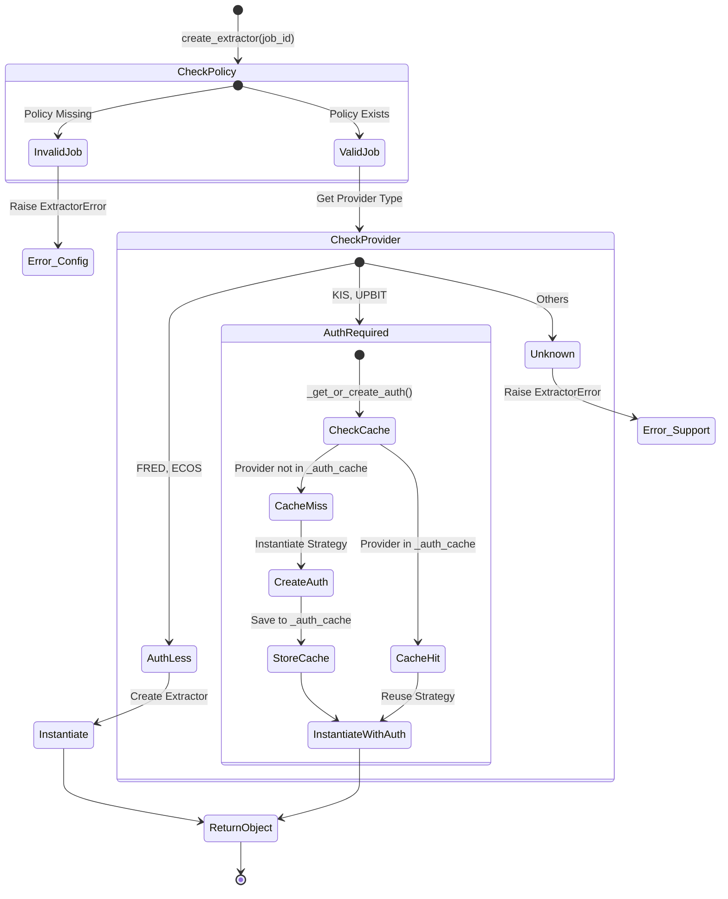

# Extractor Factory 테스트 명세서

## 1. 문서 정보 및 전략

- **대상 모듈:** `extractor.extractor_factory.ExtractorFactory`
- **복잡도 수준:** **중 (Medium)** (팩토리 패턴, 싱글톤 유사 캐싱, 의존성 주입)
- **커버리지 목표:** 분기 커버리지 100%, 구문 커버리지 100%
- **적용 전략:**
  - [x] **상태 전이 (State Transition):** 인증 객체 캐싱(Cache Miss -> Create -> Cache Hit) 흐름 검증.
  - [x] **경계값 분석 (BVA):** 미지원 Provider, 대소문자 혼용, 비어있는 설정 등 예외 케이스.
  - [x] **의존성 격리 (Isolation):** `AppConfig`, `HttpClient` 등 외부 객체의 철저한 Mocking.
  - [x] **결정 테이블 (Decision Table):** Provider 타입별(KIS, UPBIT, FRED 등) 분기 로직 완전 탐색.
  - [x] **싱글톤 검증 (Singleton Verification):** 로거 및 인증 객체의 인스턴스 재사용성(Identity Check) 검증.

## 2. 로직 흐름도

## 3. BDD 테스트 시나리오 (전체 목록)

**시나리오 요약 (총 14건):**

1.  **기능 정상 동작 (Functional Success):** 4건 (KIS, UPBIT, FRED, ECOS/대소문자)
2.  **상태 및 캐싱 전략 (State & Caching Strategy):** 2건 (캐시 적중, 신규 생성)
3.  **초기화 및 내부 로직 (Initialization & Internal Logic):** 3건 (로거 지연 로딩, **로거 싱글톤 재사용**, 내부 메서드 방어)
4.  **예외 처리 및 회복력 (Error Handling & Resilience):** 4건 (설정 누락, 미지원 Provider, 생성 실패 등)
5.  **의존성 격리 (Dependency Isolation):** 1건 (외부 객체 격리)

|  테스트 ID   | 분류 |  기법  | 전제 조건 (Given)               | 수행 (When)                   | 검증 (Then)                                                             | 입력 데이터 / 상황      |
| :----------: | :--: | :----: | :------------------------------ | :---------------------------- | :---------------------------------------------------------------------- | :---------------------- |
| **FUNC-01**  | 통합 |  결정  | KIS 정책이 설정된 Config        | `create_extractor` 호출       | 1. `KISExtractor` 인스턴스 반환 2. `KISAuthStrategy`가 주입됨        | `job_id="job_kis"`      |
| **FUNC-02**  | 통합 |  결정  | UPBIT 정책이 설정된 Config      | `create_extractor` 호출       | 1. `UPBITExtractor` 인스턴스 반환 2. `UPBITAuthStrategy`가 주입됨    | `job_id="job_upbit"`    |
| **FUNC-03**  | 통합 |  결정  | FRED(인증X) 정책 설정           | `create_extractor` 호출       | 1. `FREDExtractor` 인스턴스 반환 2. 인증 전략 없이 생성됨            | `job_id="job_fred"`     |
| **FUNC-04**  | 단위 |  BVA   | Provider가 소문자 혼용됨 (ECOS) | `create_extractor` 호출       | 1. 대문자 변환 로직 작동 2. `ECOSExtractor` 생성 (분기 커버)         | `provider="Ecos"`       |
| **CACHE-01** | 단위 |  상태  | `_auth_cache`에 KIS 전략 존재   | `create_extractor` 호출 (KIS) | 1. **새 전략 생성 안 함** 2. 캐시된 기존 객체(`id` 동일) 재사용 반환 | `Cache={"KIS": obj}`    |
| **CACHE-02** | 단위 |  상태  | `_auth_cache`가 비어있음        | `create_extractor` 호출 (KIS) | 1. 새로운 전략 객체 생성 2. `_auth_cache`에 "KIS" 키로 저장됨        | `Cache={}`              |
| **INIT-01**  | 단위 |  상태  | 클래스 로드 직후 (초기 상태)    | `_get_logger` 최초 호출       | 1. `_logger`가 `None`에서 객체로 변경됨 2. Lazy Loading 작동 확인    | `_logger=None`          |
| **INIT-02**  | 단위 |  구조  | 이미 로거가 생성된 상태         | `_get_logger` 재호출          | 1. 내부 생성 로직 건너뜀 (Branch Coverage) 2. 기존 객체와 동일(`is`) | `_logger=Obj`           |
|  **INT-01**  | 단위 |  BVA   | 내부 메서드 직접 호출           | `_get_or_create_auth` 호출    | 정의되지 않은 Provider 문자열 전달 시 `ExtractorError` 발생             | `provider="INVALID"`    |
| **CONF-01**  | 단위 |  BVA   | 정책(Policy)이 빈 딕셔너리      | `create_extractor` 호출       | `ExtractorError` 발생 (Job ID 찾을 수 없음 - Empty Set)                 | `policies={}`           |
|  **ERR-01**  | 예외 |  로직  | 설정에 없는 Job ID 요청         | `create_extractor` 호출       | 1. `ExtractorError` 발생 2. 로그에 "No policy found" 기록            | `job_id="unknown_job"`  |
|  **ERR-02**  | 예외 |  로직  | 정책은 있으나 미지원 Provider   | `create_extractor` 호출       | `ExtractorError` 발생 ("Unsupported Provider")                          | `provider="BINANCE"`    |
|  **ERR-03**  | 예외 | 견고성 | Extractor 생성자 내부 에러      | `create_extractor` 호출       | 1. 예외가 `ExtractorError`로 래핑됨 2. 원본 에러 메시지 포함         | Mock: `Raise TypeError` |
|  **DI-01**   | 단위 |  격리  | `HttpClient`, `Config` Mocking  | `create_extractor` 호출       | 실제 네트워크 연결 없이 팩토리 로직만 독립 검증 수행                    | `client=MagicMock()`    |
