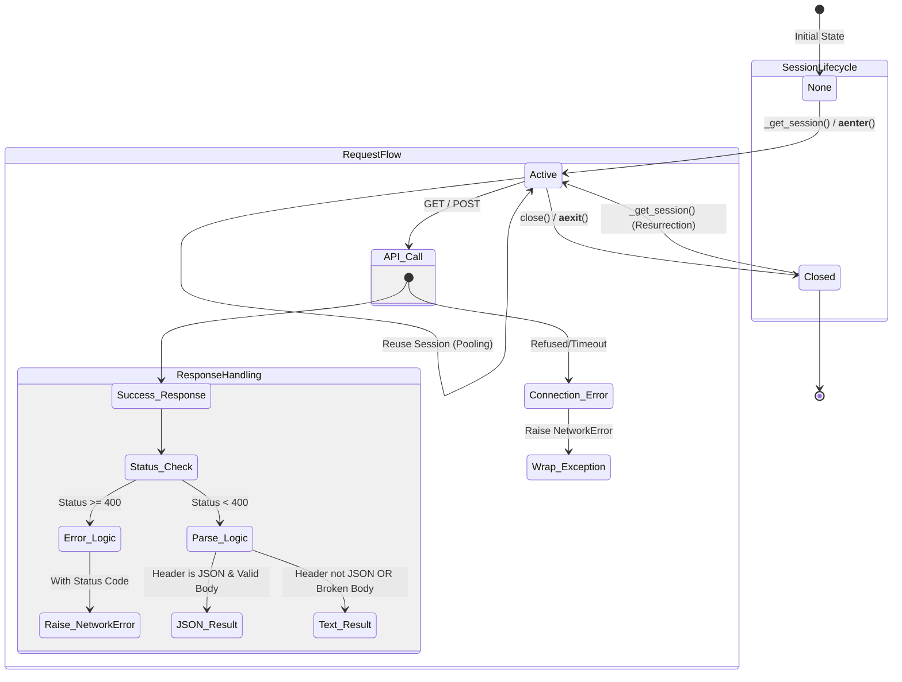

# 2단계. 정식 테스트 명세서 (TCS-HTTP-001)

## 2-1. 문서 정보 및 전략

- **대상 모듈:** `infrastructure.AsyncHttpAdapter`
- **복잡도 수준:** **높음 (High)** (비동기 I/O, 세션 풀링, 데코레이터 상호작용)
- **커버리지 목표:** **분기 커버리지(Branch Coverage) 100%**, 구문 커버리지 100%
- **적용 전략:**
  - [x] **상태 전이 (State Transition):** 세션의 생성(Lazy Loading) → 재사용(Pooling) → 종료(Closing) → 부활(Resurrection).
  - [x] **MC/DC (수정 조건/결정 커버리지):** `_handle_response` 내부의 복합 조건(Header 타입 && Body 유효성) 검증.
  - [x] **에러 매핑 (Exception Mapping):** `aiohttp`의 하위 에러가 도메인 에러(`NetworkError`)로 정확히 변환되는지 검증.
  - [x] **멱등성 (Idempotency):** `close()` 메서드의 중복 호출 안전성 검증.

## 2-2. 로직 흐름도 (참조)

## 2-3. BDD 테스트 시나리오 (전체 목록)

**시나리오 요약:**

- **초기화 (Initialization):** 2건 (설정 주입 검증)
- **생명주기 (Lifecycle):** 4건 (Context Manager, Lazy Loading, Pooling, Resurrection)
- **요청 처리 (Request Handling):** 2건 (GET/POST 메서드 및 파라미터 전달)
- **데이터 파싱 (Data Parsing):** 4건 (JSON/Text 파싱 및 MC/DC 기반의 견고성 테스트)
- **에러 핸들링 (Error Handling):** 4건 (HTTP 에러, 네트워크 에러, 타임아웃, 예외 래핑)

|  테스트 ID  | 분류 | 기법  | 전제 조건 (Given)                       | 수행 (When)                             | 검증 (Then)                                                      | 입력 데이터 / 상황        |
| :---------: | :--: | :---: | :-------------------------------------- | :-------------------------------------- | :--------------------------------------------------------------- | :------------------------ |
| **INIT-01** | 단위 | 표준  | 없음                                    | `AsyncHttpAdapter()` 초기화             | `timeout` 속성이 기본값(30s)인 `ClientTimeout` 객체로 설정됨     | `timeout=Default`         |
| **INIT-02** | 단위 |  BVA  | 없음                                    | `AsyncHttpAdapter(timeout=60)` 초기화   | `timeout` 속성이 사용자 정의 값(60s)으로 설정됨                  | `timeout=60`              |
| **LIFE-01** | 단위 | 상태  | 어댑터 인스턴스 생성됨                  | `async with adapter:` 구문 실행 및 탈출 | 1. 진입 시 `_session` 생성 2. 탈출 시 세션 `closed` 상태 전환 | Context Manager           |
| **LIFE-02** | 단위 | 상태  | `_session`이 `None`인 상태              | `_get_session()` 호출                   | 새로운 `ClientSession` 객체 생성 및 반환                         | `session is None`         |
| **LIFE-03** | 단위 | 상태  | `_session`이 이미 생성된 상태           | `_get_session()` 재호출                 | **동일한 객체 ID** 반환 (세션 풀링 작동)                         | `session exists`          |
| **LIFE-04** | 단위 | 상태  | `_session`이 닫힌(`closed`) 상태        | `_get_session()` 호출                   | **새로운 객체 ID**의 세션 생성 (부활/Resurrection)               | `session.closed=True`     |
| **REQ-01**  | 통합 | 표준  | Mock Session 주입                       | `get(url, params=p)` 호출               | `session.get`이 올바른 URL과 Params로 호출됨                     | `params={'q': 1}`         |
| **REQ-02**  | 통합 | 표준  | Mock Session 주입                       | `post(url, data=d)` 호출                | `session.post`가 올바른 JSON Data로 호출됨                       | `data={'k': 'v'}`         |
| **DATA-01** | 단위 | 표준  | 응답: JSON Header + Valid Body          | `_handle_response()` 실행               | Python Dict 객체로 파싱되어 반환                                 | `{"a": 1}`                |
| **DATA-02** | 단위 | 표준  | 응답: Text Header + String Body         | `_handle_response()` 실행               | Raw String 반환                                                  | `Header: text/html`       |
| **DATA-03** | 단위 | MC/DC | 응답: **JSON Header** + **Broken Body** | `_handle_response()` 실행               | `ValueError` 내부 처리 후 **Raw Text 반환** (Fail-Safe)          | Body: `{"a": 1,` (Broken) |
| **DATA-04** | 단위 | MC/DC | 응답: **Header 누락** + Valid Body      | `_handle_response()` 실행               | `ContentTypeError` 방지 및 Text 반환                             | `Header: None`            |
| **ERR-01**  | 예외 |  BVA  | 응답: HTTP 404 Not Found                | `get()` 호출                            | `NetworkError` 발생 (메시지에 404 포함)                          | Status: `404`             |
| **ERR-02**  | 예외 |  BVA  | 응답: HTTP 500 Internal Error           | `post()` 호출                           | `NetworkError` 발생 (메시지에 500 포함)                          | Status: `500`             |
| **ERR-03**  | 예외 | 래핑  | `aiohttp.ClientConnectorError` 발생     | `get()` 호출                            | `NetworkError`로 래핑되어 전파 (하위 구현 은닉)                  | Connection Refused        |
| **ERR-04**  | 예외 | 래핑  | `asyncio.TimeoutError` 발생             | `get()` 호출                            | `NetworkError`로 래핑되어 전파                                   | Timeout                   |
