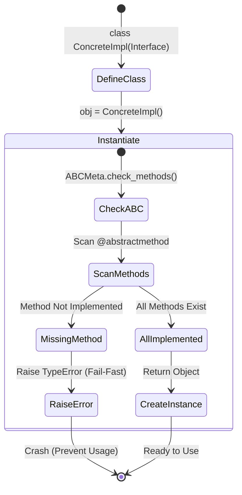

# Interface 테스트 명세서

## 1. 문서 정보 및 전략

- **대상 모듈:** `src.common.interfaces` (`IHttpClient`, `IAuthStrategy`, `IExtractor`, `ITransformer`)
- **복잡도 수준:** **하 (Low)** (인터페이스 정의 및 아키텍처 강제성 검증, 상태 변이 없음)
- **커버리지 목표:** 분기 커버리지(Branch) 100%, 구문 커버리지(Statement) 100%
- **적용 전략:**
  - [x] **계약 테스트 (Contract Testing):** 추상 클래스(ABC)가 하위 구현체에 특정 메서드 구현을 강제하는지 검증.
  - [x] **실패 격리 (Fail-Fast):** 구현이 누락된 불완전한 클래스는 인스턴스화 단계에서 즉시 에러(`TypeError`)를 발생.
  - [x] **비동기/동기 계약 (Async/Sync Contract):** 네트워크/I/O 바운드 작업(비동기)과 CPU 바운드 변환 작업(동기)의 시그니처 검증.
  - [x] **타입 및 스키마 검증 (Type & Schema):** 데이터프레임(`pd.DataFrame`) 및 DTO 반환 타입 강제성 검증.

## 2. 로직 흐름도

## 3. BDD 테스트 시나리오

### 1. IHttpClient 인터페이스

**시나리오 요약 (총 4건):**

1. **아키텍처 강제성 (Architecture Enforcement):** 3건 (직접 생성 방지, 불완전 구현 방지, 기본 구현 실행)
2. **비동기 계약 (Async Contract):** 1건 (코루틴 선언 여부 검증)

|   Test ID   | Category | Technique | Given                                 | When                                 | Then                                                   | Input Data            |
| :---------: | :------: | :-------: | :------------------------------------ | :----------------------------------- | :----------------------------------------------------- | :-------------------- |
| **HTTP-01** |   단위   |   표준    | `IHttpClient` 추상 클래스 정의        | `IHttpClient()` 직접 인스턴스화 시도 | **TypeError 발생** (직접 생성 불가)                    | `None`                |
| **HTTP-02** |   단위   |    BVA    | `get`만 구현하고 `post` 누락한 클래스 | 인스턴스화 시도                      | **TypeError 발생** (Regex: `abstract method .?post.?`) | `class PartialClient` |
| **HTTP-03** |   단위   | 커버리지  | `super()` 호출 특수 구현체            | `get()`, `post()` 호출               | **에러 없음**, 부모의 `pass` 실행 (커버리지 100%)      | `super().get(...)`    |
| **HTTP-04** |   단위   |   계약    | 인터페이스 내 모든 메서드             | `inspect.iscoroutinefunction` 검사   | **True 반환** (반드시 비동기로 선언되어야 함)          | `IHttpClient.get`     |

### 2. IAuthStrategy 인터페이스

**시나리오 요약 (총 4건):**

1. **아키텍처 강제성 (Architecture Enforcement):** 2건 (직접 생성 방지, 불완전 구현 방지)
2. **인터페이스 준수 (Interface Compliance):** 1건 (정상 구현 및 호출 검증)
3. **비동기 계약 (Async Contract):** 1건 (코루틴 선언 여부 검증)

|   Test ID   | Category | Technique | Given                          | When                                   | Then                                                        | Input Data                |
| :---------: | :------: | :-------: | :----------------------------- | :------------------------------------- | :---------------------------------------------------------- | :------------------------ |
| **AUTH-01** |   단위   |   표준    | `IAuthStrategy` 추상 클래스    | `IAuthStrategy()` 직접 인스턴스화 시도 | **TypeError 발생** (직접 생성 불가)                         | `None`                    |
| **AUTH-02** |   단위   |    BVA    | `get_token` 누락한 상속 클래스 | 인스턴스화 시도                        | **TypeError 발생** (Regex: `abstract method .?get_token.?`) | `class BadAuth`           |
| **AUTH-03** |   단위   |   표준    | 정상 구현체(Mock)              | `get_token(client)` 호출               | **에러 없음**, 토큰 문자열(`str`) 리턴                      | `MockAuth`                |
| **AUTH-04** |   단위   |   계약    | 인터페이스 메서드              | `inspect.iscoroutinefunction` 검사     | **True 반환** (반드시 비동기로 선언되어야 함)               | `IAuthStrategy.get_token` |

### 3. IExtractor 인터페이스

**시나리오 요약 (총 4건):**

1. **아키텍처 강제성 (Architecture Enforcement):** 2건 (직접 생성 방지, 불완전 구현 방지)
2. **타입 및 예외 (Type & Robustness):** 1건 (타입 힌트 호환성 검증)
3. **비동기 계약 (Async Contract):** 1건 (코루틴 선언 여부 검증)

|  Test ID   | Category | Technique | Given                             | When                                | Then                                                      | Input Data                |
| :--------: | :------: | :-------: | :-------------------------------- | :---------------------------------- | :-------------------------------------------------------- | :------------------------ |
| **EXT-01** |   단위   |   표준    | `IExtractor` 추상 클래스          | `IExtractor()` 직접 인스턴스화 시도 | **TypeError 발생** (직접 생성 불가)                       | `None`                    |
| **EXT-02** |   단위   |    BVA    | `extract` 누락한 상속 클래스      | 인스턴스화 시도                     | **TypeError 발생** (Regex: `abstract method .?extract.?`) | `class BadExt`            |
| **EXT-03** |   단위   |  데이터   | `RequestDTO`, `ExtractedDTO` 객체 | `extract.__annotations__` 검사      | 매개변수/반환 타입 힌트가 `DTO`를 올바르게 참조           | `extract.__annotations__` |
| **EXT-04** |   단위   |   계약    | 인터페이스 메서드                 | `inspect.iscoroutinefunction` 검사  | **True 반환** (반드시 비동기로 선언되어야 함)             | `IExtractor.extract`      |

### 4. ITransformer 인터페이스

**시나리오 요약 (총 5건):**

1. **아키텍처 강제성 (Architecture Enforcement):** 2건 (직접 생성 방지, 불완전 구현 방지)
2. **동기 계약 (Sync Contract):** 1건 (코루틴 선언 부정 검증)
3. **타입 및 예외 (Type & Robustness):** 2건 (타입 힌트 호환성, 예외 전파)

|  Test ID   | Category | Technique | Given                             | When                                  | Then                                                        | Input Data                  |
| :--------: | :------: | :-------: | :-------------------------------- | :------------------------------------ | :---------------------------------------------------------- | :-------------------------- |
| **TRF-01** |   단위   |   표준    | `ITransformer` 추상 클래스        | `ITransformer()` 직접 인스턴스화 시도 | **TypeError 발생** (직접 생성 불가)                         | `None`                      |
| **TRF-02** |   단위   |    BVA    | `transform` 누락한 상속 클래스    | 인스턴스화 시도                       | **TypeError 발생** (Regex: `abstract method .?transform.?`) | `class BadTrf`              |
| **TRF-03** |   단위   |   계약    | 인터페이스 메서드                 | `inspect.iscoroutinefunction` 검사    | **False 반환** (CPU 연산이므로 동기 함수여야 함)            | `ITransformer.transform`    |
| **TRF-04** |   단위   |  데이터   | Pandas DataFrame 모듈             | `transform.__annotations__` 검사      | 매개변수/반환 타입이 `pd.DataFrame`을 올바르게 참조         | `transform.__annotations__` |
| **TRF-05** |   단위   |  견고성   | `transform` 내부 예외 발생 구현체 | `transform(data)` 호출                | 인터페이스 레벨에서 예외를 삼키지 않고 그대로 상위 전파     | `raise ValueError`          |
