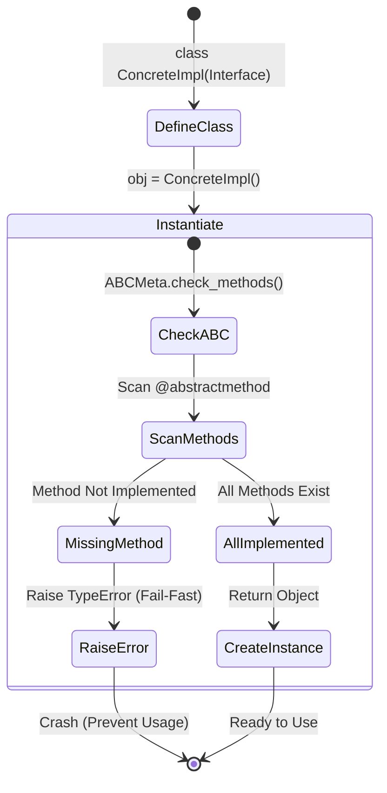

# 2단계. 정식 테스트 명세서 (TCS-ARCH-001) v1.1

## 1. 문서 정보 및 전략

- **대상 모듈:** `src.common.interfaces`
- **복잡도 수준:** **하 (Low)** (인터페이스 정의 및 아키텍처 강제성 검증)
- **커버리지 목표:** 분기 커버리지 100%, 구문 커버리지 100%
- **적용 전략:**
  - [x] **계약 테스트 (Contract Testing):** 추상 클래스(ABC)가 하위 구현체에 특정 메서드 구현을 강제하는지 검증.
  - [x] **실패 격리 (Fail-Fast):** 구현이 누락된 불완전한 클래스는 인스턴스화 단계에서 즉시 에러(`TypeError`)를 발생시켜 런타임 오류를 방지.
  - [x] **환경 호환성 (Environment Compatibility):** Python 3.12+의 에러 메시지 변경 사항(`'method'` vs `method`)에 유연하게 대응하는 정규식 검증.
  - [x] **커버리지 완결성 (Coverage Completeness):** `super()` 호출을 통해 추상 메서드의 기본 바디(`pass`)까지 실행하여 데드 코드 없음을 증명.

## 2. 로직 흐름도

## 3. BDD 테스트 시나리오

**시나리오 요약 (총 10건):**

1.  **아키텍처 강제성 (Architecture Enforcement):** 4건 (직접 생성 방지, 불완전 구현 방지, 기본 구현 실행)
2.  **인터페이스 준수 (Interface Compliance):** 3건 (각 주요 인터페이스별 정상 구현 및 호출 검증)
3.  **비동기 계약 (Async Contract):** 1건 (코루틴 선언 여부 검증)
4.  **타입 및 예외 (Type & Robustness):** 2건 (타입 힌트 호환성, 예외 전파)

|  테스트 ID   | 분류 |     기법     | 전제 조건 (Given)                     | 수행 (When)                            | 검증 (Then)                                                                          | 입력 데이터 / 상황           |
| :----------: | :--: | :----------: | :------------------------------------ | :------------------------------------- | :----------------------------------------------------------------------------------- | :--------------------------- |
| **ARCH-01**  | 단위 |     표준     | `IHttpClient` 추상 클래스 정의        | `IHttpClient()` 직접 인스턴스화 시도   | **TypeError 발생** (추상 클래스는 직접 생성 불가해야 함)                             | `None`                       |
| **ARCH-02**  | 단위 |     BVA      | `get`만 구현하고 `post` 누락한 구현체 | `PartialClient()` 인스턴스화 시도      | **TypeError 발생** (Regex: `abstract method .?post.?` 매칭 확인)                     | `class Partial(IHttpClient)` |
| **ARCH-03**  | 단위 |     BVA      | `IExtractor` 상속 후 `extract` 누락   | `BadExtractor()` 인스턴스화 시도       | **TypeError 발생** (Regex: `abstract method .?extract.?` 매칭 확인)                  | `class Bad(IExtractor)`      |
| **ARCH-04**  | 단위 | **커버리지** | `super()`를 호출하는 특수 구현체 정의 | 각 메서드(`get`/`post` 등) 호출        | **에러 없음**, `None` 반환 확인 (부모의 `pass` 구문까지 실행되어 커버리지 100% 달성) | `super().extract()` 호출     |
| **IMPL-01**  | 단위 |     표준     | `IHttpClient` 정상 구현체(Mock)       | `get()`, `post()` 메서드 호출          | 에러 없이 호출되며, 정의된 반환값(`Response`)을 리턴함                               | `MockClient`                 |
| **IMPL-02**  | 단위 |     표준     | `IAuthStrategy` 정상 구현체(Mock)     | `get_token(client)` 호출               | 에러 없이 호출되며, 토큰 문자열(`str`)을 리턴함                                      | `MockAuth`                   |
| **IMPL-03**  | 단위 |     표준     | `IExtractor` 정상 구현체(Mock)        | `extract(request)` 호출                | 에러 없이 호출되며, `ExtractedDTO` 객체를 리턴함                                     | `MockExtractor`              |
| **ASYNC-01** | 단위 |   **계약**   | 인터페이스 내 모든 메서드             | `inspect.iscoroutinefunction()` 검사   | 모든 메서드가 `True`를 반환해야 함 (비동기 함수로 정의됨)                            | `IHttpClient.get` 등         |
| **TYPE-01**  | 단위 |    데이터    | `RequestDTO`, `ExtractedDTO` 정의     | 인터페이스 메서드의 `Annotations` 검사 | 매개변수와 반환 타입 힌트가 `DTO` 클래스를 올바르게 참조하고 있음                    | `extract.__annotations__`    |
|  **ERR-01**  | 단위 |    견고성    | 구현체에서 예외 발생 상황             | 인터페이스 메서드 호출                 | 인터페이스 레벨에서 예외를 삼키지 않고 **그대로 전파(Propagate)**함                  | Mock: `raise ValueError`     |
