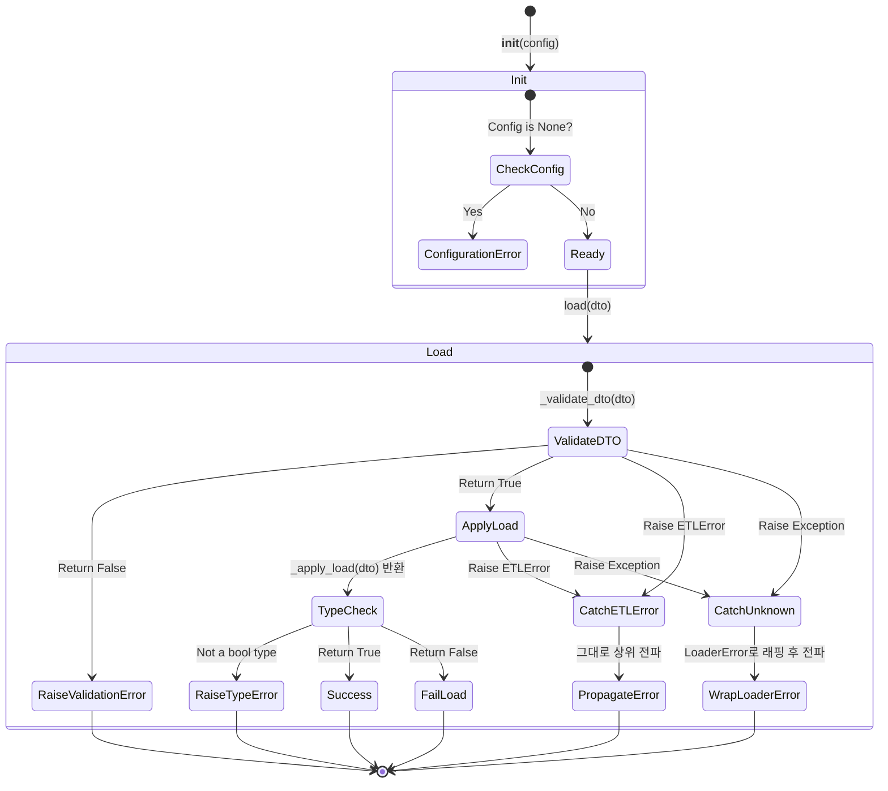

# AbtractLoader 테스트 문서

## 1. 문서 정보 및 전략

- **대상 모듈:** `src.common.loaders.abstract_loader.AbstractLoader`
- **복잡도 수준:** **높음 (High)** (Template Method 흐름 제어, 타입 방어, 중앙 집중식 예외 래핑)
- **커버리지 목표:** **분기/조건 커버리지(Branch/Condition Coverage) 100%**
- **적용 전략:**
  - [x] **상태 전이 검증 (State Transition):** 검증 -> 적재 로직 -> 타입 검사의 파이프라인 흐름 통제 검증.
  - [x] **경계값 및 타입 분석 (BVA & Type Defense):** 파이썬의 동적 타이핑 취약점을 노린 반환값 조작(Non-boolean) 방어.
  - [x] **예외 매핑 (Exception Mapping):** 이미 처리된 도메인 에러(`ETLError`)의 통과 보장 및 알 수 없는 에러(`Exception`)의 `LoaderError` 래핑(Wrapping) 보장.

## 2. 로직 흐름도

## 3. BDD 테스트 시나리오 명세

**시나리오 요약 (총 9건):**

1. **초기화 및 자원 방어:** 2건 (정상 생성, Config 로드 실패 방어)
2. **정상 흐름 및 비즈니스 로직:** 2건 (적재 성공, 적재 실패)
3. **데이터 및 타입 무결성 방어:** 2건 (DTO 검증 실패, 반환 타입 위반)
4. **결함 격리 및 예외 매핑:** 2건 (기지 에러 통과, 미지 에러 래핑)
5. **구조적 커버리지 달성:** 1건 (추상 메서드 선언부 검증)

|   테스트 ID   | 분류 | 기법  | 전제 조건 (Given)                                                        | 수행 (When)                  | 검증 (Then)                                                                    | 입력 데이터 / 상황                         |
| :-----------: | :--: | :---: | :----------------------------------------------------------------------- | :--------------------------- | :----------------------------------------------------------------------------- | :----------------------------------------- |
|  **INIT-01**  | 단위 |  BVA  | `ConfigManager.load()` 호출 시 에러가 발생하도록 설정됨                  | Mock 로더 초기화             | `ConfigurationError` 예외가 발생해야 함                                        | Mock Raise `ConfigurationError`            |
|  **INIT-02**  | 단위 | 표준  | `ConfigManager.load()`가 정상적인 객체를 반환하도록 설정됨               | Mock 로더 초기화             | 에러 없이 객체가 생성되고 로거가 초기화되어야 함                               | Mock Return Config                         |
|  **LOAD-01**  | 단위 | 표준  | `_validate_dto`가 `True`, `_apply_load`가 `True`를 반환하도록 상태 제어  | `load(dto)` 호출             | 예외 없이 `True`를 반환해야 함                                                 | `dto=MockDTO()`                            |
|  **LOAD-02**  | 단위 | 표준  | `_validate_dto`는 `True`, `_apply_load`는 `False`를 반환하도록 상태 제어 | `load(dto)` 호출             | 예외 없이 `False`를 반환해야 함                                                | `dto=MockDTO()`                            |
| **FAIL-V-01** | 단위 | MC/DC | `_validate_dto` 훅 메서드가 `False`를 반환하도록 강제됨                  | `load(dto)` 호출             | 1. `LoaderValidationError` 발생 2. `_apply_load`는 호출되지 않음            | `dto=MockDTO()`                            |
| **FAIL-T-01** | 단위 | 방어  | `_apply_load`가 `bool`이 아닌 값(`str`, `None` 등)을 반환하도록 오염됨   | `load(dto)` 호출             | 반환 타입 에러가 감지되어 `LoaderError` 예외가 발생해야 함                     | Return: `"Success"`                        |
| **ERR-K-01**  | 단위 | 매핑  | 하위 로직(`_apply_load`) 수행 중 `ETLError`(기지 에러)가 발생함          | `load(dto)` 호출             | 래핑되지 않고 원본 `ETLError`가 그대로 상위로 전파되어야 함                    | Raise `ETLError`                           |
| **ERR-U-01**  | 단위 | 매핑  | 하위 로직(`_apply_load`) 수행 중 `ValueError`(미지 에러)가 발생함        | `load(dto)` 호출             | 1. `LoaderError`로 래핑되어 전파됨 2. `original_exception`에 원본 에러 보존 | Raise `ValueError`                         |
|  **ABST-01**  | 단위 | 구조  | 추상 클래스의 원본 메서드(`_validate_dto`, `_apply_load`)에 접근         | 원본 추상 메서드를 직접 호출 | 예외 발생 없이 내부의 `pass` 블록을 통과해야 함                                | `AbstractLoader._validate_dto(None, None)` |
