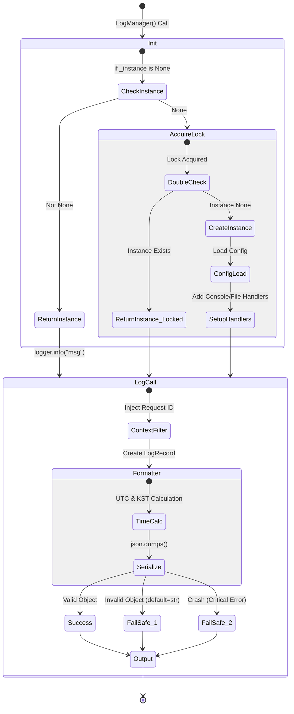

# LogManager 테스트 문서

## 1. 문서 정보 및 전략

- **대상 모듈:** `src.common.log`
- **복잡도 수준:** **상 (High)** (스레드 안전성, 비동기 컨텍스트 격리, 무중단 Fail-Safe 로직 포함)
- **커버리지 목표:** 분기 커버리지 100%, 구문 커버리지 100%
- **적용 전략:**
  - [x] **무중단성 (Fail-Safe):** 로깅 중 발생하는 어떠한 에러(직렬화 실패, 파일 권한 등)도 비즈니스 로직을 중단시키지 않음을 검증.
  - [x] **동시성 제어 (Concurrency):** 멀티스레드 환경에서의 Singleton 초기화 안전성(Double-Checked Locking) 및 비동기 Task 간 컨텍스트 격리 검증.
  - [x] **이중 타임존 (Dual Timezone):** 기계 처리를 위한 UTC와 운영자를 위한 KST가 동시에 정확히 기록되는지 검증.
  - [x] **데이터 무결성 (Data Integrity):** 특수문자, 비직렬화 객체 등 비정상 입력에 대한 방어 로직 검증.

## 2. 로직 흐름도

## 3. BDD 테스트 시나리오

**시나리오 요약 (총 16건):**

- **기능 성공 (Functional Success)**: 5건 (기본 포맷, 설정 로드, 자식 로거 분기)
- **경계값 및 데이터 (BVA/Data)**: 3건 (비직렬화 객체, 특수문자, 예외 트레이스)
- **견고성 (Robustness)**: 2건 (치명적 직렬화 실패, 파일 권한 오류)
- **동시성 및 상태 (Concurrency/State)**: 6건 (싱글톤 경합/경쟁상태, 컨텍스트 격리, 멱등성, 핸들러 중복방지)

|   테스트 ID   | 분류 |     기법     | 전제 조건 (Given)                      | 수행 (When)                            | 검증 (Then)                                                                      | 입력 데이터 / 상황             |
| :-----------: | :--: | :----------: | :------------------------------------- | :------------------------------------- | :------------------------------------------------------------------------------- | :----------------------------- |
|  **INIT-01**  | 단위 |     통합     | `ConfigManager` Mock 설정 (DEBUG 레벨) | `LogManager` 최초 초기화               | 1. 로거 레벨 `DEBUG` 설정 2. 핸들러 최소 1개 이상 부착                        | `log_level="DEBUG"`            |
|  **FMT-01**   | 단위 |     표준     | `LogManager` 초기화 완료               | `logger.info("test")` 호출             | JSON 내 `time`(UTC), `korean_time`(KST), `host`, `pid` 필드 존재 확인            | `msg="test"`                   |
|  **FMT-02**   | 단위 | **FailSafe** | 직렬화 불가능한 객체(Set 등) 포함      | `logger.info({"data": {1, 2}})` 호출   | 1. 에러 없음 2. 해당 객체가 문자열(`"{1, 2}"`)로 변환되어 기록됨              | `set={1, 2}`                   |
|  **FMT-03**   | 단위 |     BVA      | 빈 문자열 또는 특수문자 포함 메시지    | `logger.info("")` 또는 이스케이프 문자 | JSON 문법 오류 없이 파싱 가능한 유효한 JSON 문자열 생성                          | `msg=""` or `"\n\t"`           |
|  **FMT-04**   | 단위 | **FailSafe** | `json.dumps` 자체가 실패하도록 Mocking | `logger.info()` 호출                   | 1. 앱 크래시 없음 2. "CRITICAL: Failed to serialize" 메시지로 대체 기록       | `Mock side_effect=TypeError`   |
|  **CTX-01**   | 단위 |     상태     | `set_context("req-123")` 실행          | `logger.info()` 호출                   | JSON 내 `request_id` 필드가 "req-123"과 일치함                                   | `id="req-123"`                 |
|  **CTX-02**   | 단위 |     상태     | `set_context(None)` 실행               | `logger.info()` 호출                   | `request_id`가 UUID v4 형식으로 자동 생성되어 주입됨                             | `id=None`                      |
|  **EXC-01**   | 단위 |     예외     | `try-except` 블록 내부                 | `logger.exception("Error")` 호출       | JSON 내 `exception` 필드에 Stack Trace 정보가 텍스트로 포함됨                    | `raise ValueError`             |
|  **FILE-01**  | 통합 | **FailSafe** | 로그 디렉토리 쓰기 권한 제거(`chmod`)  | `LogManager` 초기화 시도               | 1. 앱 중단(Crash) 없음 2. `sys.stderr`에 에러 경고 출력                       | `Permission Denied`            |
|  **CONC-01**  | 통합 |  **동시성**  | 인스턴스 없는 상태, 10개 스레드 대기   | 동시에 `LogManager()` 생성자 호출      | 1. 생성된 인스턴스 주소값이 모두 동일 (Singleton) 2. 에러 없이 10개 모두 성공 | `Threads=10`                   |
|  **CONC-02**  | 통합 |  **동시성**  | `asyncio` 환경, 2개의 Task 실행        | 각 Task에서 서로 다른 Context ID 설정  | 로그 기록 시 서로의 `request_id`가 섞이지 않고 격리됨                            | `Task A="id-A", Task B="id-B"` |
|  **IDEM-01**  | 단위 |    멱등성    | 이미 초기화된 `LogManager` 존재        | `LogManager()` 재호출                  | 새로운 인스턴스를 만들지 않고 기존 인스턴스 반환                                 | `Singleton Check`              |
| **BRANCH-01** | 단위 |     분기     | `LogManager` 초기화 완료               | `get_logger("Child")` 호출             | 반환된 로거의 이름이 `APP.Child` 형태로 계층 구조를 가짐                         | `name="Child"`                 |
| **BRANCH-02** | 단위 |     분기     | 로거에 이미 핸들러가 존재하는 상태     | `LogManager` 초기화 실행               | **핸들러 추가 로직을 건너뜀** (기존 핸들러 개수 유지)                            | `handlers=[Existing]`          |
|  **RACE-01**  | 단위 |   **심화**   | `__new__`의 Lock 획득 시점 Mocking     | 다른 스레드가 인스턴스 생성했다고 가정 | 내가 생성하려던 것을 취소하고, **다른 스레드가 만든 인스턴스**를 반환            | `mock_lock` 조작               |
|  **RACE-02**  | 단위 |   **심화**   | `__init__`의 Lock 획득 시점 Mocking    | 다른 스레드가 초기화 완료했다고 가정   | **초기화 로직(Config 로드 등)을 수행하지 않음** (`_initialized` 플래그 확인)     | `mock_lock` 조작               |
