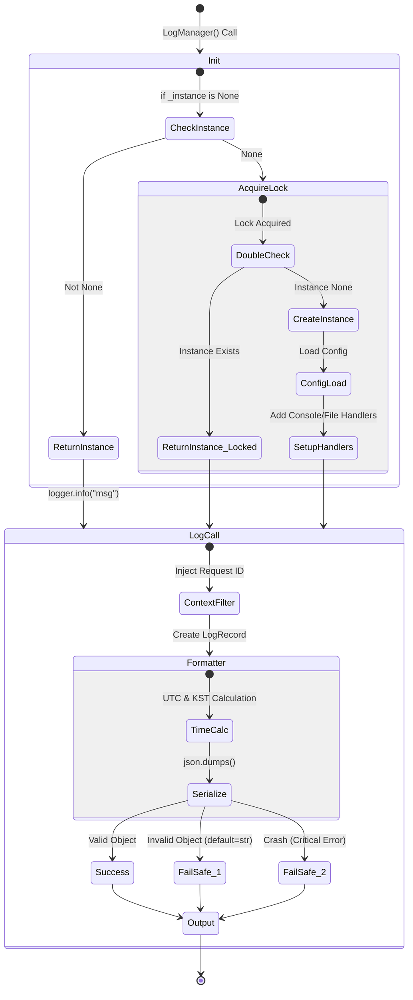

# LogManager 테스트 문서

## 1. 문서 정보 및 전략

- **대상 모듈:** `src.common.log`
- **복잡도 수준:** **상 (High)** (스레드 안전성, 비동기 컨텍스트 격리, 무중단 Fail-Safe 로직 포함)
- **커버리지 목표:** 분기 커버리지 100%, 구문 커버리지 100%
- **적용 전략:**
  - [x] **무중단성 (Fail-Safe):** 로깅 중 발생하는 어떠한 에러(직렬화 실패, 파일 권한 등)도 비즈니스 로직을 중단시키지 않음을 검증.
  - [x] **동시성 제어 (Concurrency):** 멀티스레드 환경에서의 Singleton 초기화 안전성(Double-Checked Locking) 및 비동기 Task 간 컨텍스트 격리 검증.
  - [x] **이중 타임존 (Dual Timezone):** 기계 처리를 위한 UTC와 운영자를 위한 KST가 동시에 정확히 기록되는지 검증.
  - [x] **데이터 무결성 (Data Integrity):** 특수문자, 비직렬화 객체 등 비정상 입력에 대한 방어 로직 검증.

## 2. 로직 흐름도

## 3. BDD 테스트 시나리오

**시나리오 요약 (총 19건):**

- **포맷팅 및 시각화 (Formatting/Visualization)**: 7건 (ColorFormatter 미적용 분기, JsonFormatter 예외 직렬화 및 Fallback 방어 수정)
- **컨텍스트 및 필터 (Context/Filter)**: 2건 (Request ID 주입, KST 시간 주입)
- **무중단성 방어 (Fail-Safe/Robustness)**: 3건 (JSON 직렬화 붕괴 방어 수정, OSError 파일 권한 방어)
- **초기화 및 동시성 (Init/Concurrency)**: 5건 (싱글톤 잠금, Init 내부 경합 분기, 핸들러 중복 방지)
- **기능 유틸리티 (Utility)**: 2건 (Get Logger 계층, Set Context)

|  테스트 ID  | 분류 |     기법     | 전제 조건 (Given)                                    | 수행 (When)                       | 검증 (Then)                                                          | 입력 데이터 / 상황                  |
| :---------: | :--: | :----------: | :--------------------------------------------------- | :-------------------------------- | :------------------------------------------------------------------- | :---------------------------------- |
| **CFMT-01** | 단위 |   동등분할   | 스네이크, 카멜, 빈 문자열 형태의 로거 이름           | `_format_name_to_pascal` 호출     | 모든 형태가 일관된 파스칼 케이스로 정규화됨                          | `"pipeline_service"`, `"App"`, `""` |
| **CFMT-02** | 단위 |     분기     | `INFO`, `ERROR` 레벨 및 특수 키워드(`요약`, `START`) | `ColorFormatter.format()` 호출    | 레벨 및 키워드에 맞는 ANSI 컬러 코드가 포맷팅된 문자열에 포함됨      | `level="INFO", msg="작업 요약"`     |
| **CFMT-03** | 단위 |     분기     | `WARNING`, `DEBUG` 등 별도 처리 조건이 없는 레벨     | `ColorFormatter.format()` 호출    | 조건문 통과(Bypass) 후 일반 포맷팅이 적용되어 반환됨                 | `level="WARNING"`                   |
| **JFMT-01** | 단위 |     포맷     | UTC 기준의 `LogRecord.created` 타임스탬프            | `JsonFormatter.formatTime()` 호출 | `+00:00`이 `Z`로 치환된 ISO 8601 포맷 반환                           | `record.created = 1609459200`       |
| **JFMT-02** | 단위 |     예외     | `exc_info`에 도메인 `ETLError`가 포함된 레코드       | `JsonFormatter.format()` 호출     | `ETLError.to_dict()` 내용 병합 및 `stack_trace` 필드 생성            | `raise ETLError`                    |
| **JFMT-03** | 단위 |     예외     | `exc_info`에 일반 `ValueError`가 포함된 레코드       | `JsonFormatter.format()` 호출     | `exception` 필드에 시스템 스택 트레이스 문자열 기록                  | `raise ValueError`                  |
| **JFMT-04** | 단위 | **FailSafe** | `json.dumps` 내부에서 치명적 예외 발생 상황          | `JsonFormatter.format()` 호출     | 프로세스 중단 없이 대체(Fallback) JSON 문자열 반환 (2차 직렬화 성공) | `Mock dumps -> [Error, Success]`    |
| **FLT-01**  | 단위 |     상태     | `request_id_ctx`에 특정 ID가 셋팅된 상태             | `ContextFilter.filter()` 호출     | 레코드에 `request_id`와 변환된 `korean_time` 속성 주입               | `request_id="REQ-123"`              |
| **INIT-01** | 단위 |    싱글톤    | 초기화되지 않은 `LogManager`                         | 인스턴스 2회 연속 생성            | 동일한 메모리 주소 반환 및 2번째는 초기화 로직 스킵                  | `manager1 is manager2`              |
| **INIT-02** | 단위 |     분기     | `ConfigManager._cache`에 캐시된 설정 존재            | `LogManager` 최초 초기화          | 캐시된 설정을 로드하며 에러 없이 로거 설정 완료                      | `Config._cache = {"A": Mock()}`     |
| **INIT-03** | 단위 |     분기     | 로거(`logger.handlers`)에 이미 핸들러가 존재         | `LogManager` 초기화 호출          | 핸들러 중복 추가(Duplicate Append) 방지 메커니즘 작동                | `len(logger.handlers) == 1`         |
| **INIT-04** | 단위 |  **동시성**  | `__init__` 내부 Lock 획득 시점 타 스레드 간섭        | Lock 진입 직후 초기화 여부 검사   | `_initialized`가 `True`일 경우 내부 로직 바이패스                    | `Mock Lock -> initialized=True`     |
| **FILE-01** | 통합 | **FailSafe** | 로그 디렉토리 쓰기 불가능 (OSError 강제)             | `_setup_file_handler()` 호출      | 프로세스 Crash 없이 `sys.stderr`에 에러 로그 출력                    | `Mock mkdir -> OSError`             |
| **CONC-01** | 통합 |  **동시성**  | 멀티스레드 환경 (10개 스레드 동시 생성)              | `LogManager()` 호출 경합          | Double-Checked Locking을 통해 단 1개의 인스턴스만 보장               | `ThreadPool(10)`                    |
| **CONC-02** | 단위 |    멱등성    | 인스턴스 생성 중 Lock 획득 시점 타 스레드 간섭       | `__new__` 내부 진입 시 검증       | Lock 획득 후 `_instance`가 이미 있다면 생성 취소 후 반환             | `Mock Lock.__enter__`               |
| **CTX-01**  | 단위 |     상태     | `request_id="custom_id"` 명시적 전달                 | `LogManager.set_context()` 호출   | ContextVar에 "custom_id" 저장 및 반환                                | `request_id="custom_id"`            |
| **CTX-02**  | 단위 |     상태     | `request_id=None` (파라미터 미제공)                  | `LogManager.set_context()` 호출   | UUID v4 포맷의 난수 ID 자동 생성 및 저장                             | `request_id=None`                   |
| **LOG-01**  | 단위 |     계층     | `name="CHILD_MODULE"` 파라미터 제공                  | `get_logger(name)` 호출           | "APP.CHILD_MODULE" 이름의 하위 로거 객체 반환                        | `name="CHILD"`                      |
| **LOG-02**  | 단위 |     계층     | `name=None` 파라미터 제공                            | `get_logger()` 호출               | "APP" 이름의 최상위 Root 로거 반환                                   | `name=None`                         |
