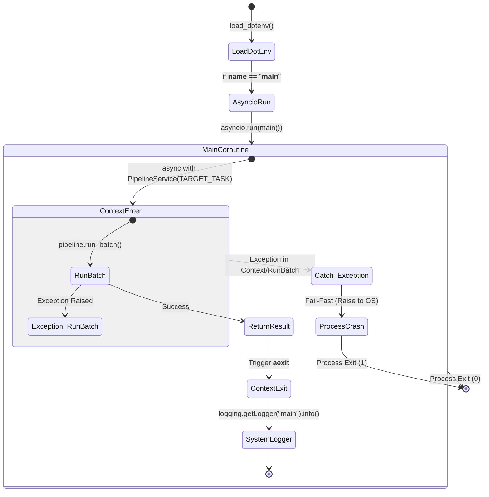

# Main 테스트 문서

## 1. 문서 정보 및 전략

- **대상 모듈:** `main.py`
- **복잡도 수준:** **하 (Low)** (단일 진입점, 환경변수 부트스트랩, 비동기 루프 생성)
- **커버리지 목표:** **분기/결정(Branch/Decision) 커버리지 100%**, 구문 커버리지 100%
- **적용 전략:**
  - [x] **초기화 보장 (Environment & Bootstrapping):** `.env` 파일 로드 동작 및 런타임 환경 구성 안정성 검증.
  - [x] **생명주기 및 리소스 관리 (Context Management):** `PipelineService`의 `async with` 블록이 정상적으로 진입/종료되는지 확인.
  - [x] **Fail-Fast (즉시 실패):** 파이프라인 초기화 또는 배치 실행 중 치명적 에러 발생 시, 에러를 삼키지 않고 프로세스를 즉각 종료시켜 좀비 프로세스화를 방지하는지 검증.
  - [x] **로깅 견고성 (Robustness):** `run_batch()`의 반환값이 예상치 못한 형태(`None`, 원시 타입 등)이더라도 메인 로거가 크래시 없이 안전하게 기록하는지 검증.

## 2. 로직 흐름도

## 3. BDD 테스트 시나리오

**시나리오 요약 (총 5건):**

1.  **정상 흐름 (Functional Success):** 1건 (정상 배치 실행 및 로그 기록)
2.  **경계값 및 환경 (Boundary/Environment):** 1건 (`.env` 누락 시 방어)
3.  **데이터 견고성 (Data Robustness):** 1건 (비정상 반환값 로깅)
4.  **논리적 예외 및 Fail-Fast (Logical Exceptions):** 2건 (초기화 실패, 실행 중 치명적 시스템 에러)

|    테스트 ID    | 분류 | 기법 | 전제 조건 (Given)                                                                                      | 수행 (When)               | 검증 (Then)                                                                                                                | 입력 데이터 / 상황                        |
| :-------------: | :--: | :--: | :----------------------------------------------------------------------------------------------------- | :------------------------ | :------------------------------------------------------------------------------------------------------------------------- | :---------------------------------------- |
| **MAIN-SUC-01** | 통합 | 표준 | 1. `PipelineService.run_batch()`가 정상적인 집계 딕셔너리 반환하도록 Mocking 2. 표준 Logger Mocking | `main()` 비동기 실행      | 1. `run_batch`가 1회 호출됨 2. 결과가 "main" 로거를 통해 `info` 레벨로 출력됨                                           | Mock Return: `{"total": 1, "success": 1}` |
| **MAIN-ENV-01** | 단위 | BVA  | 1. 로컬 환경에 `.env` 파일이 존재하지 않음 (Mock `load_dotenv` 반환값 False)                           | 모듈 로드 (`import main`) | 애플리케이션이 크래시되지 않고 정상적으로 로드 및 다음 라인(상수 정의 등)으로 진행됨                                       | `load_dotenv` -> `False`                  |
| **MAIN-LOG-01** | 단위 | BVA  | 1. `run_batch()`의 반환값이 빈 값(`None`)이거나 비정상 데이터 구조(문자열)임                           | `main()` 비동기 실행      | `print` 에러나 Type Error 없이 로거가 문자열로 안전하게 포맷팅하여 출력함                                                  | Mock Return: `None` 또는 `"Empty"`        |
| **MAIN-ERR-01** | 통합 | 상태 | 1. `PipelineService` 초기화 시점(Context 진입)에 `ConfigurationError` 발생하도록 Mocking               | `main()` 비동기 실행      | 1. 예외가 잡히지 않고(Fail-Fast) 상위 호출자에게 그대로 전파됨 2. 로깅 로직이 실행되지 않음                             | Mock Context: `raise ConfigurationError`  |
| **MAIN-ERR-02** | 통합 | 상태 | 1. `run_batch()` 내부에서 치명적인 `RuntimeError` 발생하도록 Mocking                                   | `main()` 비동기 실행      | 1. 예외가 상위로 전파됨 (프로세스 강제 종료 유도) 2. 컨텍스트 매니저의 `__aexit__`가 정상 호출되어 자원이 정리됨을 확인 | Mock Run: `raise RuntimeError`            |
