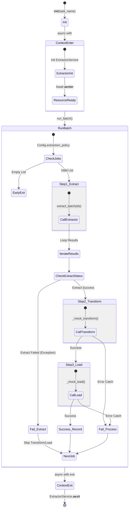

# 2단계. 정식 테스트 명세서 (TCS-PIPE-001)

## 1. 문서 정보 및 전략

- **대상 모듈:** `src.pipeline_service.PipelineService`
- **복잡도 수준:** **상 (High)** (다단계 프로세스 조율, 단계별 실패 격리, 비동기 리소스 전파)
- **커버리지 목표:** 분기 커버리지 100%, 구문 커버리지 100%
- **적용 전략:**
  - [x] **생명주기 전파 (Lifecycle Propagation):** 상위 서비스(`Pipeline`)의 Context 진입/종료가 하위 서비스(`Extractor`)에 올바르게 전파되는지 검증.
  - [x] **결함 격리 (Fault Tolerance):** 수집/변환/적재 각 단계의 실패가 전체 배치 작업을 중단시키지 않는지 검증 (Partial Failure Support).
  - [x] **MC/DC (수정 조건/결정 커버리지):** 성공/수집실패/변환실패/적재실패의 4가지 분기 조건이 독립적으로 동작하는지 검증.
  - [x] **조기 종료 (Early Return):** 설정(Config)이나 작업 목록이 비어있을 때 불필요한 리소스 할당 없이 종료되는지 검증.

## 2. 로직 흐름도

## 3. BDD 테스트 시나리오

**시나리오 요약 (총 10건):**

1.  **자원 생명주기 (Lifecycle):** 2건 (하위 서비스 리소스 전파, 재사용성)
2.  **배치 실행 (Batch Execution):** 3건 (단건 성공, 다건 성공, 빈 설정 방어)
3.  **결함 격리 (Fault Tolerance):** 4건 (수집 실패, 변환 실패, 적재 실패, 혼합 상황)
4.  **데이터 흐름 (Data Flow):** 1건 (DTO 객체 전달 정합성)

|  테스트 ID   | 분류 |    기법    | 전제 조건 (Given)                    | 수행 (When)                    | 검증 (Then)                                                                     | 입력 데이터 / 상황         |
| :----------: | :--: | :--------: | :----------------------------------- | :----------------------------- | :------------------------------------------------------------------------------ | :------------------------- |
| **LIFE-01**  | 통합 |    상태    | `PipelineService` 인스턴스 생성      | `async with Service` 블록 진입 | 내부 `_extractor_service.__aenter__`가 호출되어 리소스가 준비됨                 | `task_name="demo"`         |
| **LIFE-02**  | 통합 |   멱등성   | 이미 실행 완료된 서비스 인스턴스     | `run_batch()` 재호출           | 상태 꼬임 없이 독립적으로 재실행되며 정상 결과 반환 (재사용 가능)               | `Reuse Instance`           |
| **BATCH-01** | 단위 |    표준    | 정상 Job ID 1건이 포함된 설정        | `run_batch()` 호출             | 1. 수집->변환->적재 순차 실행 2. `summary`에 성공 1건 기록                   | `jobs=["job_A"]`           |
| **BATCH-02** | 단위 |    표준    | 정상 Job ID 3건이 포함된 설정        | `run_batch()` 호출             | 병렬 수집 후 3건 모두 성공 처리 (`total`: 3, `success`: 3)                      | `jobs=["A", "B", "C"]`     |
| **BATCH-03** | 단위 | 방어(BVA)  | `extraction_policy`가 비어있는 설정  | `run_batch()` 호출             | 1. 하위 서비스 호출 없이 즉시 리턴 2. `status`: "empty", `total`: 0 반환     | `jobs=[]`                  |
| **FAULT-01** | 단위 | **MC/DC**  | 수집 단계(`Extract`)에서 예외 발생   | `run_batch()` 호출             | 1. 변환/적재 단계 **호출되지 않음** 2. 결과 상태 `FAIL_EXTRACT` 기록         | Mock: `Extract -> Raise`   |
| **FAULT-02** | 단위 | **MC/DC**  | 변환 단계(`Transform`)에서 예외 발생 | `run_batch()` 호출             | 1. 적재 단계 **호출되지 않음** 2. 결과 상태 `FAIL_TRANSFORM_LOAD` 기록       | Mock: `Transform -> Raise` |
| **FAULT-03** | 단위 | **MC/DC**  | 적재 단계(`Load`)에서 예외 발생      | `run_batch()` 호출             | 결과 상태 `FAIL_TRANSFORM_LOAD` 기록 (변환 단계는 성공했음)                     | Mock: `Load -> Raise`      |
| **FAULT-04** | 통합 |  **격리**  | [성공, 수집실패, 적재실패] 혼합      | `run_batch()` 호출             | 전체 프로세스 중단 없이 완료. 집계 결과: `Total: 3`, `Success: 1`, `Fail: 2` | Mock: `[OK, Err, OK(Err)]` |
|  **INT-01**  | 단위 | 데이터흐름 | 수집된 `ExtractedDTO` 데이터 존재    | `run_batch()` 내부 흐름        | `_mock_transform`과 `_mock_load`에 `DTO` 객체가 손실 없이 순차적으로 전달됨     | `DTO(data="test")`         |
