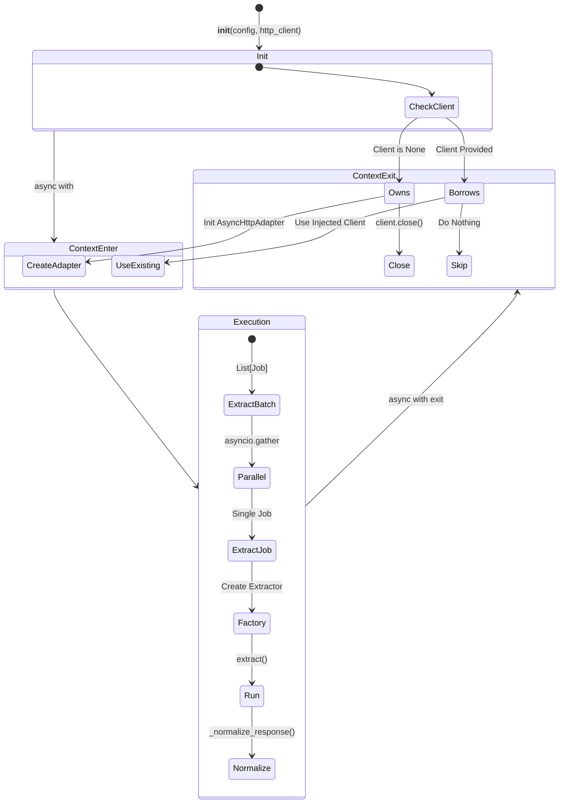

# Extractor Service 테스트 명세서

## 1. 문서 정보 및 전략

- **대상 모듈:** `extractor.extractor_service.ExtractorService`
- **복잡도 수준:** **상 (High)** (리소스 생명주기 제어, 비동기 병렬 처리, 예외 격리 및 전파)
- **커버리지 목표:** 분기 커버리지 100%, 구문 커버리지 100%
- **적용 전략:**
  - [x] **생명주기 검증 (Lifecycle):** Context Manager(`async with`) 진입/종료 시점의 리소스 할당 및 해제 검증.
  - [x] **의존성 주입 (DI):** 외부 주입(`External`) vs 내부 생성(`Internal`)에 따른 소유권 분기 검증.
  - [x] **결함 격리 (Fault Isolation):** 배치 처리 중 개별 작업 실패가 전체 프로세스를 중단시키지 않음(Partial Success).
  - [x] **정규화 (Normalization):** Provider별 상이한 성공 응답(200, OK, 0)의 표준화 로직에 BVA 적용.

## 2. 로직 흐름도

## 3. BDD 테스트 시나리오

**시나리오 요약 (총 16건):**

1. **자원 생명주기 (Lifecycle Management):** 4건 (내부/외부 자원 소유권 분기, Guard Clause, 예외 시 안전 종료)
2. **응답 정규화 (Response Normalization):** 4건 (Fast Path, 표준 매핑, 결측치 보정, 에러 코드 방어)
3. **단건 수집 및 에러 (Single Job & Error):** 4건 (설정 누락 예외, 파라미터 오버라이드 병합, Known/Unknown 에러 계층 래핑)
4. **배치 및 동시성 (Batch & Concurrency):** 4건 (혼합 타입 파싱, 방어적 타입 검사, 부분 성공 격리 보장, 빈 요청 처리)

|  테스트 ID   | 분류 |   기법   | 전제 조건 (Given)                                    | 수행 (When)                     | 검증 (Then)                                                                           | 입력 데이터 / 상황      |
| :----------: | :--: | :------: | :--------------------------------------------------- | :------------------------------ | :------------------------------------------------------------------------------------ | :---------------------- |
| **LIFE-01**  | 통합 |   상태   | `http_client=None`으로 서비스 초기화                 | `async with` 진입 후 종료       | 1. 진입 시 내부 `AsyncHttpAdapter` 생성 2. 종료 시 `close()` 정상 호출 확인        | `client=None`           |
| **LIFE-02**  | 통합 |   상태   | 외부에서 생성된 `http_client` 주입                   | `async with` 진입 후 종료       | 종료 시 주입된 외부 클라이언트의 `close()`가 **호출되지 않음** (자원 보존)            | `client=MockAdapter`    |
| **LIFE-03**  | 단위 |   방어   | `async with`를 통한 초기화 없이 생성                 | `extract_job()` 직접 호출       | `RuntimeError` 발생 ("HTTP Client is not initialized")                                | Context Entry 누락      |
| **LIFE-04**  | 단위 |   예외   | 내부 자원 할당 상태에서 작업 중 강제 예외 발생       | `__aexit__` 호출 (Context 이탈) | 로직 실패와 무관하게 `client.close()`가 안전하게 수행되어 누수 방지                   | `Raise Exception`       |
| **NORM-01**  | 단위 |   경로   | 이미 `status="success"`인 정규화 완료 응답           | `_normalize_response()` 호출    | 추가 연산 없이 원본 DTO를 즉시 반환 (Fast Path)                                       | `status="success"`      |
| **NORM-02**  | 단위 |   BVA    | 다양한 이질적 성공 코드 (200, 0, OK, SUCCESS)        | `_normalize_response()` 호출    | 모든 케이스가 `status="success"`로 일관되게 정규화됨                                  | `code="200", "0", "OK"` |
| **NORM-03**  | 단위 |   견고   | `status_code`가 None 이거나 빈 문자열인 응답         | `_normalize_response()` 호출    | 암묵적 성공으로 간주하여 `success` 및 `200`으로 자가 보정                             | `code=None` or `""`     |
| **NORM-04**  | 단위 |   방어   | 외부 API 실패 코드 (404, 500, ERROR) 응답            | `_normalize_response()` 호출    | 상태가 `success`로 덮어씌워지지 않고 원본 상태 유지                                   | `code="404", "FAIL"`    |
|  **JOB-01**  | 예외 |   로직   | Config에 정의되지 않은 잘못된 Job ID                 | `extract_job()` 호출            | `ConfigurationError` 발생 ("Job ID를 찾을 수 없습니다")                               | `job_id="INVALID"`      |
|  **JOB-02**  | 통합 |  데이터  | Policy 기본 파라미터 + Override 파라미터 동시 존재   | `extract_job()` 호출            | Factory에 전달된 최종 파라미터에 Override 값이 병합(우선 적용)됨                      | `override={"k":"v"}`    |
|  **JOB-03**  | 예외 |   계층   | Extractor가 `ETLError` (도메인 에러) 발생            | `extract_job()` 호출            | 예외를 중복 래핑하지 않고 그대로 `ETLError`로 상위 전파                               | `Raise ETLError`        |
|  **JOB-04**  | 예외 |   계층   | Extractor가 `KeyError` (시스템 에러) 발생            | `extract_job()` 호출            | 구조화된 로깅 후 `ExtractorError`로 강제 래핑하여 전파                                | `Raise KeyError`        |
| **BATCH-01** | 통합 |   구조   | `str` ID와 `tuple` (ID, Params)이 혼합된 배치 리스트 | `extract_batch()` 호출          | 두 가지 타입이 모두 올바르게 파싱되어 병렬 작업 큐에 추가 및 수행됨                   | `["id1", ("id2", {})]`  |
| **BATCH-02** | 단위 |   방어   | 배치 리스트 내에 잘못된 타입(int)이 섞여 있음        | `extract_batch()` 호출          | 잘못된 타입은 로깅 후 무시하고 유효한 작업만 정상 반환                                | `["id1", 1234]`         |
| **BATCH-03** | 통합 | **격리** | 3건의 요청 중 2번째 작업에서 네트워크 예외 발생      | `extract_batch()` 호출          | 1. 파이프라인 크래시 없음 2. 결과 리스트에 성공 DTO 2개, Exception 객체 1개가 담김 | `[OK, Error, OK]`       |
| **BATCH-04** | 단위 |   BVA    | 빈 리스트(`[]`)로 배치 수집 요청                     | `extract_batch()` 호출          | 에러 없이 즉시 빈 리스트 `[]` 반환                                                    | `requests=[]`           |
