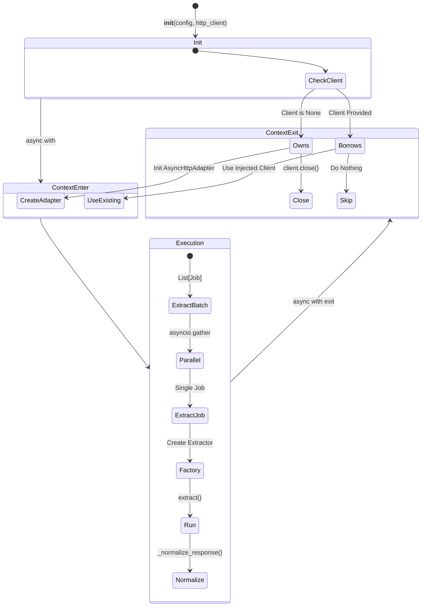

# Extractor Service 테스트 명세서

## 1. 문서 정보 및 전략

- **대상 모듈:** `extractor.extractor_service.ExtractorService`
- **복잡도 수준:** **상 (High)** (리소스 생명주기 제어, 비동기 병렬 처리, 예외 격리 및 전파)
- **커버리지 목표:** 분기 커버리지 100%, 구문 커버리지 100%
- **적용 전략:**
  - [x] **생명주기 검증 (Lifecycle):** Context Manager(`async with`) 진입/종료 시점의 리소스 할당 및 해제 검증.
  - [x] **의존성 주입 (DI):** 외부 주입(`External`) vs 내부 생성(`Internal`)에 따른 소유권 분기 검증.
  - [x] **결함 격리 (Fault Isolation):** 배치 처리 중 개별 작업 실패가 전체 프로세스를 중단시키지 않음(Partial Success).
  - [x] **정규화 (Normalization):** Provider별 상이한 성공 응답(200, OK, 0)의 표준화 로직에 BVA 적용.

## 2. 로직 흐름도

## 3. BDD 테스트 시나리오

**시나리오 요약 (총 17건):**

1.  **자원 생명주기 (Lifecycle Management):** 4건 (내부 생성, 외부 주입, 가드 클로즈, 안전한 종료)
2.  **응답 정규화 (Response Normalization):** 4건 (Fast Path, 표준 매핑, 빈 값 보정, 실패 유지)
3.  **단건 수집 및 에러 (Single Job & Error):** 4건 (정책 누락, 파라미터 병합, 도메인/시스템 에러 분기)
4.  **배치 및 동시성 (Batch & Concurrency):** 4건 (입력 혼합, 잘못된 입력, 부분 성공, 빈 요청)
5.  **팩토리 협력 (Factory Interaction):** 1건 (올바른 위임 검증)

|  테스트 ID   | 분류 |    기법    | 전제 조건 (Given)                  | 수행 (When)                    | 검증 (Then)                                                                         | 입력 데이터 / 상황           |
| :----------: | :--: | :--------: | :--------------------------------- | :----------------------------- | :---------------------------------------------------------------------------------- | :--------------------------- |
| **LIFE-01**  | 통합 |    상태    | `http_client=None`으로 초기화      | `async with Service` 블록 진입 | 1. 내부 `AsyncHttpAdapter` 생성 2. 종료 시 `close()` 호출됨                      | `client=None`                |
| **LIFE-02**  | 통합 |    상태    | 외부 `client` 주입하여 초기화      | `async with Service` 블록 종료 | 종료 시 주입된 클라이언트의 `close()`가 **호출되지 않음**                           | `client=MockObj`             |
| **LIFE-03**  | 단위 |   방어적   | `async with` 없이 인스턴스만 생성  | `extract_job()` 직접 호출      | `RuntimeError` 발생 ("HTTP Client is not initialized")                              | Context Entry 누락           |
| **LIFE-04**  | 단위 |    구조    | 내부 Client 생성 후 예외 발생      | `__aexit__` 강제 호출          | 예외 발생 여부와 관계없이 `client.close()`가 안전하게 수행됨                        | `exc_type=ValueError`        |
| **NORM-01**  | 단위 |     -      | 이미 `status="success"`인 응답     | `_normalize_response` 호출     | 로직 수행 없이 원본 객체 즉시 반환 (Fast Path)                                      | `meta={"status": "success"}` |
| **NORM-02**  | 단위 | 결정(BVA)  | 다양한 성공 코드 (대소문자/공백)   | `_normalize_response` 호출     | 모두 `status="success"`로 변환됨 (200, 0, OK, SUCCESS)                              | `code="200"`, `"Ok "`, `"0"` |
| **NORM-03**  | 단위 |   견고성   | `status_code`가 없거나 빈 값       | `_normalize_response` 호출     | 1. `status="success"` 설정 2. `status_code=200` 기본값 보정                      | `code=None` or `""`          |
| **NORM-04**  | 단위 |     -      | 실패 코드 (404, 500 등)            | `_normalize_response` 호출     | `status`가 변경되지 않음 (성공으로 오인 방지)                                       | `code="404"`, `"ERROR"`      |
|  **JOB-01**  | 예외 |    로직    | Config에 없는 Job ID               | `extract_job` 호출             | `ExtractorError` 발생 ("Job ID not found")                                          | `job_id="GHOST_JOB"`         |
|  **JOB-02**  | 단위 | 데이터흐름 | Override 파라미터 제공             | `extract_job` 호출             | Factory 생성 시 Config 파라미터 위에 Override 값이 덮어씌워짐                       | `params={"p": "new"}`        |
|  **JOB-03**  | 예외 |    계층    | Extractor가 `ExtractorError` 발생  | `extract_job` 호출             | 경고(Warning) 로그만 남기고, 에러를 그대로(Raise) 상위 전파                         | `Raise ExtractorError`       |
|  **JOB-04**  | 예외 |    계층    | Extractor가 `Exception` 발생       | `extract_job` 호출             | 에러(Error) 로그 기록 후, `ExtractorError`로 래핑하여 던짐                          | `Raise KeyError`             |
| **BATCH-01** | 통합 |    구조    | `str`과 `tuple`이 섞인 리스트 요청 | `extract_batch` 호출           | 두 가지 타입 모두 파싱되어 정상적으로 작업 큐에 추가됨                              | `["id1", ("id2", param)]`    |
| **BATCH-02** | 단위 |   방어적   | 리스트에 잘못된 타입(int) 포함     | `extract_batch` 호출           | 해당 항목은 무시(Skip)하고 경고 로그 기록 후, 나머지 작업만 수행                    | `requests=["id1", 123]`      |
| **BATCH-03** | 통합 |  **격리**  | 3건 중 1건에서 에러 발생           | `extract_batch` 호출           | 1. 전체 프로세스 중단 없음 2. 결과 리스트에 `ResponseDTO`와 `Exception`이 혼합됨 | Mock: `[OK, Error, OK]`      |
| **BATCH-04** | 단위 |    BVA     | 빈 리스트 요청                     | `extract_batch` 호출           | 에러 없이 빈 리스트 `[]` 즉시 반환                                                  | `requests=[]`                |
| **FACT-01**  | 단위 |    협력    | 정상적인 Job ID 요청               | `extract_job` 호출             | `ExtractorFactory.create_extractor`가 올바른 인자로 호출됨                          | Spy on `Factory.create`      |
