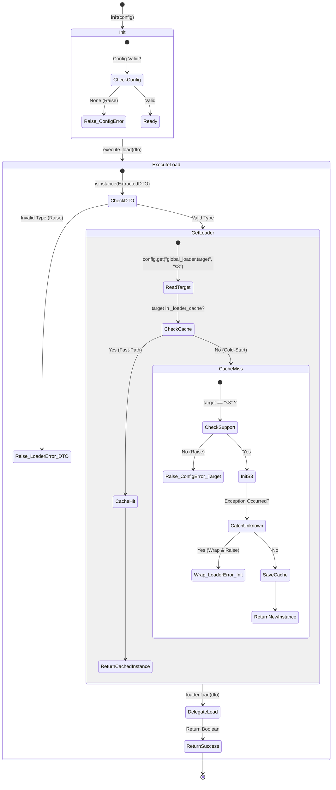

# Loader Service 테스트 명세서

## 1. 문서 정보 및 전략

- **대상 모듈:** `src.loader.loader_service.LoaderService`
- **복잡도 수준:** **높음 (High)** (지연 초기화, 인메모리 캐싱, 예외 래핑(Exception Wrapping), 런타임 의존성 주입)
- **커버리지 목표:** 분기 커버리지 100%, 구문 커버리지 100%
- **적용 전략:**
  - [x] **상태 기반 캐싱 검증 (State & Idempotency):** Cold-Start(캐시 미스)와 Fast-Path(캐시 히트) 시 객체 생성 횟수가 정확히 통제되는지 검증.
  - [x] **입력 데이터 무결성 방어 (Data Schema):** 잘못된 DTO 타입 인입 시 조기 종료(Early Return) 및 방어 로직 검증.
  - [x] **예외 격리 및 래핑 (Exception Mapping):** 동적 임포트(Import) 및 인스턴스화 과정에서 발생하는 알 수 없는 에러가 파이프라인 표준 예외(`LoaderError`)로 래핑되는지 검증.
  - [x] **경계값 및 기본값 처리 (BVA / Fallback):** 설정에 타겟 명시가 누락되었을 때 하드코딩된 기본값(`s3`)으로 정상 작동하는지 확인.

## 2. 로직 흐름도

## 3. BDD 테스트 시나리오

**시나리오 요약 (총 6건):**

1. **데이터 무결성 검증 (Validation):** 1건 (DTO 타입 방어 로직)
2. **지연 초기화 및 캐싱 (Lazy Loading & Caching):** 2건 (AWS 로더 Cold-Start 및 Fast-Path)
3. **설정 및 타겟 검증 (Configuration):** 1건 (미지원 타겟 입력 시 ConfigurationError 바이패싱)
4. **예외 격리 및 래핑 (Exception Handling):** 1건 (알 수 없는 에러의 LoaderError 래핑)
5. **정상 실행 (Execution):** 1건 (성공적인 위임 및 반환)

|   테스트 ID   | 분류 | 기법 | 전제 조건 (Given)                                        | 수행 (When)                                | 검증 (Then)                                                            | 입력 데이터 / 상황          |
| :-----------: | :--: | :--: | :------------------------------------------------------- | :----------------------------------------- | :--------------------------------------------------------------------- | :-------------------------- |
| **DTO-E-01**  | 단위 | Type | `target="aws"`로 서비스가 초기화됨                       | 일반 Dict 객체로 `execute_load()` 호출     | 1. `LoaderError` 발생 2. 타입 검증 실패 메시지 확인                 | `dto={"data": "test"}`      |
|  **LOAD-01**  | 단위 | 상태 | 1. `target="aws"` 설정 2. 인메모리 캐시가 비어있음    | 올바른 DTO로 `execute_load()` 최초 호출    | 1. `S3Loader` 모듈 동적 임포트 및 객체 생성 2. 캐시에 인스턴스 저장 | `target="aws"`, 1회 호출    |
|  **LOAD-02**  | 단위 | 상태 | 1. `target="aws"` 설정 2. S3Loader가 이미 캐시에 존재 | 올바른 DTO로 `execute_load()` 두 번째 호출 | 1. 객체 재생성(초기화) 없음 2. 캐시 히트로 즉시 `load()` 위임       | 2회 연속 호출               |
| **CONF-E-01** | 단위 | BVA  | `target="gcp"` (미지원 타겟)로 서비스 초기화됨           | 올바른 DTO로 `execute_load()` 호출         | 1. `ConfigurationError`가 래핑 없이 즉시 발생 (Bypass)                 | `target="gcp"`              |
|  **ERR-01**   | 단위 | 래핑 | AWS 로더 초기화 중 예상치 못한 `KeyError` 발생           | 올바른 DTO로 `execute_load()` 호출         | 1. `LoaderError`로 래핑되어 발생 2. 원본 예외(`KeyError`) 보존      | Mock: Policy 객체 속성 누락 |
|  **EXEC-01**  | 통합 | 표준 | `target="aws"` 환경 및 정상 DTO 준비                     | `execute_load()` 호출                      | 내부 `loader.load()`의 결과인 `True` 반환 확인                         | Mock: `load()` -> `True`    |
