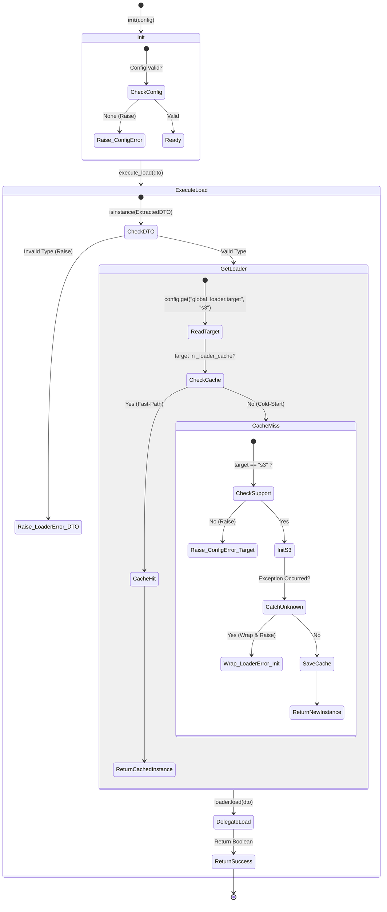

# Loader Service 테스트 명세서

## 1. 문서 정보 및 전략

- **대상 모듈:** `src.loader.loader_service.LoaderService`
- **복잡도 수준:** **높음 (High)** (지연 초기화, 인메모리 캐싱, 예외 래핑(Exception Wrapping), 런타임 의존성 주입)
- **커버리지 목표:** 분기 커버리지 100%, 구문 커버리지 100%
- **적용 전략:**
  - [x] **상태 기반 캐싱 검증 (State & Idempotency):** Cold-Start(캐시 미스)와 Fast-Path(캐시 히트) 시 객체 생성 횟수가 정확히 통제되는지 검증.
  - [x] **입력 데이터 무결성 방어 (Data Schema):** 잘못된 DTO 타입 인입 시 조기 종료(Early Return) 및 방어 로직 검증.
  - [x] **예외 격리 및 래핑 (Exception Mapping):** 동적 임포트(Import) 및 인스턴스화 과정에서 발생하는 알 수 없는 에러가 파이프라인 표준 예외(`LoaderError`)로 래핑되는지 검증.
  - [x] **경계값 및 기본값 처리 (BVA / Fallback):** 설정에 타겟 명시가 누락되었을 때 하드코딩된 기본값(`s3`)으로 정상 작동하는지 확인.

## 2. 로직 흐름도

## 3. BDD 테스트 시나리오

**시나리오 요약 (총 9건):**

1.  **객체 초기화 (Initialization):** 2건 (정상 초기화, 설정 누락 방어)
2.  **데이터 무결성 검증 (Validation):** 1건 (DTO 타입 검증)
3.  **지연 초기화 및 캐싱 성능 (Lazy Loading & Caching):** 2건 (최초 호출, 재호출 성능 이점)
4.  **설정값 폴백 처리 (Fallback):** 1건 (기본 타겟 사용)
5.  **예외 처리 및 래핑 (Exception Handling):** 3건 (미지원 타겟, 초기화 중단 에러 래핑, 정상 실행 완료)

|   테스트 ID   | 분류 |   기법   | 전제 조건 (Given)                             | 수행 (When)                   | 검증 (Then)                                                                             | 입력 데이터 / 상황                  |
| :-----------: | :--: | :------: | :-------------------------------------------- | :---------------------------- | :-------------------------------------------------------------------------------------- | :---------------------------------- |
|  **INIT-01**  | 단위 |   표준   | 유효한 `ConfigManager` 객체가 준비됨          | `LoaderService` 인스턴스 생성 | 1. 예외 없이 인스턴스 생성됨 2. 빈 `_loader_cache` 딕셔너리가 초기화됨               | `config=MockConfig()`               |
| **INIT-E-01** | 단위 |   BVA    | `ConfigManager` 객체가 `None`임               | `LoaderService` 인스턴스 생성 | `ConfigurationError`가 즉시 발생하며 초기화가 차단됨                                    | `config=None`                       |
| **DTO-E-01**  | 단위 |   Type   | `execute_load` 호출 시 DTO가 아닌 값 전달됨   | `execute_load(dto)` 호출      | 1. `LoaderError` 발생 2. `should_retry=False` 속성 확인                              | `dto={"data": "test"}` (Dict)       |
|  **LOAD-01**  | 연동 |   상태   | 1. 캐시가 비어있음 2. 타겟이 "s3"로 설정됨 | `execute_load(dto)` 최초 호출 | 1. `S3Loader`가 동적 임포트/생성됨 2. 생성된 객체가 캐시에 저장됨                    | `target="s3"`, 1회 호출             |
|  **LOAD-02**  | 단위 |   상태   | 1. 타겟 "s3" 로더가 이미 캐시에 존재함        | `execute_load(dto)` 재호출    | 1. 새 로더 인스턴스를 생성하지 않음 2. 캐시된 인스턴스의 `load()`가 즉시 호출됨      | 2회 연속 호출                       |
|  **CONF-01**  | 단위 |   BVA    | 설정 파일에 `global_loader.target` 값이 없음  | `execute_load(dto)` 호출      | 기본값인 `DEFAULT_LOADER_TARGET`("s3")을 사용하여 정상 적재 수행됨                      | `config.get` 반환값 누락            |
| **CONF-E-01** | 단위 |  MC/DC   | 설정된 타겟이 지원하지 않는 값("mysql")임     | `execute_load(dto)` 호출      | 1. `ConfigurationError` 발생 2. 메시지에 잘못된 타겟명이 포함됨                      | `target="mysql"`                    |
|  **ERR-01**   | 단위 | 예외래핑 | "s3" 로더 초기화 중 예상치 못한 에러 발생     | `execute_load(dto)` 호출      | 1. 발생한 예외가 `LoaderError`로 래핑됨 2. `original_exception`에 원본 에러가 보존됨 | Mock: `S3Loader()` -> `ImportError` |
|  **EXEC-01**  | 연동 |   표준   | 올바른 설정과 유효한 `ExtractedDTO`가 준비됨  | `execute_load(dto)` 호출      | 내부 `loader.load(dto)` 결과값(True)을 최종 반환함                                      | `loader.load` -> `True` 반환        |
