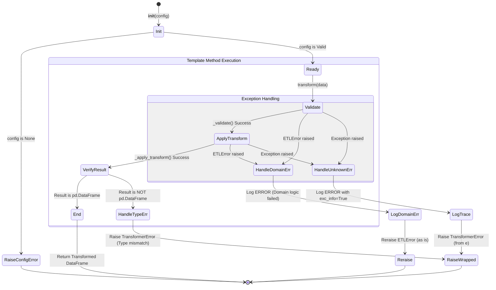

# AbstractTransformer 테스트 명세서

## 1. 문서 정보 및 전략

- **대상 모듈:** `src.transformer.processors.abstract_transformer.AbstractTransformer`
- **복잡도 수준:** **높음 (High)** (모든 데이터 변환기의 기반이 되는 템플릿 메서드 패턴 적용 및 중앙 집중식 에러/로깅 처리)
- **커버리지 목표:** 분기 커버리지 100%, 구문 커버리지 100%
- **적용 전략:**
  - [x] **상태 전이 (State Transition):** 템플릿 메서드의 실행 흐름(`_validate` -> `_apply_transform` -> 타입 검증) 순서 보장 검증.
  - [x] **결함 주입 (Fault Injection):** 예측 가능한 도메인 예외(`ETLError`)와 예측 불가능한 런타임 예외(`Exception`) 상황 강제 시뮬레이션.
  - [x] **Stubbing & Mocking:** 추상 클래스 테스트를 위한 구체 구현체(Stub) 정의 및 `ConfigManager`, 로거 모의 객체(Mock) 주입.
  - [x] **경계값 분석 (BVA):** 빈 데이터프레임(Empty DataFrame) 입력 및 필수 의존성 누락(`None`) 방어 검증.

## 2. 로직 흐름도

## 3. BDD 테스트 시나리오

**시나리오 요약 (총 9건):**

- **초기화 (Initialization):** 2건 (정상 인스턴스 생성, Config 누락 방어)
- **정상 흐름 (Happy Path):** 1건 (템플릿 메서드 호출 순서 및 로깅)
- **데이터 검증 (Data Verification):** 2건 (빈 DataFrame 통과, 반환 타입 방어)
- **에러 핸들링 (Error Handling):** 2건 (도메인 에러 통과, 예측 불가 에러 래핑)
- **상태 및 멱등성 (State & Idempotency):** 1건 (연속 호출 시 상태 비저장성 유지)
- **기반 메서드 (Base Method):** 1건 (추상 클래스 기본 동작 확인)

|  테스트 ID  | 분류 |   기법   | 전제 조건 (Given)                                   | 수행 (When)                                     | 검증 (Then)                                                                                                     | 입력 데이터 / 상황        |
| :---------: | :--: | :------: | :-------------------------------------------------- | :---------------------------------------------- | :-------------------------------------------------------------------------------------------------------------- | :------------------------ |
| **INIT-01** | 단위 |   표준   | 유효한 `ConfigManager` 모의 객체                    | `StubTransformer(config)` 초기화                | 1. 인스턴스 정상 생성 2. 내부 로거가 해당 클래스명으로 초기화됨                                              | `config=MockConfig()`     |
| **INIT-02** | 단위 |   BVA    | `config` 객체가 `None`인 상태                       | `StubTransformer(None)` 초기화                  | `ConfigurationError` 발생 (메시지: "초기화 실패...")                                                            | `config=None`             |
| **FLOW-01** | 단위 |   상태   | 모든 단계가 성공하는 `StubTransformer`              | `transform(valid_df)` 호출                      | 1. `_validate` -> `_apply_transform` 순서대로 호출됨 2. 시작/종료 INFO 로그 기록됨 3. 결과 DataFrame 반환 | `valid_df (shape: 10, 5)` |
| **DATA-01** | 단위 |   BVA    | 로우(Row)가 없는 빈 DataFrame                       | `transform(empty_df)` 호출                      | 에러 없이 파이프라인 정상 통과 및 반환                                                                          | `empty_df (shape: 0, 5)`  |
| **DATA-02** | 단위 |  견고성  | `_apply_transform`이 DataFrame이 아닌 값 반환       | `transform(df)` 호출                            | 1. `TransformerError` 발생 2. `should_retry=False` 설정 확인                                                 | Stub Return: `pd.Series`  |
| **ERR-01**  | 예외 | 결함주입 | `_validate` 중 `ETLError` 도메인 에러 발생          | `transform(df)` 호출                            | 1. 에러 래핑 없이 원본 `ETLError` 그대로 발생 2. ERROR 로그 기록 확인                                        | Raise `ETLError`          |
| **ERR-02**  | 예외 | 결함주입 | `_apply_transform` 중 알 수 없는 `MemoryError` 발생 | `transform(df)` 호출                            | 1. `TransformerError`로 래핑되어 발생 2. ERROR 로그에 Stack Trace(`exc_info`) 포함                           | Raise `MemoryError`       |
| **STAT-01** | 단위 |   상태   | 단일 `StubTransformer` 인스턴스 생성                | `transform(df1)`, `transform(df2)` 연속 호출    | 두 호출이 서로 간섭 없이 독립적으로 성공하며 멱등성 보장                                                        | `df1`, `df2`              |
| **BASE-01** | 단위 |   표준   | 초기화된 `StubTransformer` 인스턴스                 | `AbstractTransformer`의 추상 메서드 명시적 호출 | `pass` 블록이 예외 없이 실행되며 반환값이 `None`임                                                              | `valid_df`                |
