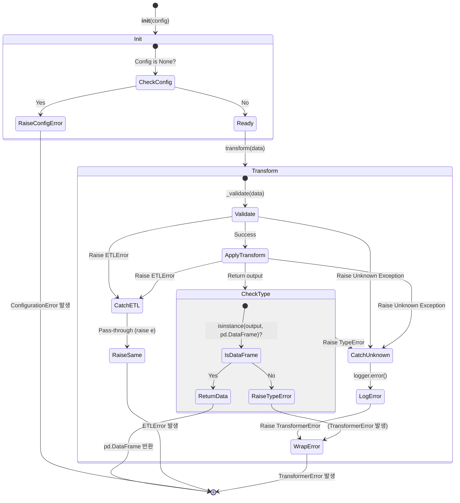

# AbstractTransformer 테스트 명세서

## 1. 문서 정보 및 전략

- **대상 모듈:** `src.common.transformers.AbstractTransformer`
- **복잡도 수준:** **중 (Medium)** (추상 클래스의 템플릿 메서드 패턴, 예외 타입 분기 처리)
- **커버리지 목표:** **분기 커버리지(Branch Coverage) 100%**, 구문 커버리지 100%
- **적용 전략:**
  - **의존성 격리 (Dependency Isolation):** 추상 클래스를 직접 인스턴스화할 수 없으므로, 테스트 전용 구체 클래스(Dummy/Mock Concrete Class)를 선언하여 `_validate`와 `_apply_transform`의 동작을 제어합니다.
  - **예외 래핑 및 전파 (Exception Propagation):** 파이썬 내장 에러가 `TransformerError`로 규격화되는 로직과 이미 규격화된 `ETLError`가 그대로 전파되는 로직을 구분하여 검증합니다.
  - **타입 강제 (Type Assertion):** 동적 언어의 한계를 보완하기 위해 반환 타입이 `pd.DataFrame`인지 검증하는 방어 로직을 중점적으로 테스트합니다.

## 2. 로직 흐름도

## 3. BDD 테스트 시나리오

**시나리오 요약 (총 7건):**

1.  **초기화 (Initialization):** 1건 (설정 누락 검증)
2.  **정상 흐름 (Happy Path):** 1건 (정상 변환 파이프라인)
3.  **경계값 분석 (BVA):** 1건 (빈 데이터프레임 처리)
4.  **타입 무결성 (Type Integrity):** 1건 (반환 타입 불일치 방어)
5.  **예외 처리 (Exception Handling):** 3건 (알려진 에러 전파, 알 수 없는 에러 래핑, 로깅 호출)

|  테스트 ID   | 분류 | 기법 | 전제 조건 (Given)                                  | 수행 (When)                          | 검증 (Then)                                                                           | 입력 데이터 / Mock 상황         |
| :----------: | :--: | :--: | :------------------------------------------------- | :----------------------------------- | :------------------------------------------------------------------------------------ | :------------------------------ |
| **INIT-01**  | 예외 | BVA  | `config` 인자에 `None`을 주입하여 초기화 시도      | `AbstractTransformer` 상속 객체 생성 | `ConfigurationError`가 발생해야 함                                                    | `config=None`                   |
| **TRANS-01** | 정상 | 표준 | 정상적인 `ConfigManager` 주입 및 구현체 준비       | `transform(df)` 호출                 | 1. `_validate` -> `_apply_transform` 순차 호출 2. 변환된 `DataFrame` 반환          | `df = pd.DataFrame({'a': [1]})` |
|  **BVA-01**  | 정상 | BVA  | 구현체가 빈 데이터를 처리하도록 설정               | `transform(empty_df)` 호출           | 에러 없이 빈 `DataFrame`이 반환되어야 함                                              | `empty_df = pd.DataFrame()`     |
| **TYPE-01**  | 예외 | 방어 | `_apply_transform`이 `DataFrame`이 아닌 타입 반환  | `transform(df)` 호출                 | `TransformerError` 발생 (반환 타입 오류 메시지 포함)                                  | Mock 반환: `dict` 또는 `list`   |
|  **ERR-01**  | 예외 | 분기 | `_apply_transform` 내에서 `ETLError` 강제 발생     | `transform(df)` 호출                 | 원본 `ETLError`가 래핑 없이 그대로 상위로 전파됨                                      | Mock 에러: `ETLError("Known")`  |
|  **ERR-02**  | 예외 | 분기 | `_apply_transform` 내에서 `KeyError` (Native) 발생 | `transform(df)` 호출                 | `TransformerError`로 래핑되어 전파되며, `original_exception`에 `KeyError`가 담겨야 함 | Mock 에러: `KeyError("col")`    |
|  **LOG-01**  | 검증 | 상태 | 예기치 않은 네이티브 에러 발생 상황                | `transform(df)` 호출                 | `self.logger.error`가 `exc_info=True`와 함께 1회 호출되어야 함                        | Mock 에러: `ValueError`         |
