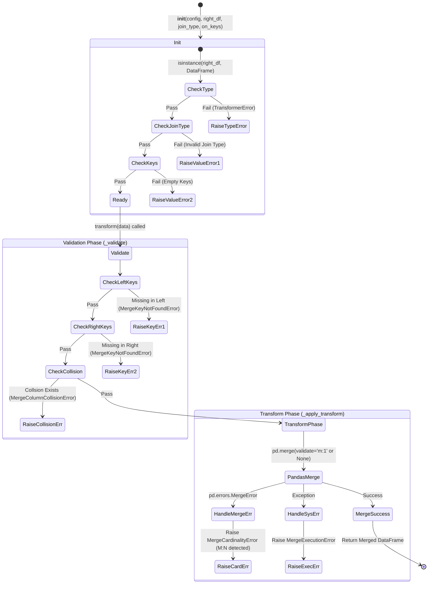

# DataMarger 테스트 문서

## 1. 문서 정보 및 전략

- **대상 모듈:** `src.transformer.processors.data_merger.DataMerger`
- **복잡도 수준:** **최상 (Critical)** (데이터 정합성 보장, M:N 증폭 방지 및 스키마 오염 원천 차단)
- **커버리지 목표:** 분기 커버리지(Branch Coverage) 100%, 구문 커버리지(Statement Coverage) 100%
- **적용 전략:**
  - [x] **경계값 분석 (BVA):** 빈 리스트(`[]`), 빈 데이터프레임(Empty DataFrame) 등 엣지 케이스 검증.
  - [x] **오류 추측 (Error Guessing):** Pandas의 내부 런타임 에러(MemoryError 등) 강제 시뮬레이션 및 래핑 확인.
  - [x] **방어적 프로그래밍 (Defensive):** 입력 타입, 컬럼 충돌(Collision), 카디널리티(M:N) 위반에 대한 사전/사후 차단 검증.
  - [x] **멱등성 (Idempotency):** 상태(State)로 보유한 `right_df`의 불변성 및 반복 호출 안정성 검증.

## 2. 로직 흐름도

## 3. BDD 테스트 시나리오

**시나리오 요약 (총 14건):**

- **초기화 방어 (Initialization):** 4건 (정상 생성, 타입 예외, 미지원 조인 방식, 빈 키 리스트)
- **정상 흐름 (Happy Path):** 3건 (Left 1:1 조인, Inner N:1 조인, 제약 없는 Outer 조인)
- **경계값 및 엣지 (Edge Cases):** 1건 (빈 DataFrame 병합)
- **스키마 검증 (Schema Validation):** 3건 (Left 키 누락, Right 키 누락, 조인 키 외 컬럼 충돌)
- **에러 핸들링 (Error Handling):** 2건 (카디널리티 폭발 M:N 방어, 시스템 런타임 예외 래핑)
- **상태 및 멱등성 (State & Idempotency):** 1건 (상태 불변성 및 연속 호출)

|  테스트 ID  | 분류 | 기법 | 전제 조건 (Given)                                    | 수행 (When)                        | 검증 (Then)                                                            | 입력 데이터 / 상황                   |
| :---------: | :--: | :--: | :--------------------------------------------------- | :--------------------------------- | :--------------------------------------------------------------------- | :----------------------------------- |
| **INIT-01** | 단위 | 표준 | 유효한 `right_df` 및 지원되는 `join_type`, `on_keys` | `DataMerger` 인스턴스 초기화       | 정상적으로 객체가 생성되며 내부 상태가 올바르게 할당됨                 | `join_type="left"`, `on_keys=["id"]` |
| **INIT-02** | 단위 | 방어 | `right_df` 파라미터에 DataFrame이 아닌 값 주입       | `DataMerger` 인스턴스 초기화       | 1. `TransformerError` 발생 2. `should_retry=False` 설정 확인        | `right_df=None` 또는 `[]`            |
| **INIT-03** | 단위 | BVA  | 지원하지 않는 `join_type` 문자열 주입                | `DataMerger` 인스턴스 초기화       | `ValueError` 발생 (지원 포맷 안내 메시지 포함)                         | `join_type="cross"`                  |
| **INIT-04** | 단위 | BVA  | 병합 기준 키 `on_keys`에 빈 리스트 주입              | `DataMerger` 인스턴스 초기화       | `ValueError` 발생 (최소 1개 키 필요 메시지)                            | `on_keys=[]`                         |
| **FLOW-01** | 단위 | 표준 | 1:1 관계를 만족하는 Left/Right 데이터 세팅           | `transform(left_df)` 호출          | 병합이 정상 수행되고 Left 기준 행(Row) 수 유지됨                       | `join_type="left"`                   |
| **FLOW-02** | 단위 | 표준 | N:1 관계(Left에 중복키 존재)의 데이터 세팅           | `transform(left_df)` 호출          | 병합이 정상 수행되고 Inner 조인 결과 반환됨                            | `join_type="inner"`                  |
| **FLOW-03** | 단위 | 방어 | m:1 제약이 없는 상태에서의 조인 세팅                 | `transform(left_df)` 호출          | `validate` 정책 없이 Outer 조인이 정상 수행됨                          | `join_type="outer"`                  |
| **EDGE-01** | 단위 | BVA  | 행(Row)이 0개인 빈(Empty) Left DataFrame             | `transform(empty_df)` 호출         | 에러 없이 스키마(컬럼)만 병합된 빈 DataFrame 반환                      | `left_df.shape = (0, 3)`             |
| **VAL-01**  | 단위 | 방어 | `left_df`에 `on_keys`로 지정된 컬럼 누락             | `transform(left_df)` 호출          | `MergeKeyNotFoundError` 조기 발생 (Left 명시)                          | `left_df`에 "id" 컬럼 없음           |
| **VAL-02**  | 단위 | 방어 | `right_df`에 `on_keys`로 지정된 컬럼 누락            | `transform(left_df)` 호출          | `MergeKeyNotFoundError` 조기 발생 (Right 명시)                         | `right_df`에 "id" 컬럼 없음          |
| **VAL-03**  | 단위 | 방어 | 조인 키를 제외하고 양쪽에 동일한 컬럼 존재           | `transform(left_df)` 호출          | `MergeColumnCollisionError` 조기 발생 (접미사 오염 방지)               | 양쪽에 "status" 컬럼 존재            |
| **ERR-01**  | 예외 | 결함 | Right 데이터에 조인 키가 중복되어 M:N 발생 유도      | `transform(left_df)` 호출          | `MergeCardinalityError` 발생 (Pandas 예외 래핑)                        | `join_type="left"`, Right에 키 중복  |
| **ERR-02**  | 예외 | 결함 | `pd.merge` 호출 시 `MemoryError` 발생 (Mocking)      | `transform(left_df)` 호출          | `MergeExecutionError`로 래핑되어 발생                                  | Mock `pd.merge` -> Raise             |
| **STAT-01** | 단위 | 멱등 | 단일 `DataMerger` 인스턴스와 고정된 `left_df`        | `transform(left_df)` 3회 연속 호출 | 1. 세 번 모두 동일한 데이터프레임 반환 2. 원본 `right_df` 변경 없음 | 동일한 `left_df` 객체 재사용         |
